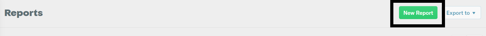
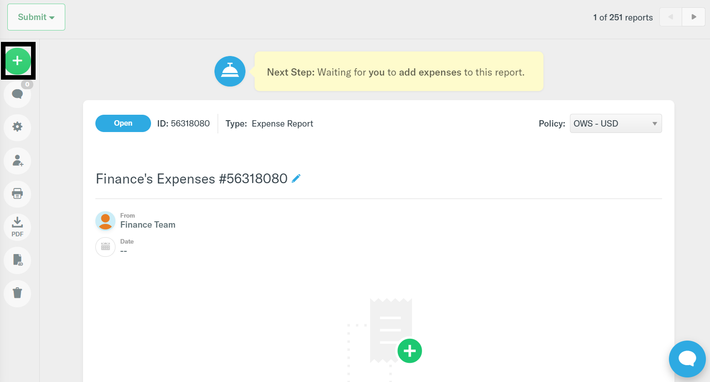
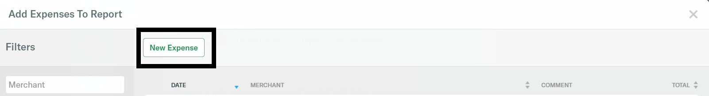
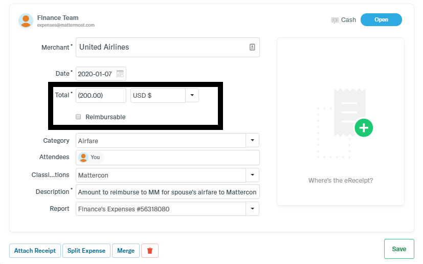

# How to reimburse the company

The purpose of this policy is to provide guidance to staff members who have spent company money for personal expenses and need to reimburse Mattermost. This policy discusses the steps to completing and submitting a report via Expensify and making payment to Mattermost. As noted in principle 8 of [How to spend company money](https://handbook.mattermost.com/company/how-to-guides-for-staff/how-to-spend-company-money), all refunds are due and payable within 14 days from the date of expense.

## Who does this impact?

* Any staff member with a company credit card
* Any staff member using United Airlines Pass Plus for personal and not for a business reason

## How to create a report in Expensify to refund Mattermost

In order to reimburse Mattermost for company money spent on personal expenses, you will need to submit an expense report in Expensify. The steps below will guide you to successfully documenting and paying Mattermost timely.

* Step 1: Log into your Expensify account
* Step 2: Choose Reports → New Reports

* Step 3: Click on “+” to add new expense

* Step 4: Click on “New Expense” on the top left corner of the window and complete the expense form. Please remember to add a receipt or supporting document to the expense report.

* Step 5: In the Total section, input amount owed to Mattermost as a negative amount and uncheck the Reimbursable radio button.

* Step 6: Click “Save”. Expense report should look similar to the screenshot below:

* Step 7: Click “Submit” in the top left corner.

## How to make a payment to Mattermost

Once you have completed your report, please use the [Bank Payment Information](https://drive.google.com/file/d/1k2iiBMpnrspkUCezfngck7Vxd7n2NUd4/view?usp=sharing) to refund the company. We currently offer two payment options: ACH/Wire or Check

### Wire/ACH/Funds Transfer

If you elect to reimburse via Wire/ACH, you are responsible for the Payer and Payee fees, if any. In other words, the cash refund received should not be net of fees. In the description field, please indicate the 8 digit Expensify Report Number\(s\) so that Finance may properly apply the payment to the report upon receipt.

### Check

Make checks payable to Mattermost, Inc. and in the memo field indicate the 8 digit Expensify Report Number\(s\) so that Finance may properly apply the payment to the report upon receipt. Checks should be mailed to the address listed below:

              **Attention: Mattermost Finance Team**

              **Mattermost, Inc.**

              **20 California St., Suite 250**

              **San Francisco, CA 94111**

