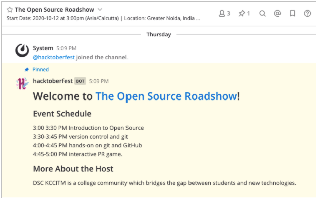

# Hacktoberfest Event Organizer Guide for Mattermost

This page gives you tips for running your Hacktoberfest event on the Mattermost platform.

## Join your event channel

Each [Hacktoberfest event](https://hacktoberfest.digitalocean.com/events) has a dedicated Mattermost channel on the [https://hacktobefest.cloud.mattermost.com/](https://hacktobefest.cloud.mattermost.com/) server. To join your event channel:

1. [Create your Mattermost account](https://hacktoberfest.cloud.mattermost.com/signup_email).
2. Verify your email address.
3. On the left-hand side, click the **Jump to…** bar and type your event name.
4. Select the resulting channel for your event.

Once you’ve joined the channel, you’ll find the event time and location in the channel header, along with the event schedule posted by the **Hacktoberfest** bot:

## Connect with your community

Mattermost is a great way to connect with your community before, during, and after the event. It's also a great way to create an open, inclusive, and welcoming atmosphere for everyone.

Use the channel to facilitate conversations related to your event. For instance, what questions do people have? What open source contributions are they planning to make? What ideas do they have for Hacktoberfest?

After the event, thank your attendees for taking the time to attend your Hacktoberfest meetup, and keep the conversation going throughout October.

## Quick tips

- Complete your profile in **Main Menu > Account Settings**, including your profile picture and name, so your community can make a more personal connection with you.
- Join the **Off-Topic** channel to have conversations with all Hacktoberfest event organizers and attendees.
- Use `@channel` in your event channel to share important updates with your community. This will send an email notification to anyone who is not currently online.

## Have questions?

Direct message `@jason.blais` in the [https://hacktobefest.cloud.mattermost.com/](https://hacktobefest.cloud.mattermost.com/) Mattermost server. See you there!
