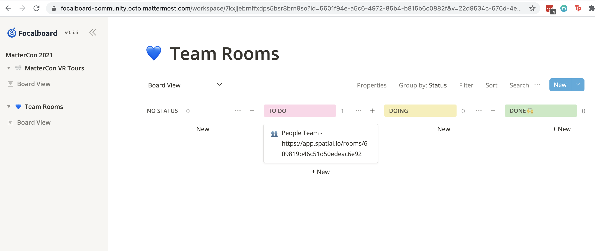

# MatterCon 2021

MatterCon 20201 will be Mattermost's first VR conference. Using Oculus Quest 2 devices, we'll be meeting up virtually in June 2021. [Join the MatterCon2021 channel on Community](https://community.mattermost.com/core/channels/mattercon-2021). Use the hashtag #mattercon2021.

## When will I receive my Oculus Quest 2?

Some of you may have already received your Oculus Quest 2 headsets and some may still have to wait a bit but everyone should have their Oculus Quest 2 headsets in a couple of weeks to the address and phone number on your BambooHR profile. Please make sure your BambooHR profile is up-to-date!

## Did you receive your Oculus Quest 2?

1. Log in using your Facebook account. If you don't have one or don't want to use your personal Facebook account, feel free to create a Facebook account using your @mattermost.com email.
2. Download the Oculus app on your phone/mobile device.
3. A couple of good first free apps to try are called First Steps and Beat Saber Demo.
4. Download and create an account on the Spatial app on the same phone/mobile device.
5. Create a realistic avatar on the Spatial app.
6. Visit [Mattermost VR Gallery](https://app.spatial.io/rooms/609458b76c51d50edeac2669?share=7621477051219851177).
7. [Pair](https://support.spatial.io/hc/en-us/articles/360043402231-Pair-Your-AR-VR-Headset-to-Spatial) Oculus Quest 2 headset.
8. Sneak peek at MatterCon 2021 and say hi to the Focalbirds in the [Mattermost VR Gallery](https://app.spatial.io/room/609458b76c51d50edeac2669?share=7621477051219851177).
10. Help decorate and/or add to the [Mattermost VR Gallery](https://app.spatial.io/rooms/609458b76c51d50edeac2669?share=7621477051219851177).

## Create your own team room (think VR booth at a virtual conference) on Spatial!! Sign up on Focalboard

1. First, join the MatterCon2021 channel on Community.
2. Make your team room by creating a **+NEW SPACE** on your Spatial app with your phone or browser.
3. Select the up arrow box on the RHS and change the options to share with **Anyone with a link**.
4. Go to [Team Rooms Focalboard](https://focalboard-community.octo.mattermost.com/workspace/7kxjjebrnffxdps5bsr8brn9so?id=5601f94e-a5c6-4972-85b4-b815b6c0882f&v=22d9534c-676d-4ea6-8e07-82a76324af95).
5. Click on **+New =>TO DO card** with the name of your team and the Spatial URL to the team room.
6. Check out the [People Team's room](https://app.spatial.io/rooms/609819b46c51d50edeac6e92), please note it is currently under construction.
7. Decorate your team room for MatterCon VR 2021 and show us what your team is up to! #sharingiscaring.

**Note:** If you encounter an error when logging into Focalboard, check that you've joined the corresponding channel - MatterCon 2021 in this case. Then select the Focalboard button in the header. If that doesn't work, your OAuth session token may have expired. It expires every 7 days. To fix this, close the tab, and open Focalboard from the MatterCon2021 channel header.

There are additional troubleshooting steps in the [Mattermost-Focalboard announcement](https://github.com/mattermost/focalboard/discussions/349). If this doesn't resolve the problem, let the [Focalboard team](https://community.mattermost.com/core/channels/focalboard) know.
