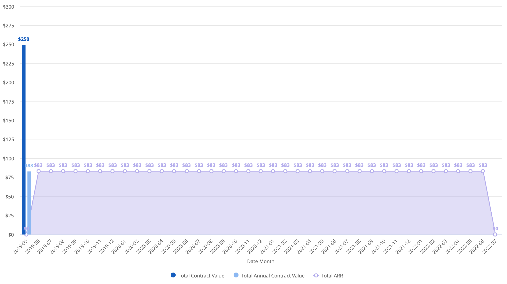

# Analytics

Business Operations, Data Engineering, and Analytics functions were started in December and are ever evolving. Because of how new we are, everything on this page is currently WIP.

We are currently focused on:

* Data collection
* Mapping data to business logic
* Data modeling
* Looker \(data visualization tool replacing Chartio\)
* Automating Metrics

## Automating Metrics

WIP - [Mattermost Metrics Google Sheet](https://docs.google.com/spreadsheets/d/1_AuT_ZwKRK-_BEUgmDoHkuIZQEnuzyb6sNpnUQkWOOQ/edit?usp=sharing)

WIP - [Mattermost Data & Metric Availability](https://docs.google.com/spreadsheets/d/1GRB6hr_eSSVcFFAQkimZ6VE0EtobkPq6iKl027G9Mig/edit?usp=sharing)

## Metrics Definitions

### Contact Us \(WIP\)

* 
### Contributors \(WIP\)

#### GitHub Contributors

* Members of the open source community with contributions to Mattermost GitHub repositories
* Definitions:
  * First Time Contributors: The first month someone contributes, they considered a First Time Contributor the whole month.
  * Old Contributors: Anyone that is not a First Time Contributor
  * First Contribution: The first contribution ever made by someone. Any following contributions will not be considered a First Contribution
  * Examples:
    * Person A
      * 2019-01-02 Contribution 1
      * 2019-01-04 Contribution 2
      * 2019-01-05 Contribution 3
    * Would count as
      * 1 First Time Contributor + 1 First Time contribution + 2 Non First Contributions

### Downloads \(WIP\)

* 
### Finance

Financial numbers cater to a wide range of teams. Some are meanth Sales, others meant for CS, and some for just relevent to our Finance team. Below you will find information on ACV, TCV, and ARR. **ACV & TCV are relevent to Sales and ARR relevent to Finance and CS.**

#### TCV \(Total Contract Value\)

_What the customer bought_

* TCV measures revenue from across the entire contract a customer signs
* Recognized **only** in the Closed Won Month
* `TCV = Total Contract Value`

#### ACV \(Annual Contract Value\)

_What the customer bought normalized for one year length_

* ACV is the value of subscription revenue from each contracted customer, normalized to a one-year period
* Recognized **only** in the Closed Won Month
* `ACV = (Total Contract Value / (End Date - Start Date)) * 365`

#### ARR \(Annual Recurring Revenue\)

_What the customer bought normalized for one year length & reoccurs for length of contract_

* ARR is the value of the contracted recurring revenue of your term subscriptions normalized to a one-year period
* Recognized from **start to end** of contract
* `ARR = (Total Contract Value / (End Date - Start Date)) * 365`
* ARR increases and decreases based on the following categories of change:
  * New: New Logo never seen before - Caused by a brand new and never before see Account signing a contract
  * Expansion: Increase in ARR by an Account - Caused by seat increase, price increase, or product upgrade
  * Contraction: Decrease in ARR by an Account - Caused by seat decrease, price decrease, or product downgrade
  * Churn: Decrease in ARR to $0 by an Account - Caused by an Account moving completely off of Mattermost

#### TCV vs. ACV vs. ARR

Example: 

* Opportunity: [Mycroft Ai-e10-5000-NP-2019renewal-3yr](https://mattermost.lightning.force.com/lightning/r/Opportunity/0063600000eRMmcAAG/view)
* Close Date: 2019-05-07
* Amount = $250
* Start Date: 2019-06-15
* End Date: 2022-06-14
* Graph below shows:
  * The ACV and TCV only occur in May 2019
  * ARR starts in June 2019 and continues until the end of the contact \(June 2022\).

### Google Analytics \(WIP\)

* 
### Hiring \(WIP\)

### Net Promoter Score \(NPS\) \(WIP\)

* Net Promoter Score \(NPS\) measures customer experience and predicts business growth
* Respondents are grouped as follows:
  * Promoters \(score 9-10\) are loyal enthusiasts who will keep buying and refer others
  * Passives \(score 7-8\) are satisfied but unenthusiastic customers who are vulnerable
  * Detractors \(score 0-6\) are unhappy customers who can damage your brand
* Net Promoter Score = % Promoters - % Detractors
  * NPS ranges from -100 \(every customer is a Detractor\) to 100 \(every customer is a Promoter\)
* Mattermost's NPS is based off of a 1-10 ranking provided by customers
  * If customers provide rankings 2+ times in a day, the last ranking of the day is used for NPS

### TEDAU \(WIP\)

* 
### Trials \(WIP\)

* 
## Looker

### What is it?

Looker is a business intelligence software and big data analytics platform that helps you explore, analyze and share real-time business analytics easily.

### Accessing Looker

Looker is currently not GA at Mattermost. We are in the process of a slow rollout with only a few early adopters. While someone may send you a link or you are able to successfully log in, you will be dropped into a holding group with very limited access.

If you feel you are meant to be part of the early adopter group and are unable to access Looker, please reach out to us in [BizOps](https://community.mattermost.com/private-core/channels/bizops).

## Reports and Dashboard

 **\* Only available to Looker early adopters. Please see** [**Looker Section**](https://handbook.mattermost.com/operations/business-operations/analytics#looker)**.**

### Community

* [GitHub Contributors Dashboard](https://mattermost.looker.com/dashboards/15)\*

### Finance

* [ARR Overview Dashboard](https://mattermost.looker.com/dashboards/14)\*
  * Overview of Mattermost ARR
* [ARR Monthly Net Changes](https://mattermost.looker.com/looks/2?toggle=det)\*
  * Monthly ARR Net Changes broken down by the four categories
* [Current FY Closed Won Opportunities TCV & ARR](https://mattermost.looker.com/dashboards/2)\*
* [FY21 Renewal ARR Overview](https://mattermost.looker.com/dashboards/9)\*

### Product

* [NPS Dashboard](https://mattermost.looker.com/dashboards/16)\*
* TEDAU
* TEDAS

### Top of Funnel

* [Traffic & Organic Google Search](https://mattermost.looker.com/dashboards/5)\*
* [Downloads Dashboard](https://mattermost.looker.com/dashboards/11)\*
* Contact Us
* Trials

