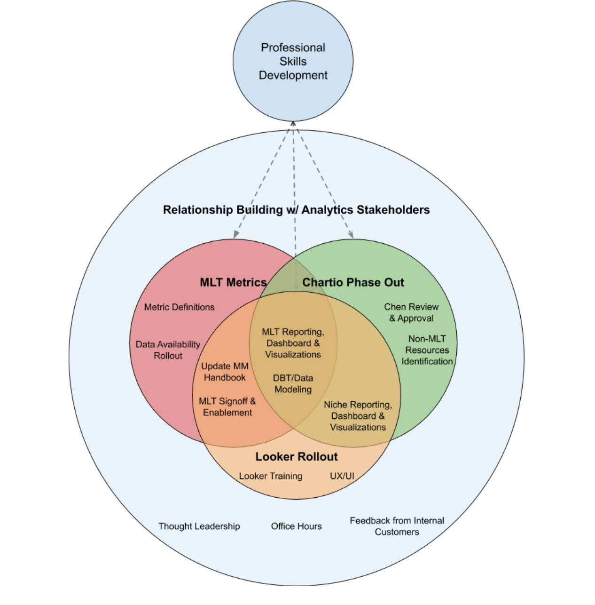

# Analytics

Business Operations, Data Engineering, and Analytics functions were started in December and are ever evolving. Because of how new we are, everything on this page is currently WIP.

We are currently focused on:

* Data collection
* Mapping data to business logic
* Data modeling
* Looker \(data visualization tool replacing Chartio\)
* Automating Metrics

## Q1FY21 Priorities

## Automating Mattermost Business Metrics

### [Mattermost Business Metrics Rollout](https://docs.google.com/spreadsheets/d/1KzeqosK-yuRrkNsfujgM2wDXKd4KECvECNJbuZrG3Ek/edit?usp=sharing)

Learn more about current status, owners, and targets for automating Mattermost Business Metrics

