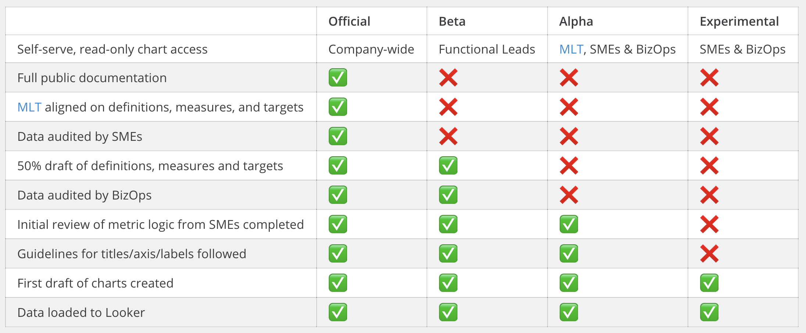

# Looker

## What is it?

Looker is a business intelligence software and big data analytics platform that helps you explore, analyze and share real-time business analytics easily.

### [Looker at Mattermost Overview](https://docs.google.com/document/d/1vp3Ce76kOVROy1nj-Us_ZpOAaW0OY-xYbQkoqPqOxi0/edit?usp=sharing)

## Accessing Looker \(NOT EVERYONE HAS ACCESS\)

Looker is currently not GA at Mattermost. We are in the process of a slow roll out with only a few early adopters. While someone may send you a link or you are able to successfully log in, you will be dropped into a holding group with very limited access.

If you feel you are meant to be part of the early adopter group and are unable to access Looker, please reach out to us in [BizOps](https://community.mattermost.com/private-core/channels/bizops).

## Looker Roll-out Stages

Dashboards will be denoted with one of the following Stages in Looker.

