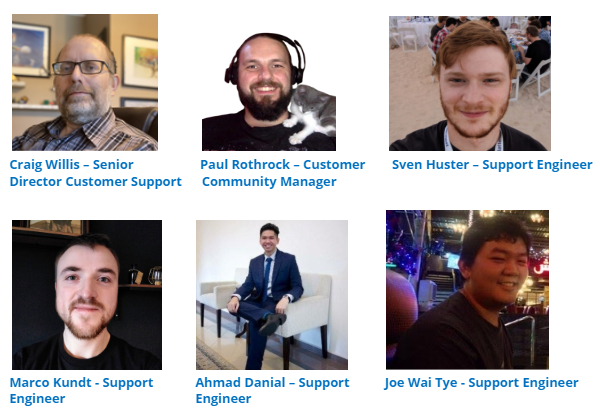

Customer Support is a core function at Mattermost with a goal to ensure the success of all customers when using the Mattermost application.

The team is based across three continents to ensure a follow the sun approach to working with our customers.  They also have strong relationships with all parts of the Mattermost organization to ensure that where necessary issues are addressed quickly and efficiently, these include, but are not limited to, Customer Success, Engineering, and Product Management.

Details of what the Support Team provides for our Enterprise Customers can be found [here](https://mattermost.com/support/), this includes our support options and SLA’s.

## Meet the Team: 

## Where to find us:

* Mattermost Channels: Customer Support, Support Standup
* Enterprise Support Team Email: support@mattermost.com
* Customer Support Portal: https://support.mattermost.com

## Mattermost Ticketing System 

To ensure that all issues raised with the Mattermost Support Team can be easily tracked, updated, and resolved, the Support Team uses Zendesk as their case management software.

Customers can access the Support Portal and submit/view their tickets via https://support.mattermost.com.  

## New Mattermost Support users

If you are new to Mattermost Support you can click [here](https://mattermost.zendesk.com/auth/v2/login/registration?auth_origin=327479%2Ctrue%2Ctrue&brand_id=327479&return_to=https%3A%2F%2Fsupport.mattermost.com%2Fhc%2Fen-us&theme=hc) to set up and verify your account.

## Existing Mattermost Support users

If you’ve worked with the Mattermost Support Team before and have existing or previous tickets with Support then you already have an account with the email address that you would have used. To (re)set your password, you can click [here](https://mattermost.zendesk.com/auth/v2/login/password_reset?auth_origin=327479%2Ctrue%2Ctrue&brand_id=327479&return_to=https%3A%2F%2Fsupport.mattermost.com%2Fhc%2Fen-us&theme=hc).

## Ticket Management ##

## Ticket Creation ##

When submitting a Support Ticket to the Mattermost Support Team we recommend that you use the ‘Submit a Request’ option from with the Support Portal.  This will ensure that we get the required information from you.

## Support Ticket Request Form ##

To ensure that we can assist our customers most efficiently it’s imperative that as much information is provided when submitting the ticket.  For details of what details should be provided you should review our Troubleshooting Guide which can be found [here](https://docs.mattermost.com/guides/administrator.html#troubleshooting).

|Field | Description |
|------|-------------|
| **CC**  |Add additional email addresses of those who you would like to receive notifications of this issue.|
| **Subject** |A brief description of the issue.            |
| **Priority**     |Urgent, High, Normal, or Low, descriptions of these priority ratings can be found here.              |
| **Category**     |Select a category that best fits the product area affected by the issue raised.            |
| **Description**     |Provide as much detail as possible to enable the Support Team to recreate the issue.  Please refer to the troubleshooting guide for what’s required.            |
| **Environment**     |Select the environment where you are experiencing the issue.            |
| **Mattermost Version**     |Enter the number of the Mattermost server version you are currently running.            |
| **Mattermost Mobile version**     |If the issue you are reporting is on a mobile device, enter the version here.            |
| **Mobile device**     |Please select which type of device you are experiencing the issue on.            |
| **Attachments**     |Add screenshots, logs, etc to the ticket here.            |

 ## Ticket Workflow ##

While working with our customers the Support Team will us the following ticket statuses to manage the ticket, New, Open, Pending, Solved, and Closed.  The workflow will be as follows:

Note: Descriptions of each status can be found [here](https://handbook.mattermost.com/operations/business-operations/analytics/metrics-definitions#support-tickets).
 
## Issue Escalation Process ##

Some technical issues may need to be addressed by our Engineering Team.  When this occurs you will be notified via the Support Ticket and the following internal steps will be carried out.

## Customer Support/Sustaining Engineering Team ##

Any case that can’t be resolved by the Support Team is escalated to the Mattermost Sustaining Engineering Team for their review.

**If the issue is confirmed as a product issue then a Pull Request is created and where necessary members of the following Teams are involved:**

- Support
- Sustaining Engineering
 - Product
 - Customer Success
 - Executives

**Action Plan Created**

 - The customer is updated via the Support Ticket with the plan to address the issue.

**Action Plan Executed**

 - The fix is tested internally
 - An update is provided via the Support Ticket

**The fix is Moved to Production**

 - The fix is released to the latest Production version of Mattermost for download 
 - An update is provided via the Support Ticket

**Urgent & High Ticket Escalation Process for Premier Support Customers**

For urgent and high priority issues from our Premium Support customers, an automated escalation process will be activated to ensure 24x7 cover for these issues.
