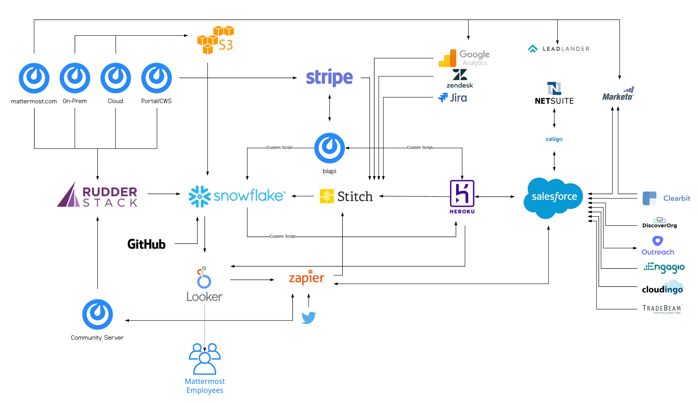
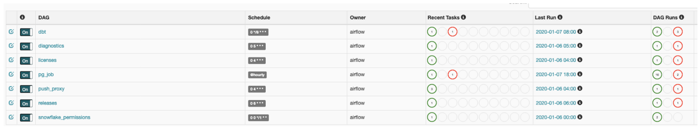

# Data Engineering

Business Operations, Data Engineering, and Analytics functions were started in 2019 and are ever evolving. Because of how new we are, eveything on this page is currently WIP.

We are currently focused on:

* Data collection
* Mapping data to business logic
* Data modeling
* Looker \(data visualization tool replacing Chartio\)
* Automating Metrics

## Data Engineering Infrastructure

### GitHub

* Link: [Mattermost Data Warehouse](https://github.com/mattermost/mattermost-data-warehouse)
  * To access the repository, you must be a member of the Core Developers team

### Amazon EKS

* [https://aws.amazon.com/eks/](https://aws.amazon.com/eks/)
* EKS is a managed Kubernetes service that allows us to deploy, orchestrate, and run our code. The main benefits of Kubernetes are being able to declaratively specify the resources you need and how much CPU and memory they require, and Kubernetes will figure out how to make it work. It will also attempt to restart VMs that have failed. We make use of [Dockerfiles](https://hub.docker.com/repository/docker/adovenmm/data-warehouse-psql/general) for our images. We also use [Bitnami’s Airflow helm chart](https://github.com/bitnami/charts/tree/master/bitnami/airflow).
* To keep our data and configuration confidential, we make use of [Kubernetes Secrets](https://kubernetes.io/docs/concepts/configuration/secret/) which are only shared with team members who need access in LastPass.

### Airflow

* To access Airlow, you must be on VPN go to this [link](http://airflow.internal.mattermost.com). The Airflow Creds are stored in the Shared-BizOps LastPass Folder.
* [Apache Airflow](https://airflow.apache.org/) is a workflow orchestration tool built in Python that allows you to build and schedule [DAGs](https://airflow.apache.org/docs/stable/concepts.html#dags). With these DAGs we can schedule jobs to run using [crontab style scheduling](https://crontab.guru/) and also declare dependencies between jobs so that we can ensure that data that we’re processing doesn’t get overwritten. Airflow also has great utilities for retrying failed jobs and alerting for job and DAG failures.
* We take advantage of [Mattermost Incoming Webhooks](https://docs.mattermost.com/developer/webhooks-incoming.html) to send DAG failures to a special internal Mattermost channel called BizOps Ops where team members can triage the failure. We ensure that these get sent to Mattermost with our [failed task callback](https://github.com/mattermost/mattermost-data-warehouse/blob/master/dags/airflow_utils.py#L17) which is specified in each [DAGs configuration](https://github.com/mattermost/mattermost-data-warehouse/blob/master/dags/extract/diagnostics.py#L24)
* We also utilize [Bitnami’s Get DAG files from a git repository](https://github.com/bitnami/charts/tree/master/bitnami/airflow#option-3-get-your-dag-files-from-a-git-repository) so that it will automatically pull from the master branch of our [GitHub repository](https://github.com/mattermost/mattermost-data-warehouse) every 60 seconds so our DAGs are always up to date.
* We use Airflow’s new [KubernetesPodOperator](https://airflow.apache.org/docs/stable/kubernetes.html) that allows each of our jobs to run in it’s own Kubernetes Pod. The real flexibility with this is that because it’s simply a Kubernetes Pod running a process, we can actually run any job in any language. It also isolates the compute and memory for all the jobs, and we can even customize how much compute and memory power we give to each job so if a job requires more power we can grant it that.
* This is a screenshot of our actual Airflow installation and gives an example of how the UI looks.

### Kubernetes Secrets

* To keep our connection strings and other configuration items confidential, we utilize [Kubernetes Secrets](https://kubernetes.io/docs/concepts/configuration/secret/) and inject those as environment variables into our Kubernetes Pods. To inject a secret into the environment of a job run through an Airflow DAG, you must specify it in the [kube\_secrets.py](https://github.com/mattermost/mattermost-data-warehouse/blob/master/dags/kube_secrets.py) then you can import it in the [DAG file](https://github.com/mattermost/mattermost-data-warehouse/blob/master/dags/extract/diagnostics.py#L8) and then finally injecting into the [Operator object](https://github.com/mattermost/mattermost-data-warehouse/blob/master/dags/extract/diagnostics.py#L49) itself

### Snowflake

* [Snowflake](https://www.snowflake.com/) is a cloud- and SQL- based data warehouse platform that allows you to separate query compute power from data storage. It uses a proprietary data format for storing data and strives to provide a service that means you don’t need a DBA to constantly monitor and tweak to keep the warehouse performant.

#### Virtual Warehouse

* [Virtual Warehouses](https://docs.snowflake.net/manuals/user-guide/warehouses.html) are Snowflake’s concept for a cluster of compute resources that can execute queries. You are billed based on how the size of the Virtual Warehouse and how long it is running for.

**Stage and COPY**

* [Stages](https://docs.snowflake.net/manuals/sql-reference/sql/create-stage.html) in Snowflake allow you to specify an external data source that you want to load data from. Once specified, you can run a simple “COPY INTO” command with a pattern, and in our case, will allow us to import data from S3 buckets. You can see how we utilize this [here](https://github.com/mattermost/mattermost-data-warehouse/blob/master/extract/s3_extract/stage_import.py).

### dbt \(Data Build Tool\)

* [dbt](https://docs.getdbt.com/docs/introduction) is a tool, written in Python, that allows you to execute the Transform step of your ELT or ETL process. 
* We use it to transform raw data in our Snowflake warehouse into more easily usable tables and views.
* Our dbt implementation is [here](https://github.com/mattermost/mattermost-data-warehouse/tree/master/transform/snowflake-dbt)
* We are still building out our transformations, but a good example to look at [here](https://github.com/mattermost/mattermost-data-warehouse/tree/master/transform/snowflake-dbt/models/finance) where we take raw data from our Salesforce instance, and use it to calculate ARR of our customers.
* Dbt has a concept of [sources](https://docs.getdbt.com/docs/using-sources) and [models](https://docs.getdbt.com/docs/building-models).
  * An example sources file is [here](https://github.com/mattermost/mattermost-data-warehouse/blob/master/transform/snowflake-dbt/models/orgm/sources.yml) and this specifies already existing raw data that dbt can pull from to build models.
  * Then, you can define models that reference the sources. 
  * Example: 
    * [https://github.com/mattermost/mattermost-data-warehouse/blob/master/transform/snowflake-dbt/models/finance/\*\*account\_daily\_arr\*\*.sql](https://github.com/mattermost/mattermost-data-warehouse/blob/master/transform/snowflake-dbt/models/finance/**account_daily_arr**.sql)
    * The filename \(account\_daily\_arr\) of the model file determines the object name in the database \(in this case a table\). 

### Meltano Permissions

* [Meltano](https://meltano.com/) is an overall framework that includes a lot more than what we’re using it for.

  We’re actually just using a small piece that allows us to control our Snowflake user and role permissions in a fine-grained way.

* The specific piece we use is [here](https://meltano.com/docs/command-line-interface.html#permissions)
* We use this in the [snowflake\_permissions DAG](https://github.com/mattermost/mattermost-data-warehouse/blob/master/dags/general/snowflake_permissions.py#L32). The interesting piece is the container\_cmd lines. Essentially we create an entire Meltano project, but then just use a [roles.yml](https://github.com/mattermost/mattermost-data-warehouse/blob/master/load/snowflake/roles.yaml) file that we define to control the permissions.

## Data Sources

### Telemetry

* Telemetry data is data that is sent from Mattermost servers and makes its way to our data warehouse. 
  * This data is detailed [here](https://docs.mattermost.com/administration/telemetry.html).
* Currently, we use [Segment](https://segment.com/) to push this data to Snowflake. 
  * The data is available in its raw form in the Raw database, in the mattermost2 and mattermost\_nps schemas.
* We currently have a dbt model [here](https://github.com/mattermost/mattermost-data-warehouse/blob/master/transform/snowflake-dbt/models/mattermost/server_daily_details.sql) that uses this raw data, but will continue to add more.
* Active User Counts
  * Mattermost servers ping a Cloudfront endpoint with some basic telemetry. It uses the log format specified [here](https://docs.aws.amazon.com/AmazonCloudFront/latest/DeveloperGuide/AccessLogs.html#LogFileFormat). 
  * The import job uses code [here](https://github.com/mattermost/mattermost-data-warehouse/blob/master/extract/s3_extract/stage_import.py#L52).

### Push Notifications

* Mattermost runs a proxy service that allows notifications to be sent through Apple and Google’s respective notification services for mobile notifications. The log data is put into an S3 bucket and then ingested using the aforementioned Snowflake Stage and COPY. See [here](https://github.com/mattermost/mattermost-data-warehouse/blob/master/extract/s3_extract/stage_import.py#L58) for more details.

### Server Release

* To help us track how many Mattermost servers are being deployed, there is a pingback which gets logged to an S3 bucket that we import. Details [here](https://github.com/mattermost/mattermost-data-warehouse/blob/master/extract/s3_extract/stage_import.py#L46).

**License Data**

* Mattermost’s enterprise license metadata is exported nightly to an S3 bucket and then we import it daily. Code [here](https://github.com/mattermost/mattermost-data-warehouse/blob/master/extract/s3_extract/stage_import.py#L42).

### Stitch Data

* **Google Analytics**
  * Overview
    * Google Analytics - Stitch Integration has a lot of caveats and limitations.
    * Known limitations:
      * Each set of dimensions and measures from Google Analytics needs to have its own Stitch integration.
      * Each integration creates a schema in Snowflake that matches the name of the integration and adds a table called report
        * `Name: GA ChannelGrouping Source Users Org Schema: analytics.ga_channelgrouping_source_users_org Table: analytics.ga_channelgrouping_source_users_org.report`
      * Once an integration is created, it cannot be edited. If you need to make changes, you need to delete the integration and start over.
      * Data is only pulled at a daily level.
        * This is an issue because “Unique Monthly Users” is not the same as “Aggregated Unique Daily Users.
  * Mattermost.org
    * [Google Analytics Link](https://analytics.google.com/analytics/web/?authuser=0#/report-home/a64458817w100411618p104282920)
    * Owner: Jason Blais
    * Stitch Integrations:
      * [GA ChannelGrouping Source Users Org](https://app.stitchdata.com/client/153136/pipeline/connections/211988/summary)
        * Frequency: 6 hours
        * Dimensions: ChannelGrouping, Source
        * Measures: Users
  * Mattermost.com
    * [Google Analytics Link](https://analytics.google.com/analytics/web/?authuser=0#/report-home/a120238482w177779216p176410444)
    * Owner: Rachel Bradley-Haas
    * Stitch Integrations:
      * [GA ChannelGrouping Source Users Com](https://app.stitchdata.com/client/153136/pipeline/connections/212282/summary)
        * Frequency: 6 hours
        * Dimensions: ChannelGrouping, Source
        * Measures: Users
      * [GA Mattermost Com Pages Visits](https://app.stitchdata.com/client/153136/pipeline/connections/226666/summary)
        * Frequency: 6 hours
        * Dimensions: Page Path, Page Title
        * Measures: Page Visits, Unique Page Visits, Avg Time on Page
  * Developers.Mattermost.com
    * [Google Analytics Link](https://analytics.google.com/analytics/web/#/dashboard/uh0tcPOLS1ir9osCAZvBiQ/a64458817w179061281p177463446/)
    * Owner: Jason Blas
    * Stitch Integrations:
      * [GA Developers Pages Visits](https://app.stitchdata.com/client/153136/pipeline/connections/226635/summary)
        * Frequency: 6 hours
        * Dimensions: Page Path, Page Title
        * Measures: Page Visits, Unique Page Visits, Avg Time on Page
* **Salesforce/Heroku Connect**
  * [OrgM](https://app.stitchdata.com/client/153136/pipeline/connections/206623/summary)
  * Frequency: 1 hour \(as of 2020-01-07\)
  * [Tables Syncing](https://app.stitchdata.com/client/153136/pipeline/connections/206623/data/db/d6ghpflham816n/schema/orgm)
  * Sync Type:  Key-Based Incremental Replication \(Recommended\)
    * When you define a Replication Key, Stitch will store the greatest value of that column of that key during each update and only sync rows with greater or equal values on subsequent updates.
    * Note: Hard deletes are not supported by this Replication Method.
    * Note: Because we use this incremental replications, when adding a new column to a table, you must reload the table to ensure all data has been backfilled in Snowflake.
    * Replication Key: sysmodstamp
    * Table Specific Info

      `app.stitchdata.com/client/153136/pipeline/connections/206623/data/db/d6ghpflham816n/schema/orgm/properties/6715619/[TABLE_NAME]/`

    * Account Example: `app.stitchdata.com/client/153136/pipeline/connections/206623/data/db/d6ghpflham816n/schema/orgm/properties/6715619/account/`
    * Updating Table Settings:
      * Follow the link formatting to table specific info
      * Click Table Settings
    * Reloading a Table:
      * In Table Settings, click **Reset Table** and save updates

### Postgres Job

* The Postgres Job is simply a way for us to run scripts against our Heroku Postgres database \(that contains our Salesforce data through Heroku Connect\). 
* The DAG for this is [here](https://github.com/mattermost/mattermost-data-warehouse/blob/master/dags/general/pg_job.py#L25)
  * The script looks for sql files in this [folder](https://github.com/mattermost/mattermost-data-warehouse/tree/master/transform/sql) and the second argument to “get\_container\_operator” must match the filename in the folder \(without the .sql\).

    It uses a Kubernetes Secret to store the credentials for our Postgres database.

  * Note: The first argument to “get\_container\_operator” must not have any underscores in the name, hyphens can be used in their place.

### Granting Access/Permissions

#### Snowflake

* Admin creates a user based on level of access

  * Admin:

  `CREATE USER rachel PASSWORD='[generate using lastpass]' COMMENT='rachel@mattermost.com' DEFAULT_ROLE='sysadmin'  
  MUST_CHANGE_PASSWORD = TRUE DEFAULT_WAREHOUSE='analyst_xs';  
  GRANT ROLE 'sysadmin' TO USER rachel;`

  * Read Only:

  `CREATE USER rachel PASSWORD='[generate using lastpass]'   
  COMMENT='rachel@mattermost.com' DEFAULT_ROLE='reporting'  
  MUST_CHANGE_PASSWORD = TRUE DEFAULT_WAREHOUSE='analyst_xs';   
  GRANT ROLE 'reporting' TO USER rachel;`

**Postgres**

* Admin adds user to [Heroku Account](https://dashboard.heroku.com/apps)

**Stitch**

* Admin adds user to [Stitch Account](https://app.stitchdata.com/client/153136/pipeline/v2/account)

 **Airflow**

* Admin shares login information with user via LastPass
  * Airflow Creds in Shared-BizOps Folder
  
