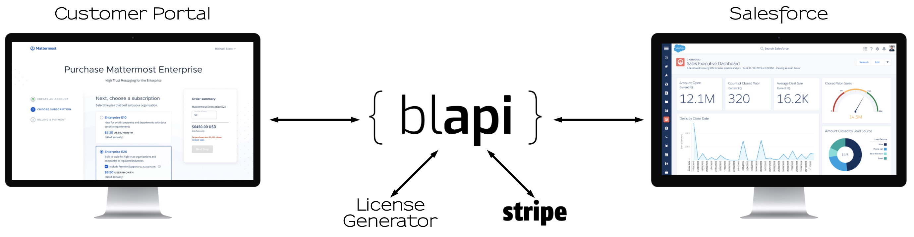

# Self Service

### Self Service is enabled through the combined capabilities of three major components

* Customer Web Portal
* blapi \(Business Logic API\)
* License Generator

**Find the Self Service Roadmap in [ProductBoard](https://mattermost.productboard.com/roadmap)**

**Ask questions [here](https://community.mattermost.com/private-core/channels/customer-portal)**

## Customer Web Portal

Customer Web Portal will provide a portal for customers to self-serve product purchases through Mattermost, reducing time to purchase and manual fulfillment time.

* [GitHub Repo](https://github.com/mattermost/customer-web-server)

## blapi \(Business Logic API\)

blapi is responsible for surfacing billings, licensing, and customer data to the Customer Web Portal, generating required records in SFDC to enable reporting and sales processes, converting SFDC records to information required to run Customer Web Portal, and lastly charging credit cards in Stripe.

* [GitHub Repo](https://github.com/mattermost/blapi)
  * [OpenAPI Schema](https://github.com/mattermost/blapi/blob/master/openapi.json)

## License Generator

The Mattermost License Generator \(MLG\) is a microservice responsible to generate the license that is used in the Mattermost application.

* [License Generator Documentation](https://docs.google.com/document/d/1GsAAQR9Cpmtj46PhSJNuHXpxRUzk4dWUyvvd6B4UT9M/edit?usp=sharing)

