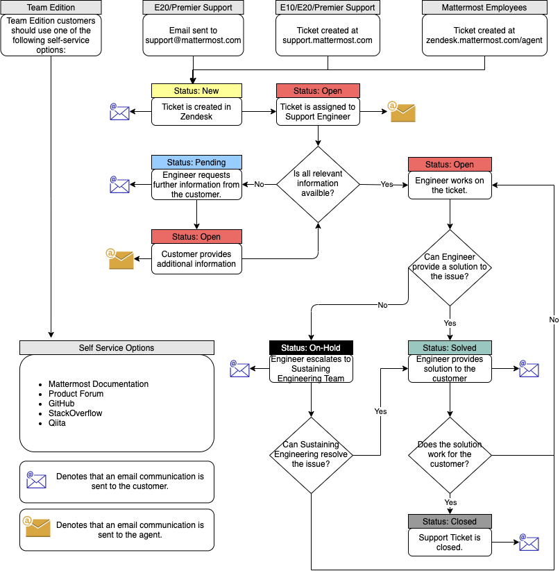
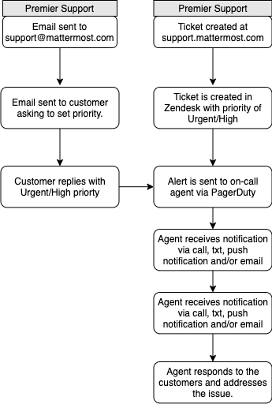
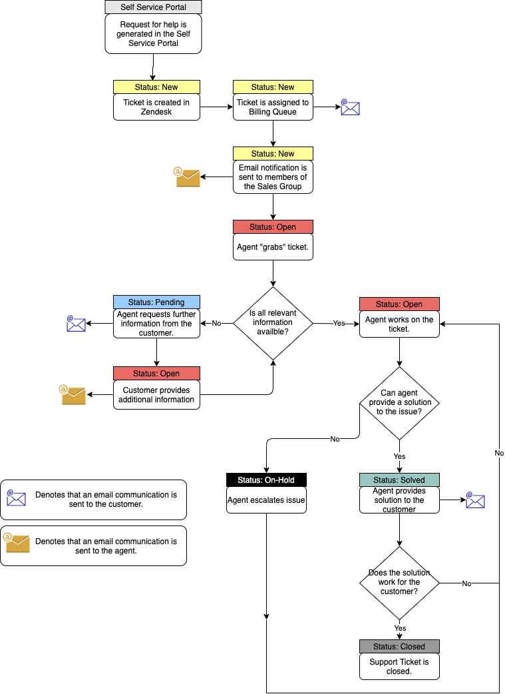

# Customer Support

Customer Support is a core function at Mattermost with a goal to ensure the success of all customers when using the Mattermost application.

The team is based across three continents to ensure a follow-the-sun approach to working with our customers. They have strong relationships with all parts of the Mattermost organization including, but not limited to, Customer Success, Engineering, and Product Management. These partnerships ensure that issues are addressed quickly and efficiently.

Details of what the Support Team provides for our Enterprise Customers can be found [here](https://mattermost.com/support/), this includes our support options and SLAs.

## Where to find us

* Mattermost Channels: [~Customer Support](https://community.mattermost.com/private-core/channels/community) & [~Support Standup](https://community.mattermost.com/private-core/channels/support-standup)
* Enterprise Support Team Email: [support@mattermost.com](https://mail.google.com/mail/?view=cm&fs=1&to=support@mattermost.com)
* Customer Support Portal: [https://support.mattermost.com](https://support.mattermost.com)

## Mattermost ticketing system

To ensure that all issues raised with the Mattermost Support Team can be easily tracked, updated, and resolved, the Support Team uses Zendesk as their case management software.

Customers can access the Support Portal and submit/view their tickets via [https://support.mattermost.com](https://support.mattermost.com).

## New Mattermost Support users

If you are new to Mattermost Support you can click [here](https://mattermost.zendesk.com/auth/v2/login/registration?auth_origin=327479%2Ctrue%2Ctrue&brand_id=327479&return_to=https%3A%2F%2Fsupport.mattermost.com%2Fhc%2Fen-us&theme=hc) to set up and verify your account.

## Existing Mattermost Support users

If you’ve worked with the Mattermost Support Team before and have existing or previous tickets with Support then you already have an account with the email address that you would have used. To \(re\)set your password, you can click [here](https://mattermost.zendesk.com/auth/v2/login/password_reset?auth_origin=327479%2Ctrue%2Ctrue&brand_id=327479&return_to=https%3A%2F%2Fsupport.mattermost.com%2Fhc%2Fen-us&theme=hc).

## Ticket management

### Ticket creation

When you submit a Support Ticket to the Mattermost Support Team, you can use [**Submit a Request**](https://support.mattermost.com/hc/en-us/requests/new?ticket_form_id=360000640492) in the Support Portal. This ensures that we get the information we need to assist you.

### Technical Support ticket request form

To ensure that we can assist our customers most efficiently it's important that as much information as possible is provided when submitting the ticket. More details around the required information is listed in our [Troubleshooting Guide](https://docs.mattermost.com/guides/administrator.html#troubleshooting).

| Field | Description |
| :--- | :--- |
| **CC** | Add additional email addresses of those who you would like to receive notifications of this issue. |
| **Subject** | A brief description of the issue. |
| **Priority** | Urgent, High, Normal, or Low, descriptions of these priority ratings can be found [here](https://mattermost.com/support/). |
| **Category** | Select a category that best fits the product area affected by the issue raised. |
| **Description** | Provide as much detail as possible to enable the Support Team to recreate the issue.  Please refer to the troubleshooting guide for what’s required. |
| **Environment** | Select the environment where you are experiencing the issue. |
| **Mattermost Version** | Enter the number of the Mattermost server version you are currently running. |
| **Mattermost Mobile version** | If the issue you are reporting is on a mobile device, enter the version here. |
| **Mobile device** | Please select which type of device you are experiencing the issue on. |
| **Attachments** | Add screenshots, logs, etc to the ticket here. |

## Ticket categories \(Technical Support\)

The following categories are availble for submiting tickets to the Technical Support Team:

| Name | Description |
| :--- | :--- |
| General inquiry | Tickets regarding general Mattermost functionality |
| AD/LDAP | Tickets regarding AD/LDAP functionality |
| Authentication & Provisioning | Tickets regarding Authentication & Provisioning functionality |
| Compliance & Auditing | Tickets regarding Compliance & Auditing functionality |
| Connectivity | Tickets regarding Connectivity functionality |
| Customization & Branding | Tickets regarding Customization & Branding functionality |
| Data Export and Import | Tickets regarding Data Export and Import functionality |
| Database | Tickets regarding Database functionality |
| Desktop | Tickets regarding Desktop functionality |
| Developer Toolkit | Tickets regarding Developer Toolkit functionality |
| DevOps Command Center | Tickets regarding DevOps Command Center functionality |
| General | Tickets regarding General functionality |
| Installation | Tickets regarding Installation functionality |
| Integrations | Tickets regarding Integrations functionality |
| Invitation & Login | Tickets regarding Invitation & Login functionality |
| Messaging | Tickets regarding Messaging functionality |
| Mobile | Tickets regarding Mobile functionality |
| Notifications & Status | Tickets regarding Notifications & Status functionality |
| Onboarding | Tickets regarding Onboarding functionality |
| Roles & Permissions | Tickets regarding Roles & Permissions functionality |
| Search | Tickets regarding Search functionality |
| Server Issues | Tickets regarding Server Issues functionality |
| System Console | Tickets regarding System Console functionality |
| Upgrading | Tickets regarding Upgrading functionality |
| User Interface | Tickets regarding User Interface functionality |
| User, Team & Channel Management | Tickets regarding User, Team & Channel Management functionality |
| User issue | Tickets regarding emd user issues such as password resets |

## Ticket workflow \(Technical Support\)

The Technical Support Team use the following ticket statuses to manage customer tickets: New, Open, Pending, Solved, and Closed. The workflow will be as follows:

## Issue escalation process

Some technical issues may need to be addressed by our Engineering Team for further investigation. If this is the case, you will be notified via the Support Ticket and the following internal steps will be carried out.

## Customer Support/Sustained Engineering Team

Any case that can’t be resolved by the Support Team is escalated to the [Mattermost Sustained Engineering Team](https://developers.mattermost.com/internal/sustained-engineering) \(SET\) for their review.

**If the issue is confirmed as a product issue then a Pull Request is created and, where necessary, members of the following teams are involved:**

* Support
* Sustained Engineering
* Product
* Customer Success
* Mattermost Leadership Team \(MLT\)

**Action plan created**

* The customer is updated via the Support Ticket with the plan to address the issue.

**Action plan executed**

* The fix is tested internally
* An update is provided via the Support Ticket

**The fix is moved to Production**

* The fix is released to the latest Production version of Mattermost for download 
* An update is provided via the Support Ticket

**Urgent and high priority ticket escalation process for Premium Support customers**

For urgent and high priority issues from our Premium Support customers, an automated escalation process will be activated to ensure 24x7 cover for these issues.

## Support Team metrics

The Support Team is driven by three key metrics:

* First Reply Time
* Next Reply Time
* Regular Updates
* Customer Satisfaction.  

Details of these metrics for our Enterprise customers can be found [here](https://handbook.mattermost.com/operations/research-and-development/product/analytics/metrics-definitions#support-tickets).

## Sales Support

Support is also provided for customers using our self-service portal which can be accessed [here](https://customers.mattermost.com/signup). Customers requesting assistance from here will be directed to the [**Submit a Request**](https://support.mattermost.com/hc/en-us/requests/new?ticket_form_id=360000852671) page.

## Ticket workflow \(Sales Support\)

The Sales Support Team use a slightly different workflow to the Technical Support Team which is illustrated here:

Note: Descriptions of each status can be found [here](https://handbook.mattermost.com/operations/research-and-development/product/analytics/metrics-definitions#support-tickets).

### Sales Support ticket request form

The following information is requested when contacting Sales Support:

| Field | Description |
| :--- | :--- |
| **CC** | Add additional email addresses of those who you would like to receive notifications of this issue. |
| **Subject** | A brief description of the issue. |
| **Category** | Select a category that best fits the product area affected by the issue raised. |
| **Description** | Provide as much detail as possible regarding the issue. |
| **Attachments** | Add screenshots, logs, etc. to the ticket. |

### Ticket categories \(Sales Support\)

The following categories are availble for submiting tickets to the Sales Support Team:

| Name | Description |
| :--- | :--- |
| **Credit Card Issues** | Problems regarding issues with credit card payment. |
| **General** | For issues that don't fit the other categories. |
| **Licensing** | For questions regarding the licensing of the Mattermost Product. |
| **Pricing** | For questions regarding the pricing of Mattermost. |
| **Product** | For questions about the different products offered. For Technical Support please click [here](https://support.mattermost.com/hc/en-us/requests/new?ticket_form_id=360000640492). |
| **Renewals** | For questions regarding license renewals. |

