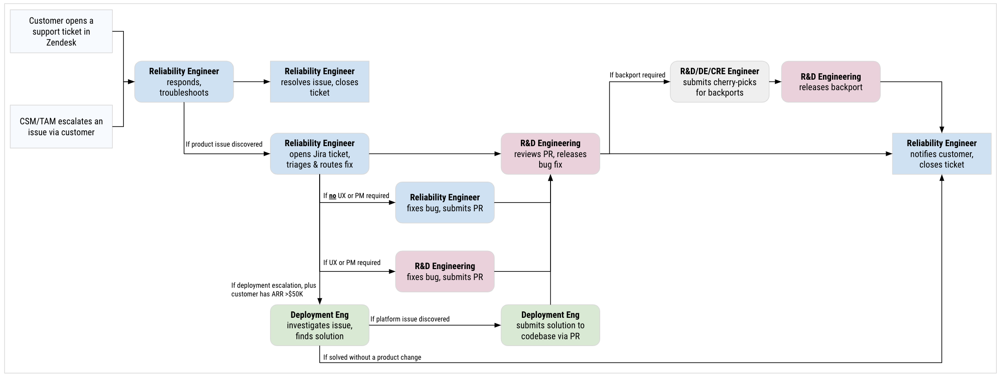
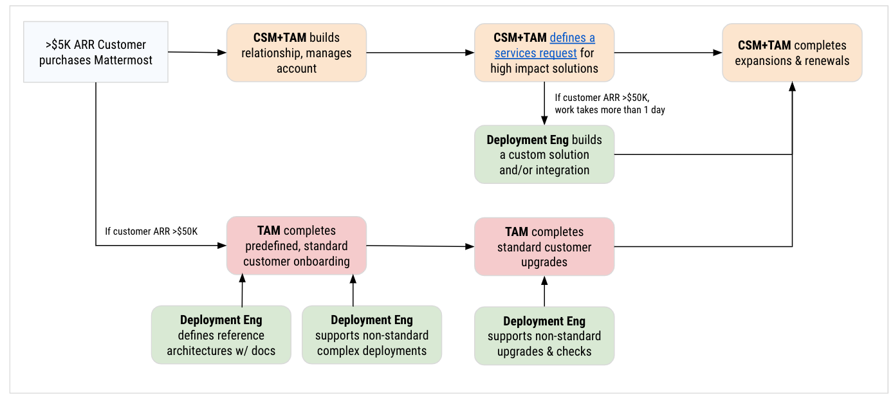

# Deployment Engineering: Workflows

## Workflow: Customer support response workflow

The following diagram demonstrates a workflow for customer support responses:

## Workflow: Customer solution development workflow

The following diagram demonstrates a workflow for customer solution development:

Additional notes:

 - When a solution takes more than 1 day to build, the CSM/TAM prepares a [service request document](https://docs.google.com/document/d/1EbP4Ab7N2hEAv--DRCcZHk0XtlG1MFP8F8F0viaTM7I/edit) to confirm the scope of work with the customer, which then gets prioritized by the Deployment Engineering team.
 - Custom solutions built by the Deployment Engineering are summarized in our [Confluence page](https://mattermost.atlassian.net/wiki/spaces/~557058c88c3d11b60143deaba6d3d018132127/pages/edit-v2/2461925377?draftShareId=13d69a4b-f7ba-4e33-87e2-4e1bee3b0536&inEditorTemplatesPanel=auto_closed).
