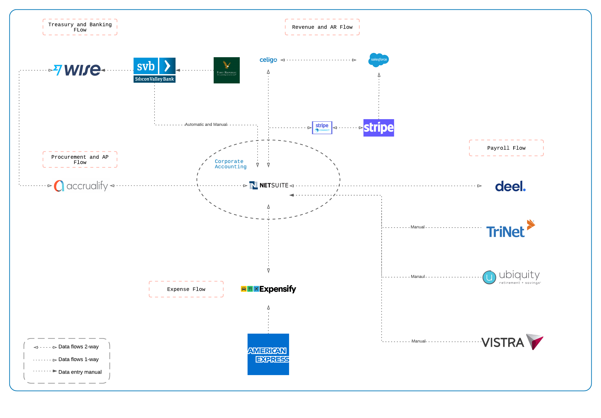

# Operations Playbook

[50% draft](https://handbook.mattermost.com/company/about-mattermost/mindsets#drafts-at-1-50-99)

Purpose: To provide an overview of the current process, playbooks, and flows that govern the day-to-day actions of the Finance and Accounting function. When using the operations playbook, not all documents are made available as they contain sensitive or personal information. To comply with governing laws (e.g. GDPR, CCPA) and the safety of all Mattermost staff, we are only providing access-based merited need. For access rights transparency, you may refer to this [referenceable table](https://handbook.mattermost.com/operations/finance/operations-playbook#roles-and-access-rights) which you may use to see team members authorized to access each document.  

## Accounting overview

[Flowchart Link](https://lucid.app/lucidchart/a9134447-128d-4731-a687-763be22ff980/edit?invitationId=inv_ae8373db-7c88-4728-9db3-7209e1f6c7ec&page=0_0#)

The below table is the current list of each system and provider used within the Accounting function. As we are continuously improving our processes, this list is updated periodically to refelct the current processes and functions. New processes or depricated processes will be noted and dated when added.

|**Systems**|Definition|**Systems**|Definition|
|:----|:----|:----|:----|
|**Netsuite**|ERP system|**Celigo**|Integrator for various systems|
|**Banking**|Silicon Valley Bank or First Republic Bank|**S-Connector**|Integrator for Stripe and Netsuite|
|**Expensify**|Expense tracking, approval, and payments (US)|**Divvy**|For issuing virtual credit cards|
|**Deel**|Staff not going through an entity or contract|**Transferwise**|For paying international vendors|
|**Vistra**|3rd party accounting and payroll provider|**Paypal**|For small ancillary spend|
|**TriNet**|US payroll|**Bamboo**|HR system of record|
|**Ubiquity**|US 401k|**G-Sheet**|Collaboration and supporting docs purpose|
|**Accrualify**|Procure to pay system|**G-Word**|Collaboration and supporting docs purpose|
|**SFDC**|Order logging and forecasting|**G-Powerpoint**|Collaboration and supporting docs purpose|
|**Stripe**|Self-serve and cloud billing system|**Excel**|Collaboration and supporting docs purpose|

### Treasury

Internal processes and framework for day-to-day banking and treasury functions.

|Process Description/Doc Link|System/Tool|Document Type|Flow Chart|Occurrence|AOR|Access Rights|
|:----|:----|:----|:----|:----|:----|:----|
|[Banking and treasury walkthrough](https://docs.google.com/document/d/1GxuAdCF4bBr3yxQwHR03zc72TQ7EoOh11r0oCLJi4hU/edit#heading=h.s8l1kxc5hir)|`SVB` `FRB` `Transferwise` `Accrualfiy`|Process Narrative| |Daily|Ben Graham|Accounting|
|[Payments via Accrualify](https://docs.google.com/document/d/1HOUvNFWpCEznwEyJmWoC5aqfJaIDK3FfYVzUt31MQp8/edit)|`Accrualify` `Netsuite`|Playbook| |Weekly|Jeff Dynda|Accounting|
|[Create wire via Transferwise](https://docs.google.com/document/d/1faaLx4aGwjGIW7EPdlwOAu1EBdG_NLGdagq9KzzzPMc/edit)|`Transferwise` `Netsuite`|Playbook| |Weekly|Jeff Dynda|Accounting|
|[Pay ROW staff via Transferwise](https://docs.google.com/document/d/1_vEICaFz3w4QAK-_j3F85noVll4Q8X7I80GJGFjAKes/edit)|`Transferwise` `Netsuite`|Playbook| |Weekly|Jeff Dynda|Accounting|
|[Settel funding between subsidiaries](https://docs.google.com/document/d/1qLHetaaljiJTF4fWb56OcnIR5XLRFx7kRS3TvNwf9yM/edit?usp=sharing)|`Netsuite`|Playbook| |Monthly|Ben Graham|Accounting|
|[Divvy virtual credit card walkthrough](https://docs.google.com/document/d/1Yypp0jbciDspLDp1_bx0aKi7EuCLs9I6ppc2-zGm6zM/edit#heading=h.hsezwk8fw18o)|`Divvy` `Netsuite`|Process Narrative| |Weekly|Ben Graham|Accounting|
|[Issue, book, monitor, and reconcile divvy corporate cards](https://docs.google.com/document/d/1kLrTfBqeWyPyXia17LJwLn-vI31j2uMJbs_DEd46p7E/edit#heading=h.t8lxnw6fufgs)|`Divvy` `Netsuite` `Accrualify`|Playbook| |Weekly|Ben Graham|Accounting|
|[Reconciling cash](https://docs.google.com/document/d/1igoLD-tSKXqukAcQkanjHDz2FJGp_CT9pOIlaovn3kM/edit#heading=h.3gt7174pkqjt)|`Netsuite`|Playbook| |Weekly|Jeff Dynda|Accounting|
|[Manage and reconcile Paypal](https://docs.google.com/document/d/1FibtBTryBYWSxKEoLULnXbGNK8NjiUjBHhzdXZPQAeM/edit#heading=h.qz5k1zqf0i4s)|`Netsuite` `Paypal`|Playbook| |Weekly|Jeff Dynda|Accounting|
|[Cash disbursement waterfall](https://docs.google.com/document/d/1hpD-c16kx_lliXhuxkF9oNZED9idlzk2O-0nJQlptbY/edit#)|`Netsuite`|Playbook| |Monthly|Jeff Dynda|Accounting|

### Revenue and accounts receivable

Internal processes and framework for order processinng, sales order review and invoicing, recognizing US GAAP revenue, cash collections, and uncollectible receivables.

|Process Description/Doc Link|System/Tool|Document Type|Flow Chart|Occurrence|AOR|Access Rights|
|:----|:----|:----|:----|:----|:----|:----|
|[Lead to contract walkthrough](https://docs.google.com/document/d/1DucB1CJqKqucLTw_9eqsjm6Fo7mE0J1vtaYcP_2Q_as/edit)|`SFDC`|Process Narrative| |Daily|Ben Graham|Mattermost|
|[Order management training videos](https://drive.google.com/drive/folders/1fgpSWCvJ0G97iSngvQr4UlTrv6xatzu7?usp=sharing)|`SFDC`|Drive| |Daily|Nikki Johnson, Jeff Dynda|Accounting|
|[Order management resources](https://drive.google.com/drive/folders/1qYOLgNIFPXxE4Kl875OJWYjv5wHMxlpj?usp=sharing)|`SFDC`|Drive| |Daily|Nikki Johnson, Jeff Dynda|Accounting|
|[Non-production key license provisioning](https://docs.google.com/document/d/1eSVIB40SpEaTHbjd2E9Sl8jt9j0U_Ngjy-aXnQsvbIY/edit?usp=sharing)|`Netsuite`|Playbook| |As needed|Jeff Dynda|Accounting|
|[True-up customer seats]|`SFDC`|Playbook| |Quarterly|Jeff Dynda|Accounting|
|[Review Netsuite sales orders](https://docs.google.com/document/d/11Laa6J8YeHTg94ecqlvYbHoh7t3FEfF6A-Qyi9ZdAG8/edit?usp=sharing)|`Netsuite` `SFDC`|Playbook| |Daily|Jeff Dynda|Accounting|
|[Accounts receivable walkthrough](https://docs.google.com/document/d/1YapE8Vl3pC-0gPDW03JXFULCjOxzyUyEL1D01Xk7j5k/edit#)|`Netsuite`|Process Narrative| |Daily|Ben Graham|Accounting|
|[Book self-serve and cloud billing orders](https://docs.google.com/document/d/1kGJz8lOIjhc5qeuSKcDcMcRiHB3YQ84aWYigP1wMXhA/edit?usp=sharing)|`Netsuite` `Stripe`|Playbook| |Daily|Jeff Dynda|Accounting|
|[Cloud and sales-serve reconciliation](https://docs.google.com/document/d/1K6wjEx7LftW1t8og9EV3vaM9CRsQP7jmDDOfr4nHQ4Y/edit?usp=sharing)|`Netsuite` `Stripe`|Playbook| |Monthly|Jeff Dynda|Accounting|
|[Recognize revenue for self-managed and cloud sales-serve and self-serve sales](https://docs.google.com/document/d/1PUK3qgsgQQ2NOLEEVZAvmeJgkCo4zXs99JKnnKappJk/edit)|`Netsuite`|Playbook| |Monthly|Ben Graham|Accounting|
|[Accounts receivable reconciliation and rollforward](https://docs.google.com/document/d/1yYAIXQjCI17Zd3uRHj798WMNzkdpBImlR5Zs1vsimPw/edit?usp=sharing)|`Netsuite`|Playbook| |Monthly|Jeff Dynda|Accounting|
|[Initiating customer credit freeze](https://docs.google.com/document/d/1TSCUqJh7SoWEpkeozshCDvnrT9sWglHDB5GUoGNXV6M/edit?usp=sharing)|`Netsuite` `SFDC`|Playbook| |Weekly|Jeff Dynda|Accounting|
|[Accounts receivable write-off](https://docs.google.com/document/d/1ogUGZ0jdVbJhHR7wYtB6_WBrCer4UWn7iX1r7cZIO_I/edit?usp=sharing)|`Netsuite`|Playbook| |Quarterly|Jeff Dynda|Accounting|
|[Issuing SLA credits](https://docs.google.com/document/d/1YnvUA6jdAJF55kd4YaILpK_BfrM2MUnkM5XCUXa71MY/edit?usp=sharing)|`Netsuite` `Stripe`|Playbook| |As needed|Ben Graham|Accounting|
|[Record deferred revenue](https://docs.google.com/document/d/1IzKya4OrMcFiiF4iuG9IrKsIcSEZ8YpOpdEPJNLHbnM/edit#heading=h.ocf5tbkimw96)|`Netsuite`|Playbook| |Monthly|Ben Graham|Accounting|
|[Build revenue metrics for month-end close](https://docs.google.com/document/d/1pwIsEE4zSyIlENK9ALtTdIgK-LJem-gt_Ep-0rN0rsU/edit?usp=sharing)|`Netsuite`|Playbook| |Monthly|Ben Graham|Accounting|
|[Create items and SKUs](https://docs.google.com/document/d/15rQQlI1hUE8fyKX6fiQ08ZNkiUKs8awSeP6ROYh2PDo/edit?usp=sharing)|`Netsuite`|Playbook| |As needed|Ben Graham|Accounting|

### Prepaid assets

Internal processes and framework for booking and recognizing upfront payments for future vendor services. 

|Process Description/Doc Link|System/Tool|Document Type|Flow Chart|Occurrence|AOR|Access Rights|
|:----|:----|:----|:----|:----|:----|:----|
|[Prepaids assets month-end close](https://docs.google.com/document/d/1e1OTP2Ru1-vAEv_8PeqffY8JIuJlTzjcz0o1GpwIS1Q/edit)|`Netsuite`|Playbook| |Monthly|Ben Graham|Accounting|

### Fixed assets

Internal processes and framework for booking and recognizing phyiscal property and depreciation/amortization. 

|Process Description/Doc Link|System/Tool|Document Type|Flow Chart|Occurrence|AOR|Access Rights|
|:----|:----|:----|:----|:----|:----|:----|
|[Fixed asset walkthrough](https://docs.google.com/document/d/1Weh3sAyNBvkO0mO_4IUGAltISTE96uEn4sYov9MbtD0/edit)|`Netsuite`|Process Narrative| |Monthly|Jeff Dynda|Accounting|
|[Mattermost hardware buyback]|`Netsuite`|Playbook| |Quarterly|Jeff Dynda|Accounting|

### Procurement and accounts payable 

Internal processes and framework for requesting spend, obtaining functional and financial approvals, review of vendor and consultant contracts, contract signing, invoice processing and classification, and making payments. 

|Process Description/Doc Link|System/Tool|Document Type|Flow Chart|Occurrence|AOR|Access Rights|
|:----|:----|:----|:----|:----|:----|:----|
|[Accounts payable walkthrough](https://docs.google.com/document/d/1e4_6qs4WM50Hz0lMrU8ba9k2e03iZnWdIuWMw0c6jeg/edit)|`Netsuite` `Accrualify`|Process Narrative| |Daily|Jeff Dynda|Accounting|
|[Running procurement at Mattermost](https://docs.google.com/document/d/18W6uergx-KZhZuldyLa1NQyAR8S-RHZPnih6ihbeKlU/edit)|`Netsuite` `Accrualify`|Playbook| |Weekly|Jeff Dynda|Finance|
|[Entering bills and classification practices]|`Netsuite` `Accrualify`|Playbook| |Daily|Jeff Dynda|Accounting|
|[Accruals at month-end](https://docs.google.com/document/d/1sgLkB35q_DStmW3Rbk27VYZwcto1TSRH5fkmE-PeBWc/edit#heading=h.v0nizejuvq0k)|`Netsuite` `Accrualify`|Playbook| |Monthly|Ben Graham|Accounting|
|[AWS accrual at month-end](https://docs.google.com/document/d/1-INok4z_MCr6ClszamVAZ9yM9D0JhdWOvY4ufEbTPCA/edit)|`Netsuite` `Accrualify`|Playbook| |Monthly|Ben Graham|Accounting|
|[How to account for a Hackathon event](https://docs.google.com/document/d/1R3LHbrXmrhIlzBbC0t9TGxahq1xUS505eM8vo9dEN8M/edit#heading=h.50wmruhabvdn)|`Netsuite` `Accrualify`|Playbook| |As needed|Jeff Dynda|Mattermost|
|[Example: Hackathon event](https://docs.google.com/spreadsheets/d/1S62A6O63O3c92uIRYpZ5zqUAfcsgV4RBipe5LdIS_rY/edit#gid=681665569)|`Netsuite` `Accrualify`|Playbook| |As needed|Jeff Dynda|Accounting|

### Payroll

Internal processes and framework for day-to-day payroll processes.

|Process Description/Doc Link|System/Tool|Document Type|Flow Chart|Occurrence|AOR|Access Rights|
|:----|:----|:----|:----|:----|:----|:----|
|[Deel walkthrough](https://docs.google.com/document/d/1ZgHUD1B9KIzBQAZiHfL7yvYUBQ4lDQvvTgG-JF6kbw8/edit#)|`Deel`|Process Narrative| |semi-monthly|Ben Graham|Accounting|
|[Deel Payroll](https://docs.google.com/document/d/1I3OzopX0tuXB0vvKts3fFB4jke6SLFWrBi9uJL69tOw/edit#)|`Deel`|Playbook| |Monthly|Shawna Young-Marcelino|Accounting|
|[US Payroll](https://docs.google.com/document/d/1TlDpPMZqs_sq1k2bjTxIkcBtff1y52Reeo5h3UM0IAY/edit?usp=sharing)|`Netsuite` `TriNet`|Playbook| |Semi-monthly|Shawna Young-marcelino|Payroll|
|[Canada Payroll](https://docs.google.com/document/d/1OJ_JoiSdA84h-IN6UZ9O6ZkzW2wgGg2Mv5047q1gKxQ/edit?usp=sharing)|`Netsuite` `Vistra`|Playbook| |Semi-monthly|Shawna Young-Marcelino, Vistra|Payroll|
|[UK Payroll](https://docs.google.com/document/d/1OJ_JoiSdA84h-IN6UZ9O6ZkzW2wgGg2Mv5047q1gKxQ/edit?usp=sharing)|`Netsuite` `Vistra`|Playbook| |Semi-monthly|Shawna Young-Marcelino, Vistra|Payroll|
|[Germany Payroll](https://docs.google.com/document/d/1OJ_JoiSdA84h-IN6UZ9O6ZkzW2wgGg2Mv5047q1gKxQ/edit?usp=sharing)|`Netsuite` `Vistra`|Playbook| |Semi-monthly|Shawna Young-Marcelino, Vistra|Payroll|
|[Contractor Invoice Approval]()|`Accrualify`|Process| |Monthly|Shawna Young-Marcelino|Payroll|
|[Commissions Approval & Payment]()|`Salesforce`|Process| |Monthly|Shawna Young-Marcelino, Ben Graham|Payroll, Accounting|
|[401K Administration](https://docs.google.com/document/d/1Ny0zOr98InPnybaQoMP82laXPmtNDTkXuECIBfyVCx8/edit#heading=h.s1shpwm3yp4j)|`Netsuite` `Ubiquity`|Playbook| |Weekly|Shawna Young-Marcelino|Payroll|
|[Sunlife Benefits]()|`Sunlife`|Process| |Ongoing|Shawna Young-Marcelino|Payroll|

### Equity

Internal processes and framework for equity transactions and US GAAP expense reporting

|Process Description/Doc Link|System/Tool|Document Type|Flow Chart|Occurrence|AOR|Access Rights|
|:----|:----|:----|:----|:----|:----|:----|
|[Equity Narrative](https://docs.google.com/document/d/1rx-EJbWnRH9KLGtGKRSK-YFxhoTXNNoUh0iPq6EPfj0/edit#heading=h.ex0tpzh4lbzf)|`Netsuite` `Banking`|Process Narrative| |Monthly|Tim Quock|Finance|
|[Stock-based compensation expense]|`Netsuite`|Playbook| |Quarterly|Ben Graham|Equity|
|[Equity Exercise Playbook](https://docs.google.com/document/d/1eLEo0tLwuagSrf4ZAxIQo4gfiQ4KurlrpbN-itZOMdg/edit#heading=h.de5nkskkw5cj)|`G-word`|Process Narrative| |As needed|Ben Graham|Mattermost|
|[FAQ: Exercising options](https://docs.google.com/document/d/1qpapX87dv1Sz62KOdqWXvOb5a6mqVyKxwaj65Sw6Pb0/edit?usp=sharing)|`G-word`|FAQ| |As needed|Tim Quock|Mattermost|
|[FAQ: Mattermost Stock Plan](https://docs.google.com/document/d/1jcYEMZvg2xGz5XdlxE661Aw0vgVL0u1FiOs8tBdUVwY/edit?usp=sharing)|`G-word`|FAQ| |As needed|Tim Quock|Corporate Finance|

### Expenses

Internal processes and framework for [how to spend company money](https://handbook.mattermost.com/operations/finance/staff-member-expenses/how-to-spend-company-money).

|Process Description/Doc Link|System/Tool|Document Type|Flow Chart|Occurrence|AOR|Access Rights|
|:----|:----|:----|:----|:----|:----|:----|
|[Expensify process steps](https://docs.google.com/document/d/1KNxkFFvxy97fxWOQPNfomJqEoudI8ENdcAUCJxXOMRU/edit?usp=sharing)|`Expensify`|Playbook| |Weekly|Ben Graham|Accounting|
|[Setting expenses as Netsuite VBRs](https://docs.google.com/document/d/17RFq5-eB5zkXGMO8jUi9isEUAgiov_9-Oyb9UaVthJM/edit#heading=h.5m7i51t7tl7m)|`Expensify` `Netsuite`|Playbook| |Daily|Jeff Dynda|Accounting|
|[Adding members to Expensify](https://docs.google.com/document/d/1iaPZOoOY8uQhogYs9_rCJk_v2fgVhfwZrb7zmg8wbZ4/edit#heading=h.l7pofzxjrg1k)|`Expensify`|Playbook| |Daily|Ben Graham|Accounting|
|[Adding New Categories and Classifications in Expensify](https://docs.google.com/document/d/12UdEI9A96WYrxV7AqHdEfYpi2peEXOQM2-GlZ_nzCVA/edit)|`Expensify`|Playbook| |As needed|Ben Graham|Accounting|
|[Expensify policy matrix](https://docs.google.com/spreadsheets/d/1CcfCjzHOjrnvkvSlwjTosVuKyvhflqhiaiVX_HlmVuY/edit#gid=0)|`Expensify`|Playbook| |Weekly|Ben Graham|Accounting|
|[Presentation: How to spend company money](https://docs.google.com/presentation/d/1FC9Pd28_KI18vPjTd2Qh_Oe6K9O1E61P131Pj5IODjc/edit?usp=sharing)|`G-powerpoint`|FAQ| |As needed|Ben Graham|Accounting|

### Intercompany

Internal processes and framework for intercompany transactions and reporting.

|Process Description/Doc Link|System/Tool|Document Type|Flow Chart|Occurrence|AOR|Access Rights|
|:----|:----|:----|:----|:----|:----|:----|
|[Intercompany walkthrough](https://docs.google.com/document/d/13_WNXzYL05lzQD3r6d_dSzMAYU2svh-Y29rlxqWIcqE/edit)|`Netsuite`|Process Narrative| |Monthly|Ben Graham|Accounting|
|[Intercompany loan and interest](https://docs.google.com/document/d/15FZ5YtepP8uR2WipPRrpnUDZ2Lxb3xgTuUyXCAnejUg/edit?usp=sharing)|`Netsuite`|Playbook| |Monthly|Ben Graham|Accounting|

### Corporate accounting and consolidations

Internal processes and framework for financial consolidations and other corporate matters. 

|Process Description/Doc Link|System/Tool|Document Type|Flow Chart|Occurrence|AOR|Access Rights|
|:----|:----|:----|:----|:----|:----|:----|
|[Month-end close checklist](https://docs.google.com/document/d/1qj-cVa48uQrxp_KBiV_dvDKmtKFgr4ds_msFC0750zg/edit)|`Netsuite`|Playbook| |Monthly|Ben Graham|Finance|
|[Allocations](https://docs.google.com/document/d/1Vu5y8OirRNGyYpCgzHhOmCicB32hgOUk8IMrKCQa4kY/edit#heading=h.z7wd719ew1n5)|`Netsuite`|Playbook| |Monthly|Ben Graham|Accounting|
|[Approvals Matrix](https://docs.google.com/spreadsheets/d/1fDIMiO0uydB_1zCUxZ4sGfSnBJ0P_49zbeQGgTqbYPI/edit#gid=1632055194)|`G-sheet`|Other| |Weekly|Tim Quock|Mattermost|
|[Legal structure and company information](https://docs.google.com/spreadsheets/d/1JMP6s594j-cJQ5fiqURvR4a3ViSD-_QinpnJN7DFxjY/edit?usp=sharing)|`G-sheet`|Other| |As needed|Tim Quock|G&A|

### Taxes

Internal processes and framework for corporate taxes, sales and use tax, and other tax matters.

|Process Description/Doc Link|System/Tool|Document Type|Flow Chart|Occurrence|AOR|Access Rights|
|:----|:----|:----|:----|:----|:----|:----|
|[Corporate federal and state taxes process]|`Netsuite`|Playbook| |Quarterly|Ben Graham|Accounting|
|[Recording sales tax](https://docs.google.com/document/d/11x58FKOHCmIQedvrGEsuNZnT_SEUzUuUc8Vyg02bqXc/edit?usp=sharing)|`Netsuite`|Playbook| |Quarterly|Ben Graham|Accounting|
|[Record and pay WA sales tax](https://docs.google.com/document/d/1gAK_9lqhkEod4BSD6NB0mpE-4XnDU-P20qozVln5TE4/edit?usp=sharing)|`Netsuite`|Playbook| |Monthly|Jeff Dynda|Accounting|

### Systems

Internal processes and framework for system integrations and automated workflows/scripts.

|Process Description/Doc Link|System/Tool|Document Type|Flow Chart|Occurrence|AOR|Access Rights|
|:----|:----|:----|:----|:----|:----|:----|
|[Overview of Celigo integration](https://docs.google.com/document/d/1KFeexDhV4tYfRoPecB1lo-932UGGEFxjjWMJYx6ei3M/edit)|`Celigo` `Bamboo` `Netsuite` `SFDC`|Playbook| |As needed|Ben Graham|Finance|
|[Bamboo to Netsuite integration]|`Celigo` `Bamboo` `Netsuite`|Playbook| |As needed|Ben Graham|Finance|
|[Stripe to Netsuite integration](https://docs.google.com/document/d/1cSKIx6GFdlK4mDkJcyh5QKZci8JqscRwwTeDHdMgsps/edit?usp=sharing)|`S-connector` `Netsuite` `Stripe`|Playbook| |As needed|Ben Graham|Finance|
|[SFDC to Netsuite integration]|`Celigo` `Netsuite` `SFDC`|Playbook| |As needed|Ben Graham|Finance|
|[Deel to Netsuite integration](https://docs.google.com/document/d/1TX9uwSfflXz-4T-J6_gVPB-gwyIYcb2QI-Om4OLFCqk/edit?usp=sharing)|`Deel` `Netsuite`|Playbook| |As needed|Ben Graham|Finance|
|[Non-posting discount items](https://docs.google.com/document/d/1wJ5ZUhdPuJsBmd5KzLIWgtYOE_kAJKE4jp8RX4z_NhA/edit?usp=sharing)|`Netsuite`|Playbook| |As needed|Ben Graham|Finance|
|[Automated dunning process](https://docs.google.com/document/d/14Ihyy4YorrCjCv02aovvO9BSNpbJnkBWrEA13yeXW3Q/edit?usp=sharing)|`Netsuite`|Playbook| |As needed|Jeff Dynda|Finance|

## Corporate finance overview

The corporate finance function consists of FP&A operations, Corprorate Finance and Budget, Long-term Planning, and Strategic Finance.

### Budget

Internal processes and framework to run the annual budget, review actuals to budget, and out of cycle budgetary requests. 

|Process Description/Doc Link|System/Tool|Document Type|Flow Chart|Occurrence|AOR|Access Rights|
|:----|:----|:----|:----|:----|:----|:----|
|[Approving new headcount](https://docs.google.com/document/d/1blReXzdOu5J1CaUuMYC2slbYrT5NZnhSC7Eeh2I3dLg/edit?usp=sharing)|`G-sheet` `Excel`|Playbook| |Annual|Elad Rosenberg|Corporate Finance|
|[Budget Process]()|`G-sheet` `Excel`|Playbook| |Annual|Elad Rosenberg|Corporate Finance|

### Financial, planning and analysis (FP&A)

Internal processes and framework for day-to-day FP&A responsabilites. 

|Process Description/Doc Link|System/Tool|Document Type|Flow Chart|Occurrence|AOR|Access Rights|
|:----|:----|:----|:----|:----|:----|:----|
|[Corporate finance walkthrough]| |Process Narrative| |Weekly|Elad Rosenberg|Corporate Finance|
|[Update finance operating model]| |Playbook| |Monthly|Elad Rosenberg|Corporate Finance|
|[Provisioning Req-Ids (TO BE UPDATED)](https://docs.google.com/document/d/1ziIFoI0dB0_WZZHBeGAy0BLNMafl0jGAdQ6Z7QA3Ah8/edit#heading=h.7cmjl0j27jxm)| |Playbook| |As needed|Elad Rosenberg|Corporate Finance|
|[Systems spend forecast](https://docs.google.com/spreadsheets/d/1F3tk1eWfeT_Kk8CbjS-Av_Z4LN7Po9Pig2KAm6h5Jlw/edit?usp=sharing)| |Playbook| |Monthly|Elad Rosenberg|Corporate Finance|
|[Marketing forecast](https://docs.google.com/spreadsheets/d/1zU4Qn0UhDvqXbw3VBuZ0nCKnWBCEe3mSr94GHm8adI4/edit?usp=sharing)| |Playbook| |Monthly|Elad Rosenberg|Corporate Finance|

### Financing

Internal processes and framework for loans, line of credits, and financing rounds.

|Process Description/Doc Link|System/Tool|Document Type|Flow Chart|Occurrence|AOR|Access Rights|
|:----|:----|:----|:----|:----|:----|:----|
|[Financing](https://docs.google.com/document/d/1Fxe51I60yo3RGNyvoBCAsetu1JEGSIgRk9WKLdoeq5U/edit?usp=sharing)| |Playbook| |As needed|Tim Quock|Corporate Finance|
|[409A valuation process]| |Playbook| |Annual|Elad Rosenberg|Corporate Finance|

## Roles and access rights

Below is a list of access roles. If you are trying to access a document in, you can only do so if you have the permission to do so. All roles are administered via Google Suite shared drive. If you are unable to access a document and believe you should, reach out to Tim Quock, VP Finance. 

|Access Role|Members|
|:----|:----|
|[Finance](https://drive.google.com/drive/folders/1W9vxRRPgzIeBF12k3GzhLS4spoiSm0ow?usp=sharing)|All of Finance (Finance and Accounting)|
|[Corporate Finance](https://drive.google.com/drive/folders/1E6DByz8Ea0tDvw2_flmDJNQu-1e3cdGN?usp=sharing)|FP&A
|[Accounting](https://drive.google.com/drive/folders/1ks7MSjrfQoP2YfhBD4EmG8xGJI1zKvEF?usp=sharing)|All of Accounting|
|[Payroll](https://drive.google.com/drive/folders/1DpBE2VLAQhGlP-UytUEyok3RHgaaK0Sc?usp=sharing)|Payroll Team Only|
|[Mattermost](https://drive.google.com/drive/folders/1ofBZbAdpDUHud3kGWAv0jJSwM-n8kFx8?usp=sharing)|All of Mattermost Staff|
|MLT|Executive Team Only|
|[G&A](https://drive.google.com/drive/folders/1sc6sVfXDE-nADfpHhvGlh1CoyMz0J-45?usp=sharing)|All of G&A|
|[Equity](https://drive.google.com/drive/folders/1rEgoUcuNRJmfRgFr3ocvD10bqi8fzHtf?usp=sharing)|Finance team members that are allowed to view equity|
