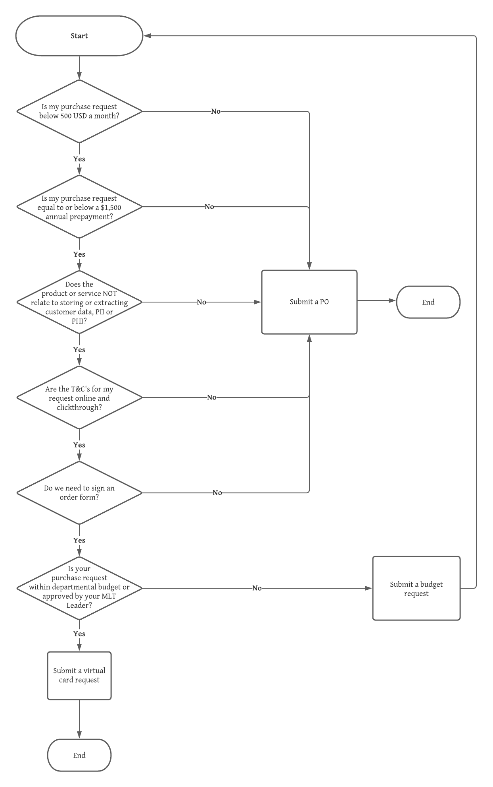

# Purchasing

The purpose of this page is to guide you as you are making purchases on behalf of Mattermost. As you are making purchases on behalf of Mattermost, please refer to the Purchase Decisioning Tree below to help guide you through the Procurement process.

After you have gone through the decisioning tree, refer to the pages below for further guidance on how to move forward with your puchase request:

1. [Submit a PO](https://handbook.mattermost.com/operations/finance/purchasing/how-to-procure-a-vendor-contract)
2. [Submit a virutal card request](https://handbook.mattermost.com/operations/finance/purchasing/request-a-divvy-virtual-credit-card)
3. [Submit a budget request](https://handbook.mattermost.com/operations/finance/budget)

For additional help, please reach out to the [Procurement team](https://github.com/mattermost/mattermost-handbook/tree/a3207bf2aa836a92f17e38342551c6ab1d03686d/operations/finance/purchasing/Procurement@mattermost.com) or post a question in the [Purchases Channel](https://community.mattermost.com/private-core/channels/purchases).

