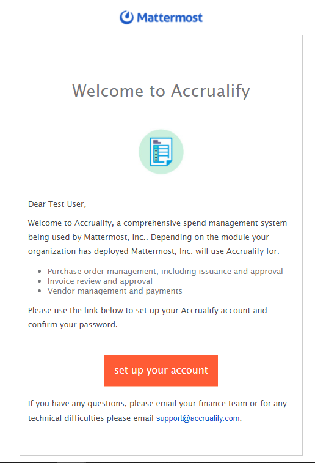
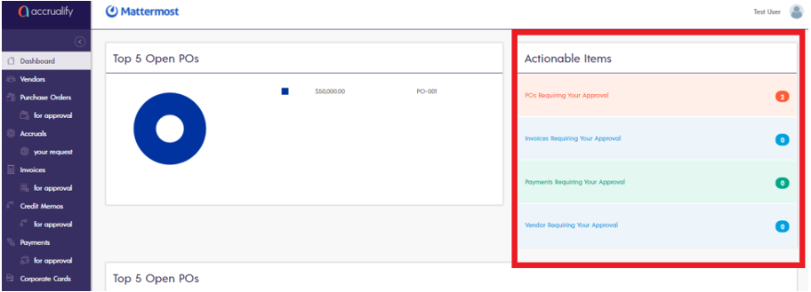

# Setting up your Account

The Finance team will send you a Welcome email from Accrualify if you need to do any of the following:

* Submit a purchase order
* Review a purchase order
* Review a vendor invoice

If you need to submit a purchase order, please make sure you've submitted a [budget request](https://handbook.mattermost.com/operations/finance/spending-company-money/budget). Once your budget request has been approved, the Finance team will provision you an account on Accrualify. You should receive a “Welcome to Accrualify” email, which includes a link to set up your account.

Once you have set up your account, you can log in to see your Accrualify dashboard to review and take action on your actionable items.

If you'll be out of office for any amount of time and would like to assign a vacation delegate during your time away, please reach out to AP@mattermost.com.

