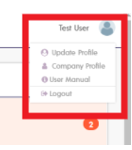

## How to navigate Accrualify

When you log in to Accrualify, you're taken directly to your dashboard. In the upper right hand corner of the screen, you can see your avatar.

Select your avatar to update your user profile and to access the Accrualify user manual.

In the left hand navigation pane you'll see the different modules you can access. Some of the common modules you will use are described below.

Select the **Vendor** module to see the list of vendors that Mattermost purchases from. 
- To search for a vendor, enter the name of the vendor in the **Vendor** text box. 
- To display more vendor details, select the green plus sign to the far right of the screen to see available column options. From here, select the columns to display on the grid, such as **Id**, **Acct Mgr**, and **Terms**.

Select the **Purchases** module to see purchase orders that you've submitted.

Within the **Purchases** module, you'll also see purchase orders ready for your review and approval.

Select the **Invoices** module to see invoices that are ready for your approval.

In the **Credit memos** module, you will also be able to see any credit memos that would need to be applied to an invoice. This would probably not happen too often.

In the **Payments** module, you'll see the payment status of your invoices.

For now, you won't need to access the **Accruals** or **Corporate Cards** modules.

For Corporate Card requests, please refer to the [Virtual Credit Card](https://handbook.mattermost.com/operations/finance/spending-company-money/procurement/request-a-divvy-virtual-credit-card) section of the Handbook.
