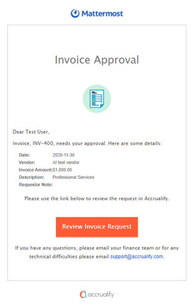
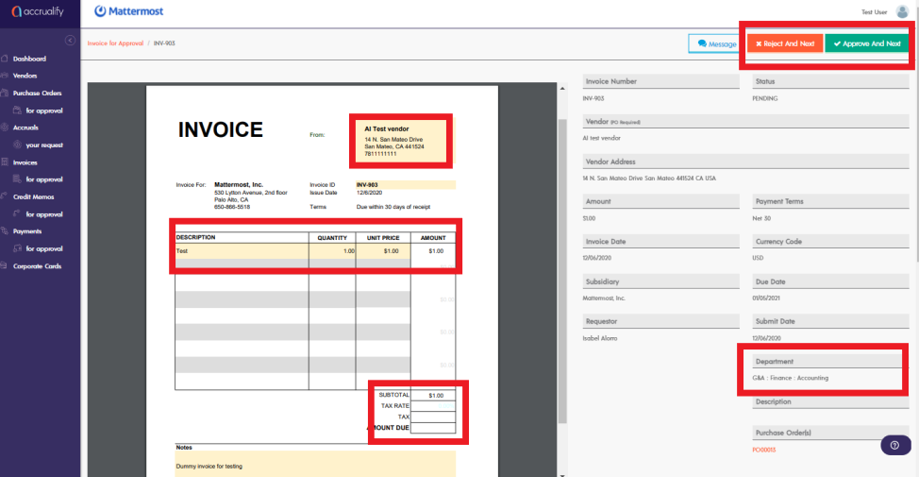
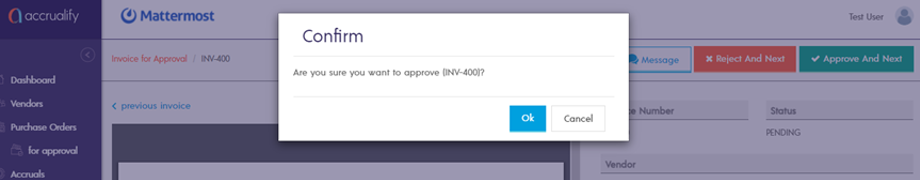
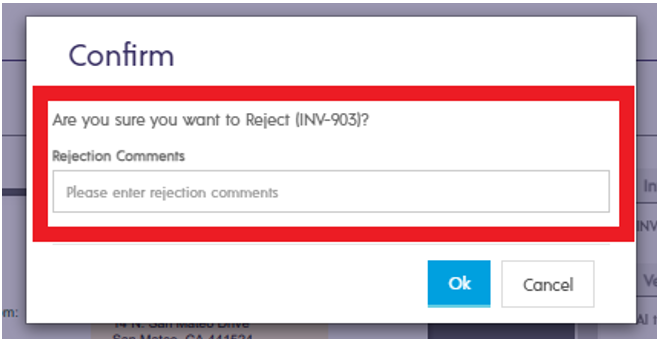

## How to Review a vendor invoice

If you need to review a vendor invoice, Accrualify will send you an email alerting you that an invoice is ready for review and approval. From the email, select the “Review Invoice Request” link to go directly to the invoice that needs your attention.

Once you're directed to the pending vendor invoice, please review the following details:

1. **Vendor:** Please make sure you are reviewing an invoice for the vendor that you have submitted a PO for.
2. **Amount:** Please make sure the amount on the invoice matches the PO submitted.
3. **Department:** Please make sure the department this spend is going to is your department or is properly allocated to your department if the spend is shared with other departments.
4. **Description:** Please make sure the description on the invoice is accurate (for example, it describes the service performed by the vendor for Mattermost).

Once you have reviewed the invoice and are ready to approve, click **Approve and Next**. After you approve the invoice, a Confirmation will pop up to ask **Are you sure you want to approve (invoice xxx)?**. Click **Ok**.

If you need to reject the vendor invoice, select **Reject and Next**. Rejecting the invoice means you disagree with one or more invoice details. 

When prompted, please provide the reasons for rejecting the invoice in the **Rejection Comments** text field then select **OK**.

, Select **Dashboard** to return to your dashboard and check for other open items that need your attention.

If you have any questions on the Invoice module, please contact [AP@mattermost.com](AP@mattermost.com).
