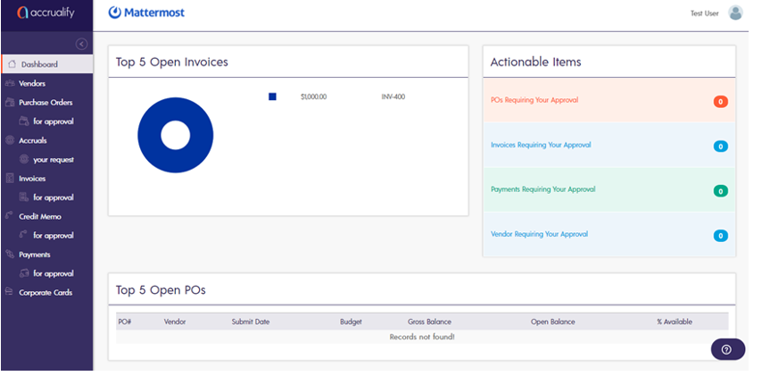

## How to Review a vendor invoice

If you need to review a vendor invoice, Accrualify will send you an email alerting you that an invoice is ready for review and approval. From the email, select the “Review Invoice Request” link to go directly to the invoice that needs your attention.

Once you're directed to the pending vendor invoice, please review the following details:

1. **Vendor:** Please make sure you are reviewing an invoice for the vendor that you have submitted a PO for.
2. **Amount:** Make sure the amount on the vendor invoice matches the submitted purchase order.
3. **Department:** Make sure this spend is for your department (or is properly allocated to your department in cases where the spend is shared with other departments).
4. **Description:** Make sure the description on the invoice is accurate. For example, a description of the service performed by the vendor for Mattermost.

Once you have reviewed the vendor invoice and are ready to approve it, select **Approve and Next**. 
When prompted to confirm the approval, select **OK**.

If you need to reject the vendor invoice, select **Reject and Next**. Rejecting the invoice means you disagree with one or more invoice details. 

When prompted, please provide the reasons for rejecting the invoice in the **Rejection Comments** text field then select **OK**.

, Select **Dashboard** to return to your dashboard and check for other open items that need your attention.

If you have any questions on the Invoice module, please contact [AP@mattermost.com](AP@mattermost.com).
