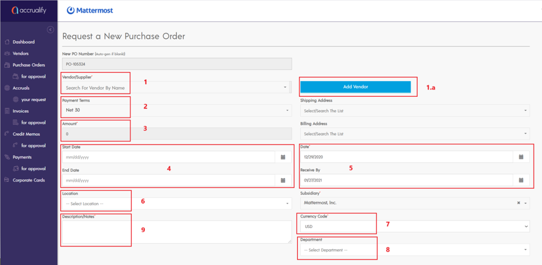

# Submitting a Purchase Order

Log into Accrualify and go to the Purchase Module on the left hand side of the screen. Select the orange **Request PO** button.

Fill in the primary information in the **Request a New Purchase Order** form. The screenshot below highlights all the required fields for successful submission.

Mapping key to each field and purpose:

1. **Vendor/Supplier:** This is a search bar. The vendor name must match exactly for the vendor to appear available. Refer to Finding a Vendor for steps detailing how to successfully locate a vendor.
      * **Add Vendor:** Only click this button if you have taken all previous steps to determine if your vendor exists as an active vendor in our repository. Refer to section Requesting a Vendor.
2. **Payment terms:** Mattermost standard payment terms is Net 30. If your vendor accelerated payment terms like Net 15, Net 7, or due on receipt, this will require additional approval from Finance. You should reach out to procurement@mattermost.com or in the Finance Team Channel.
3. **Amount:** This field is intentionally grayed out as it auto-fills based on the information in the PO Expenses section.
4. **Start Date/End Date:** These are the dates for when the services will start and complete. For goods being delivered on a specific date, the start and end date should match.
5. **Date/Receive By Date:** This is automatically populated based on today’s date. This may be changed, but is not recommended as this will account at the request date. The **Receive by** field is the date you would ideally like to PO to be approved. Note that we still maintain standard SLAs. If the request is urgent, we will do our best to accommodate but make no guarantees. If you're working with a new vendor on negotiations, it's advisable to bring the Procurement team as early as possible to avoid any potential delays or missed dates.
6. **Location:** This is the country that the vendor is physically providing services from.
7. **Currency Code:** Represents the currency preferred by the vendor and what the vendor will invoice Mattermost. This should be defined in the contract.
8. **Department:** This field is a drop down list. If you're completing a PO Request Form for yourself, it's generally assumed the spend will map to your department. If you're unsure what department you belong to, you can reference your department in BambooHR as seen in the screenshot below. If you're submitting a PO on behalf of someone else, it's advised to use their department in BambooHR. If you believe spend should be allocated to more than one department, make note of this in the **Description/Notes** section of the form.

9. **Description/Notes:** It’s important that we collect as much information as possible of the purpose and intent of the goods/services that the vendor is providing to Mattermost. The more information the better. However, at a minimum we require the following:
      * *Type of Service:* Software, consulting spend, contractor, etc.
      * *Purpose:* The intention for requesting spend: Example: Product software for UX design or contractor spend for Salesforce administration.
      * *Type of Spend:* Is this a fixed amount or variable. Be explicit as to what you are purchasing. Example: monthly retainer for the same amount over 4 months would be considered fixed versus billing on a number of registered users would be variable.
      * *Invoice Billing Frequency:* Monthly, quarterly, annually, etc.
      
## Adding Attachments

In general, a supporting document or form should accompany the purchase order request. To upload a document, find the blue **Add Attachments** button at the bottom of the **Request a New Purchase Order** form. Attach all associated legal documents needed for review. Some examples of legal documents may include:

1. Vendor Master Service Agreement
2. Vendor Online Terms and Conditions
3. Vendor Supplier Form
4. Vendor Purchase Order Form
5. Vendor Service Order Form
6. Sponsorship Agreement
7. Corporate Agreement
8. Addendum or Amendment to a Contract

## Finding a Vendor

If you're unsure whether your vendor is on file or unsure of the legal name of the vendor, you can refer to the Vendor Module to quickly look up a vendor by entering the name of the vendor in the column titled **Vendor** as seen in the screenshot below.

Vendors are named in our system based on the legal name provided on the vendor's W-9. However, the vendor may be Doing Business As “DBA” under an alternative alias.

**Example**: Netsuite is owned by Oracle, Inc. We are billed by Oracle but the software known at Mattermost is Netsuite.

If you're unable to locate the vendor and believe that your vendor is active, reach out to the Accounting team at AP@mattermost.com or the [Purchases Channel](https://community.mattermost.com/private-core/channels/purchases).

## Requesting a Vendor

If you're unable to find the vendor in question through the recommended channels, then select the blue **Add Vendor** button and complete the basic vendor information:

* Vendor Module
* **Vendor/Supplier** search field on the **Request a New Purchase Order** form
* Accounting Team is unable to locate the vendor or DBA name

If your vendor is a US vendor or supplier and you have a copy of their W-9, upload the signed documents by clicking the blue **Upload W9** button. Don't check **Send Welcome Email** if this appears on your screen. The Finance team will send the new vendor a welcome email once the PO has gone through the proper approval process.

When completing the New Vendor Details, be mindful of the following:

* If the PO request is in a currency other than USD, you can use the currency in the **Currency Code** drop down menu. After you submit the PO, the amount will convert to USD.

## How to complete PO Expenses section

At the bottom half of the page under **Request a New Purchase Order** is a section titled **PO Expenses**. This should be completed as well, but don’t worry if you get this wrong. The Finance team will be reviewing these sections thoroughly and modifying the PO forms on the back-end. That said, it's still beneficial to complete the following sections:

1. **Category:** Represents the type of spend that you will incur. A full list of expenses, definitions, and examples can be found in the Expense Category Definitions table.
2. **Amount:** Represents the total requested dollar amount. The request should be based on the currency which the vendor will invoice Mattermost. The **Currency Code** selected above will drive the amount.
3. **Department:** Should mirror the department selected in the section above.
4. **Location:** Should mirror the location selected in the section above.
5. **Business Unit:** Classifications used to categorize spend. A full list of expenses, definitions, and examples can be found in the Business Unit Definitions table.
6. **Start and end dates:** Should mirror the start and end dates in the section above.
7. **Memo:** Copy and paste the text from the **Description** section above.

**Note:** You don't need to choose an **Account and Amortization Template**.

The Procurement team will reach out to you if additional information is needed.

Once the form is complete, attach the appropriate legal documents and click **Submit** to start the approval workflow process. You can always check the status of your request in the Purchase Order Module or feel free to reach out to procurement@mattermost.com for further details on your request.

## Business Unit Definitions

Please note that these Business Units are similar to the Classifications found in Expensify.

| Business Unit  | Definition  | 
| :------------ |:---------------|
| Advisor | Expense related to Advisory services for MM |
| Bounty Projects | Fees for Services Related to Bounty Projects|
| Business Operations | Expenses to support office and business operations; stamps, postage, supplies, snacks, etc.|
| Conferences & Trade Shows | Expenses incurred to get to, attend, or stay at Conference/Trade Show|
| Consultants | Expense related for payment to Non-ROW Consultants & Contractors|
| Customer Facing | Expenses incurred when meeting, spending time, or entertaining a current or potential customer|
| Marketing Events | Expenses incurred to attend marketing events, seminars, etc.|
| Mattercon | Expenses for Mattercon events only |
| Community Member | Community Member expenses for Mattercon events only |
| Onboarding | Expenses for new hire home and office equipment; travel for onboarding training, etc. |
| Recurring Subscriptions | Expenses that are recurring in nature and support business operations; mobile subscriptions, software licenses, etc. |
| Simulation Projects | Expenses for candidate simulation projects sponsored by Mattermost |
| Staff | Expense related for payment of Monthly Salary & Periodic Bonuses to ROW Staff |
| Support | Revenue and CoS for customer support products |
| Systems | Expenses, greater than $500, incurred for work performed on systems |
| Team Celebration | Expenses for department head approved celebration with staff members |
| Team Events, Meetups & Offsites | Expenses incurred for Team Events, Meetups, or Offsites, which include all known travel costs |
| Training | Expenses incurred for work-related online courses and professional development certifications |

## Expense Category Definitions

| Expense Category  | Definition | Examples | GL Acct # |
| :------------ |:---------------| :-----| :-----|
| Advertising | Online and print advertising       |  Google ads, Facebook ads, Twitter ads |   66060 |
| Advisory or Consulting | Advisory (individuals or firms) or consulting (firms) services provided to Mattermost              |   TrustArc, BPE Global |  12040 |
| Audit and Tax Fees | Audit and tax services provided to Mattermost        |    PwC, EY, Deloitte |  62040 |
| Candidate Attainment Projects | Simulations and other related projects for prospective candidates       |    Simulation projects |  62030 |
| Company Events | Services provided to Mattermost for company sponsored events        |    Mattercon|  60530 |
| Company Swag | Mattermost branded swag NOT for marketing campaigns        |    Printfection, Kotis |  60540 |
| Conference and Seminars | Conferences and seminars (NOT Marketing related)        |     |  63070 |
| Contractor or Consultant | Individuals who will provide contractor or consulting services to Mattermost at an hourly or fixed fee for a specified period of time | Bounty Projects, contractors with SOWs |  62030 |
| Dues & Subscriptions | Dues and Subscription fees for professional, technical or trade publications        |    Financial Times, Wall Street Journal |  64010 |
| Hosting COS | Hosting web services (e.g. AWS) - allocation for Cost of Sales       |    AWS|  50020 |
| Hosting Expense | Hosting web services (e.g. AWS)      |    AWS|  64080 |
| HR Fees | Human resource services (individuals and firms) provided to Mattermost        |    TriNet, Vistra |  62070 |
| Job Advertising | Fees paid to advertise open positions to potential candidates (e.g. job boards)      |   StackOver Flow, Cyber Coders, Indeed, LinkedIn |  61050 |
| Legal Fees | Legal and compliance services (individuals and firms) provided to Mattermost        |    Law firms |  62050 |
| Marketing Promotional Materials | Promotional marketing materials        |     |  66040 |
| Marketing Swag | Mattermost branded swag for marketing campaigns only       |    Zazzle, Printfection |  66070 |
| Prepaid Insurance | All types of insurance policies, varying in period of time and premium amounts       |    The Hartford |  12010 |
| Prepaid Marketing & Advertising | Marketing and advertising services (e.g. public relations, search engine optimization and web & content development etc.) provided to Mattermost       |    |  12020 |
| Prepaid Software/SaaS Licenses | Software license fees paid in advance (a year or more)        |    NetSuite, Celigo, Snowflake, SalesForce |  12030 |
| Recruiting Fees | Fees paid to third party recruiters for candidate placement        |     |  61010 |
| Recruiting Services | Fees paid to third party service firms for recruitment efforts        |    |  61020 |
| Software Expense | Software licenses and subscription (monthly)        |    Figma, Dribbble |  64040 |
