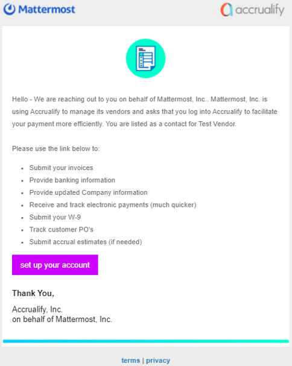
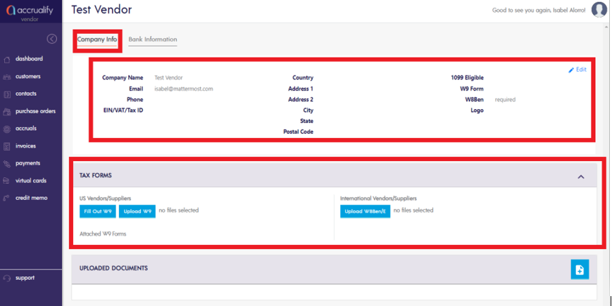
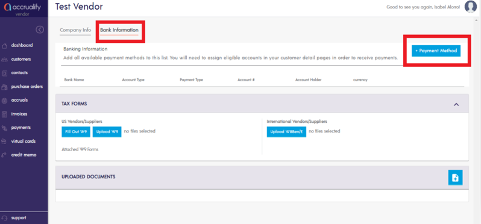
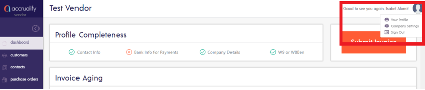
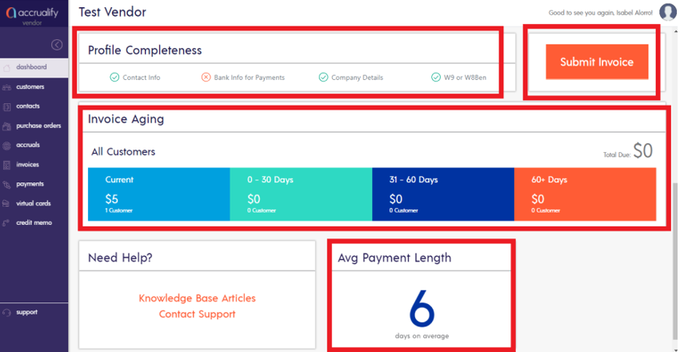
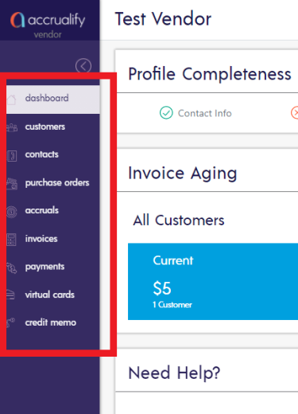
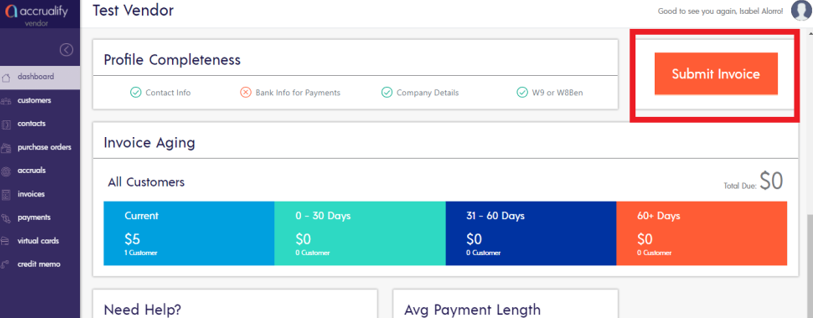
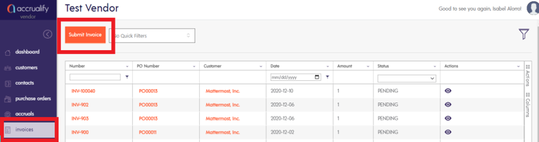
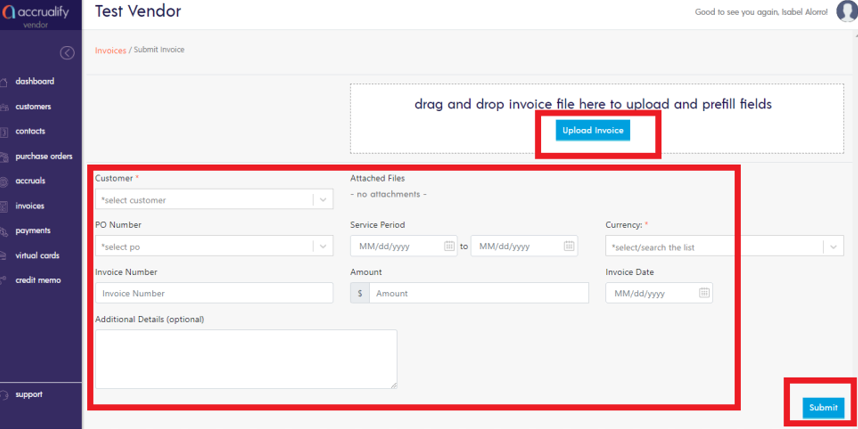

## Accrualify Vendor Portal Guide

As of December 1, 2020, the Finance team has implemented a new Procure-to-Pay automation software called Accrualify for the Procurement and Accounts Payable function. As a vendor, you will receive an invitation to the vendor portal so that you can do the following:

1. Provide company information.
2. Set up your bank account for faster payments.
3. Upload invoices.
4. Provide monthly accruals.

### How to set up your account

After your contract has been signed and completed by Mattermost, you will receive a welcome email from Accrualify to set up your account on the vendor portal. The email will include a button to **Set up your account**.

Once you arrive in the vendor portal, please complete the following fields in the Company Info section:

1. Company Name
2. Email
3. Phone
4. EIN/VAT/Tax ID
5. Country
6. Address
7. City
8. State
9. Postal Code

It’s important that you upload your completed W-9 or W-8BEN(E). If you are a US vendor registered and doing business in the US, provide a copy of your W-9. If you are an international vendor, provide a copy of your W-8BEN(E).

In the Banking Information section, select your preferred Payment Method using the **Payment Method** option.

If you need to update your profile at any time, select your your avatar on the top right hand corner of the page.

### How to navigate Accrualify

When logging into the vendor portal, you will be brought to the dashboard page, otherwise known as the “Home Page”. Once here, you can view the following items:

 1. **Profile completeness** - For accurate and timely invoice submission and payments, check to make sure your vendor profile is 100% complete.
 2. **Invoice aging** - How long has the invoice has been outstanding in our system.
 3. **Average payment length** - How long it usually takes Mattermost to pay.

From the dashboard, select **Submit Invoice** on the top right side of the page to submit an invoice.

On the left side of the page, you can toggle between the various modules:

 1. **Purchase Orders Module** - You will be able to see open POs to match incoming invoices.
 2. **Accruals Module** - You will be able to provide monthly estimates if you are unable to send an invoice at the moment.
 3. **Invoices Module** - You will be able to upload invoices.
 4. **Payments Module** - You will be able to see the status of payment on your invoices.
 5. **Credit Memo Module** - You will be able to submit a credit memo, if needed.
 

 
 ### How to submit an invoice
 
Submitting an invoice has never been easier. Select **Submit invoice** located on the top right side of the screen.

You can also select **Invoices** on the left side of the screen, then select **Submit Invoice**.

On the **Submit Invoice** form, the following fields should be completed:

1. **Customer** - Choose Mattermost, Inc.
2. **PO Number** - Open purchase orders will be available for you to relieve against. If you're unsure of the PO number, please reach out to Procurement@mattermost.com.
3. **Service period** - The service period should match the service period noted in the order form, SOW, or MSA.
4. **Currency** - The currency should be USD, unless otherwise stated in the contract.
5. **Invoice Number**
6. **Amount**
7. **Invoice Date**
8. **Additional details** (if needed)

After you complete the form, select **Upload Invoice** then select **Submit**.

If you don't wish to upload your invoice on the portal, you can continue emailing your invoices to AP@mattermost.com. If you have any questions regarding your invoice, contact AP@mattermost.com. If you are experiencing any issues with the vendor portal, please contact support@accrualify.com and copy AP@mattermost.com.
