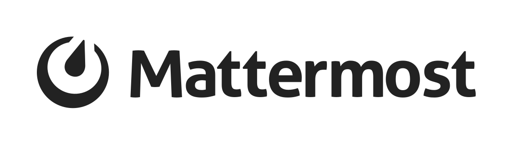
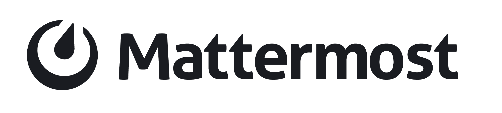
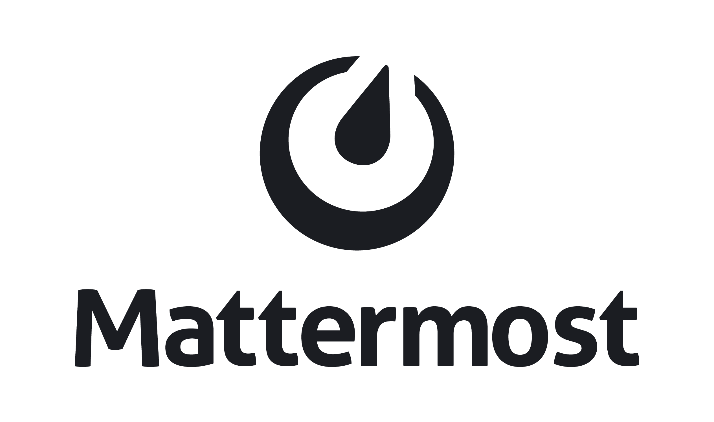
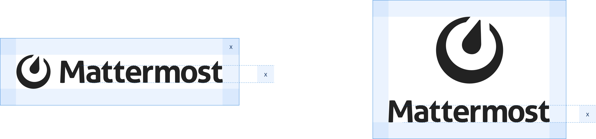

# Brand and Visual Design Guidelines

## The Mattermost logo

The logos below are available for use in your integrations and applications that connect to Mattermost. Use of the logo is permitted as long as it’s used in a non-commercial way and does not imply endorsement by Mattermost, Inc.

The Mattermost logomark is called **"the instrument"**. It represents four tools that organizations need to achieve their highest priorities:

* A compass for direction
* A clock to set pace
* A meter to measure output
* A dial representing inputs — the contribution of everyone on the team

### Logo variations

The Mattermost logo is available in vertical, horizontal, and logomark-only versions. The logo can be represented in black or white as displayed below.

**Horizontal Logo:** Min size 100x16px

|  | |   

**Vertical Logo:** Min size 70x39px

|  | |    |

**Logomark:** Min size 16x16px

### Usage guidelines

#### Clear space

To ensure an uncluttered presentation, always maintain a full "X" space around the logo. The "X" height is always the height of the lowercase letter "m" in "Mattermost". Use the safety area as an invisible border.

#### Incorrect usage

* Do not change logo colors. Use the provided options
* Do not rotate the Mattermost logo
* Do not distort or alter the Mattermost logo
* Do not lockup any other words along with the Mattermost logo
* Do not rearrange elements of the logo
* Do not use the logo at sizes smaller than the indicated minimum size

### Logo downloads

[You can download all Mattermost logo files here](http://mattermost.com/wp-content/uploads/2021/10/Mattermost_Logo.zip).

## Brand guidelines

You can view the [Mattermost Brand Guidelines here](http://mattermost.com/wp-content/uploads/2021/10/Mattermost_Brand_Guidelines.pdf).

## Name usage guidelines

Using the Mattermost name is generally permitted as long as it’s used in a non-commercial way and does not imply endorsement by Mattermost, Inc.

* Please do not name your integrations or apps starting with, or only using, the name "Mattermost", as this may confuse end-users as to where to find support.

Community projects might be named using "for Mattermost", examples:

* [GitLab Integration Service for Mattermost](https://github.com/mattermost/mattermost-integration-gitlab)
* [Giphy Integration Service for Mattermost](https://github.com/mattermost/mattermost-integration-giphy)

Alternatively, community projects may concatenate names containing Mattermost, for example:

* [Matterbridge](https://github.com/42wim/matterbridge) – is a Mattermost bridge connecting with IRC
* [Mattersend](https://github.com/mtorromeo/mattersend) – is a Mattermost integration for sending webhook events

**Exception:** Please don’t use the name “matterbot”, as that is an internal service under development.

## Company short description

Mattermost is an open source platform for secure collaboration across the entire software development lifecycle.

Hundreds of thousands of developers around the globe trust Mattermost to increase their productivity by bringing together team communication, task and project management, and workflow orchestration into a unified platform for agile software development.

Founded in 2016, Mattermost’s open source platform powers over 800,000 workspaces worldwide with the support of over 4,000 contributors from across the developer community. The company serves over 800 customers, including Samsung, Nasdaq, SAP, European Parliament, and the United States Air Force, and is backed by world-class investors including Redpoint, YC Continuity, Battery Ventures, and S28 Capital.

To learn more, visit www.mattermost.com.
