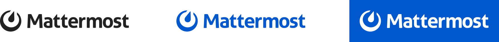
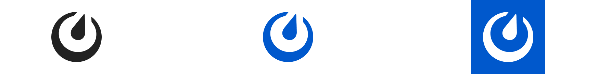
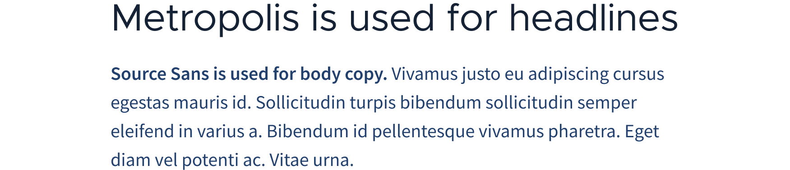
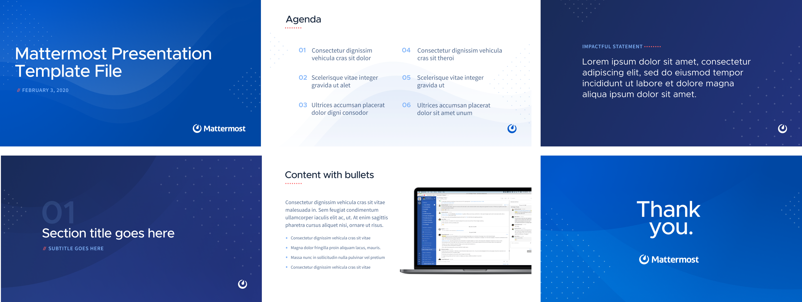

# Brand and Visual Design Guidelines

## The Mattermost Logo

The logos below are available for use in your integrations and applications that connect to Mattermost. Use of the logo is permitted so long as it’s used in a non-commercial way and does not imply endorsement by Mattermost, Inc.

The Mattermost logomark is called **"the instrument"**. It represents four tools organizations need to achieve their highest priorities:

* A compass for direction
* A clock to set pace
* A meter to measure output
* A dial representing inputs—the contribution of everyone on the team.

### Logo variations

The Mattermost logo is available is vertical, horizontal and logomark-only versions. The logo can be represented in black, blue or white as displayed below.

**Horizontal Logo:** Min size 100x16px

**Vertical Logo:** Min size 70x39px

**Logomark:** Min size 16x16px

### Usage Guidelines

#### Clear Space

To ensure an uncluttered presentation, always maintain a full X space around the logo. The X height is always the height of the lowercase letter “m” in “Mattermost”. Use the safety area as an invisible border.

#### Incorrect usage

* Do not change logo colors. Use the provided options
* Do not rotate the Mattermost logo
* Do not distort or alter the Mattermost logo
* Do not lockup any other words along with the Mattermost logo
* Do not rearrange elements of the logo
* Do not use the logo at sizes smaller than the indicated minimum size

### Logo downloads

#### Vector formats

If you need vector versions of the logos, you can [download the EPS package](https://github.com/mattermost/mattermost-handbook/raw/3b54c2cd1f823d1ea012ce45d1baa61fb4fbedbc/.gitbook/assets/branding/logo-downloads/EPS-files.zip).

#### PNG files

* Horizontal logo: [Black](https://github.com/mattermost/mattermost-handbook/raw/3b54c2cd1f823d1ea012ce45d1baa61fb4fbedbc/.gitbook/assets/branding/logo-downloads/mattermost-logo-horizontal-grey.png), [Blue](https://github.com/mattermost/mattermost-handbook/raw/3b54c2cd1f823d1ea012ce45d1baa61fb4fbedbc/.gitbook/assets/branding/logo-downloads/mattermost-logo-horizontal-blue.png), [White](https://github.com/mattermost/mattermost-handbook/raw/3b54c2cd1f823d1ea012ce45d1baa61fb4fbedbc/.gitbook/assets/branding/logo-downloads/mattermost-logo-horizontal-white.png)
* Vertical logo: [Black](https://github.com/mattermost/mattermost-handbook/raw/3b54c2cd1f823d1ea012ce45d1baa61fb4fbedbc/.gitbook/assets/branding/logo-downloads/mattermost-logo-vertical-grey.png), [Blue](https://github.com/mattermost/mattermost-handbook/raw/3b54c2cd1f823d1ea012ce45d1baa61fb4fbedbc/.gitbook/assets/branding/logo-downloads/mattermost-logo-vertical-blue.png), [White](https://github.com/mattermost/mattermost-handbook/raw/3b54c2cd1f823d1ea012ce45d1baa61fb4fbedbc/.gitbook/assets/branding/logo-downloads/mattermost-logo-vertical-white.png)
* Logomark: [Black Logomark](https://github.com/mattermost/mattermost-handbook/raw/3b54c2cd1f823d1ea012ce45d1baa61fb4fbedbc/.gitbook/assets/branding/logo-downloads/mattermost-logomark-grey.png), [Blue](https://github.com/mattermost/mattermost-handbook/raw/3b54c2cd1f823d1ea012ce45d1baa61fb4fbedbc/.gitbook/assets/branding/logo-downloads/mattermost-logomark-blue.png), [White](https://github.com/mattermost/mattermost-handbook/raw/3b54c2cd1f823d1ea012ce45d1baa61fb4fbedbc/.gitbook/assets/branding/logo-downloads/mattermost-logomark-white.png)

## Color Guidelines

Below is a sample of the core colours we've been using in the latest branding initiatives. For the full set of colors specific to the website visit the [Mattermost.com Styleguide](https://mattermost.wayfx.com/0ddc9bpne/p/44c8eb-colors)

| Name | Swatch | Hex | RGB |
| :--- | :--- | :--- | :--- |
| **Primary Blue** |  | Hex: 0058CC | rgb\(0, 88, 204\) |
| **Indigo** |  | Hex: 22406D | rgb\(34, 64, 109\) |
| **Dark Indigo** |  | Hex: 152235 | rgb\(21, 34, 53\) |
| **Light Blue** |  | Hex: 80B3FA | rgb\(128, 179, 250\) |
| **Coral** |  | Hex: FD6165 | rgb\(253, 97, 101\) |
| **Orange** |  | Hex: F59138 | rgb\(245, 145, 56\) |
| **Green** |  | Hex: 21C45D | rgb\(33, 196, 93\) |
| **Red** |  | Hex: DC3F35 | rgb\(220, 63, 53\) |

## Typography

The main typefaces used are [Metropolis](https://github.com/chrismsimpson/Metropolis) and [Source Sans Pro](https://fonts.google.com/specimen/Source+Sans+Pro). Metropolis is primarily used for section headings and titles. Source Sans Pro is used for body and description texts.

For the full set of typography guidelines specific to the website visit the [Mattermost.com Styleguide](https://mattermost.wayfx.com/0ddc9bpne/p/44c8eb-colors)

Product-specific typography guidelines coming soon…

## Presentation Guidelines

Powerpoint and Google Slides Templates coming soon…

## Website Guidelines

Website-specific guidelines can be found in the [Mattermost.com StyleGuide](https://mattermost.wayfx.com/0ddc9bpne/p/07a9e9-misc)

## Name Usage Guidelines

Using the Mattermost name is generally permitted so long as it’s used in a non-commercial way and does not imply endorsement by Mattermost, Inc.

* Please do not name your integrations or apps starting with, or only using, the name “Mattermost”, as this may confuse end users as to where to find support

Community projects might be named using “for Mattermost”, examples:

* [GitLab Integration Service for Mattermost](https://github.com/mattermost/mattermost-integration-gitlab)
* [Giphy Integration Service for Mattermost](https://github.com/mattermost/mattermost-integration-giphy)

Alternatively, community projects may concatenate names containing Mattermost, for example:

* [Matterbridge](https://github.com/42wim/matterbridge) – is a Mattermost bridge connecting with IRC
* [Mattersend](https://github.com/mtorromeo/mattersend) – is a Mattermost integration for sending webhook events

**Exception:** Please don’t use the name “matterbot”, as that is an internal service under development.

## Company Short Description

Mattermost is an open source Slack-alternative built for enterprise. Thousands of companies use Mattermost for secure, compliant workplace messaging across web, PC and phones with archiving, search, corporate SSO and integration with over 700 third party applications. Available under MIT license in 16 languages, Mattermost offers peace-of-mind, value, control, and freedom from lock-in for organizations around the world.

Learn more at [https://mattermost.com/](https://mattermost.com/)

