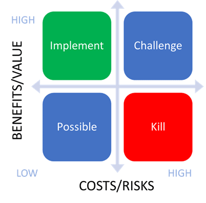

# Infrastructure

## Mission

The Infrastructure group empowers Mattermost to provide a SaaS Platform as Product which serves internal and external users by guaranteeing that we operate an enterprise-grade SaaS platform with self-serve powers.

The Infrastructure group achieves this by focusing on **quality**, **availability**, **reliability**, **scalability**, and **security** objectives. In addition to this we prioritize cost efficiency and awareness adopting FinOps culture, which is strengthened by appropriately prioritized dogfooding initiatives.

For the success of the SaaS Platform as a Product, there are many other teams which also contribute. The responsibility of the Infrastructure group is to evolve the SaaS platform enabled by platform observability data. 

## Vision

Operate fast, secure and reliable SaaS platform in which everyone can contribute

## Teams

- [SRE](/operations/research-and-development/organization/sre.md)
- [Delivery](/operations/research-and-development/organization/cloud_platform.md)
- [Platform](/operations/research-and-development/organization/delivery.md)

## Principles

- Be open and data driven
- Use our own product to complete our mission
- Align our strategy with the industry trends, company direction and customer needs
- Influence and educate best practices

## Design
The Infrastructure group uses RFCs - requests for comment - or Design Docs as a common tool to describe the problem we are solving and represent the current state for any topic.

## Dogfooding
The Infrastructure group uses Mattermost features as a core tool for the followings: 
- Secure collaboration with Channels 
- Incident Management using Playbooks
- Release and QA approval process using Playbooks
- Self-serve powers using Plugins and Slash Commands
- Community as internal release ring for testing potential releases

Having the above in mind, everyone is recommended to:
- Feel comfortable to contribute to Mattermost open source projects
- Sharing is caring and everyone should have the mindset to open source a project in order to give back to the community
- Use our product to achieve our goals and dogfood
- It’s part of Leads’ responsibility to influence this culture

## Prioritisation
As a group we believe that predictability is an important piece of our DNA, so we aim for predictability first and we believe that speed will follow. High impact and customer obsession are some of the [leadership principles](https://handbook.mattermost.com/company/about-mattermost#leadership-principles) in Mattermost which are core factors to our success and how we prioritize work items and ideas using [PICK chart](https://en.wikipedia.org/wiki/Pick_chart) as a prioritization framework. The acronym PICK is for Possible, Implement, Challenge and Kill.
- **Possible**: Low payoff, easy to do
- **Implement**: High payoff, easy to do
- **Challenge**: High payoff, hard to do
- **Kill**: Low payoff, hard to do

Any ideas that are:
- Low ROI & Low Cost/Risk is considered as a Possibility. 
- High ROI & Low Cost/Risk is Implemented. (“Quick Wins”) 
- High ROI & High Cost/Risk is considered as a Challenge 
- Low ROI & High Cost/Risk is Killed/Next year

## Meetings

| Topics                             | Meeting                    | Participants                    | Cadence |
|------------------------------------|----------------------------|---------------------------------|---------|
| Incident Review & Knowledge share  | Reliability Engineering Guild | Leadership, SRE, Delivery    | Monday  |
| Cross-org collaboration            | Infrastructure Guild    | Leadership, Infrastructure, Product, Security | Thursday  |

## Common Links

- [Infrastructure Engineering calendar](https://calendar.google.com/calendar/u/0?cid=Y19lNjg4MzNkMmZiMjNmY2VlMDgwOGJkODkwNzMwMTQ5OGZhOGY4MGI1OWVkNjlhNmUwNGU3MDEyYzNlMjljNGM1QGdyb3VwLmNhbGVuZGFyLmdvb2dsZS5jb20)
- [Incident Management Framework](https://docs.google.com/document/d/10a2n8Er11Y4QN6VahgUNmMtKpxiqJo1GlxsGq0s3bIg/edit)
- [Status page](https://status.mattermost.com/)

### General Channels
- [~infrastructure](https://community.mattermost.com/private-core/channels/infrastructure)
- [~cloud-support](https://community.mattermost.com/private-core/channels/cloud-support)

### Team Channels
- [~infrastructure-delivery-team](https://community.mattermost.com/private-core/channels/infrastructure-delivery-team)
- [~infrastructure-sre-team](https://community.mattermost.com/private-core/channels/infrastructure-sre-team)
- [~infrastructure-platform-team](https://community.mattermost.com/private-core/channels/infrastructure-platform-team)

### JIRA trackers
- [Delivery](https://mattermost.atlassian.net/jira/software/c/projects/CLD/boards/112)
- [SRE](https://mattermost.atlassian.net/jira/software/c/projects/CLD/boards/109)
- [Platform](https://mattermost.atlassian.net/jira/software/c/projects/CLD/boards/129)
