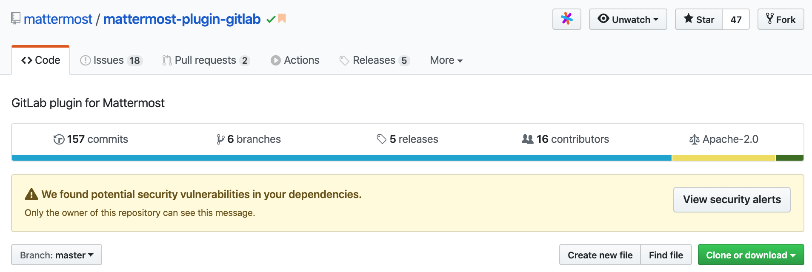
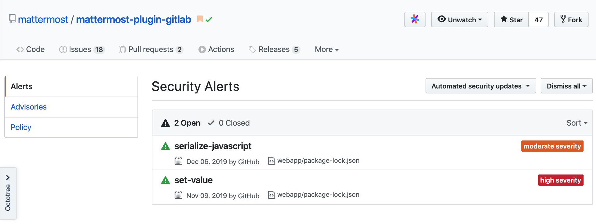
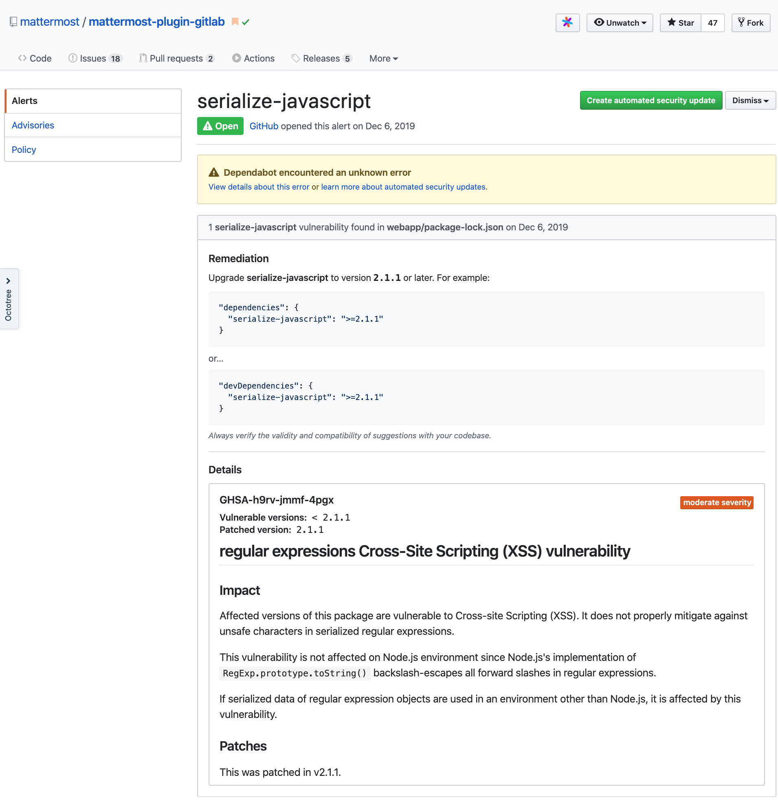
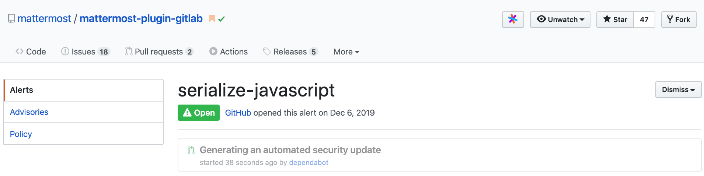

# Plugin Release Process

WIP: Migrating links and content from: https://github.com/jfrerich/plugin-release-process/blob/master/README.md.

## Overview

The release process for modifying plugin versions and plugin version dependencies currently requires a developer to perform several non-automated tasks. Bumping, tagging, releasing, publishing, and bundling (preloading) versions are not necessarily complicated, but a formal set of steps is required and should be followed. This document describes those processes in detail and will be used to help standardize and automate these flows in the future.

## Goals

1. Define the steps required to bump, tag, release, publish, and bundle plugin versions.
2. Through defining specific tasks during the process we will be able to define protocols and identify areas for automation improvements.

## Scope

This document covers the current steps required to perform the following tasks:

1. Bump the current version of an existing plugin.
2. Tag a version of a plugin for release.
3. Bundle a plugin version to a Mattermost server release.
4. Publish a bumped plugin version to the Plugin Marketplace.
5. Publish a new plugin to the Plugin Marketplace.
6. Release to `community.mattermost.com`.

The Future Enhancements section of this document describes additional suggestions for automating some of these tasks.

## Plugin Release Flows

### Considerations when bumping and releasing a plugin version

* Compare commits from last bump/tagged release.
* Documentation changes aren’t necessarily vital.
  * Documentation through bundled releases aren’t viewable through the app and users will be looking at the latest master commit in the GitHub repo.
* The PR for the version bump (in the plugin repo) does not mean that is the last commit to get tagged. This step only bumps the version. The tagging step actually determines the commit that is tagged with the release tag.

### Create version bump PR

* Feature or patch bumping determined by commits being added from previous release tag.
* Look through existing Issues and PRs and make sure the Milestone label is added for items to be included with release.
* Verify no existing security issues (using [Updating Security Alerts Through CLI](#updating-security-alerts-through-cli)).
  * If security issues exist, submit PR and merge before bumping version.
* Install/Update [`pluginops`](https://github.com/mattermost/mattermost-utilities/tree/master/pluginops).
* Run `pluginops release` inside a local copy of the repository.
* Follow the steps of the tool.
* Once the local changes are done, follow the link to open a PR.
* Add any further reasoning or description for version bump (if necessary).
* Add 2 Developers and 1 QA for review.
* You might also add a PM review to verify the release from a PM perspective.

### Tag/cut a version of a plugin for release

After the PR for bumping the version of a plugin has been merged, you can now tag the version for release.

**Prerequesite:** In order to cut releases using matterbuild slash commands, you need to add your name and userID on the Community server to `AllowedUsers` and `ReleaseUsers` in [`config.json`](https://github.com/mattermost/platform-private/blob/master/matterbuild/config.json).

Cut the release using the following as an example. Note this is a slash command for use inside Mattermost:

`/mb cutplugin --tag v1.2.0 --repo mattermost-plugin-todo`

CI runs can be viewed at [circleci.com/gh/mattermost](https://circleci.com/gh/mattermost). If CI jobs complete successfully, a new release will automatically be produced and viewable under the **Releases** tab in the plugin repo.

Matterbuild will respond with message upon success. Now view the release link and update the commit messages. This is a subjective task where determine if a commit is a feature of enhancement. Edit the release messages and arrange accordingly.

The next steps are to add the plugin to the Plugin Marketplace. The instructions are included in the return message upon a successful `cutplugin` command.

### Bundle a plugin release version to a Mattermost server release

Plugins that are released with Mattermost are called bundled plugins. These plugins are included with the software and need only to be configured.

* `git pull` the latest master branch on mattermost-server
* Create a new branch so you can modify the plugin versions
  * `git checkout -b bundle-plugins-v5.20`
  * Use branch naming convention `bundle-plugins-vX.XX`
* Edit `Makefile`
  * Locate `# Plugins Packages` comment
  * Modify plugin release versions
* Create PR against master branch with following:
  * **Title:** `Update bundled plugins for vX.XX`
  * **Summary:** List of updated plugins
    * Ideally includes `from version` > `to version` for each plugin

### Publish a plugin release version to the Plugin Marketplace

The steps to have a plugin version added the Plugin Marketplace are included with the success of an `/mb cutplugin` slash command.

### Release to `community.mattermost.com`

Once the Marketplace PR is merged, request an update on the plugin in the `~community-configuration`[https://community.mattermost.com/core/channels/community-configuration] channel.

## Security upgrade process

(**`TODO`**: Automate checking all released plugins through CLI, cron, or GH webhook event)  
(**`TODO`**: User must be repo admin to see and resolve automated security issue)  
(**`TODO`**: Need method to hook to tell us when security issue is found)  
(**`TODO`**: PR for security updates should be discrete)  
(**`TODO`**: investigate `npm ls hoek`)

Security alerts are displayed when viewing a GitHub repo and are resolved via the automated `dependabot` tool

### Updating npm Dependencies CLI

* `git checkout latest master`
* `git checkout -b bump-dependency-versions`
* `cd webapp/`
  * `npm-check -E -u` to view the changes interactively
    `npm-check -E -y` to update without interactive
* `git add package-lock.json package-lock.json`
* `git commit -m "Update dependencies"`
* `git push --set-upstream origin bump-dependency-versions`
* Create PR
  * Title: `Update Dependencies` (Will automatically get set)
  * Summary: Update dependencies

### Updating Security Alerts Through CLI

* `git checkout latest master`
* `git checkout -b npm-audit-fix`
* `cd webapp/`
* `npm audit` - will return list of security issues
* `npm audit fix` - updates `package-lock.json` dependencies
* `git add package-lock.json`
* `git commit -m "Update dependencies"`
* `git push --set-upstream origin npm-audit-fix`
* Create PR
  * Title: `Update Dependencies` (Will automatically get set)
  * Summary: &lt;library\_name&gt; &lt;from\_ver&gt; -&gt; &lt;to\_ver&gt;

### Updating Security Alerts Through GitHub

GitHub displays security alerts when viewing a GitHub repo.

View all alerts by clicking on the **View security alerts** button.

Clicking on a specific security alert will open the details alert and provide a **Create automated security update** button. Click the button to have `dependabot` begin generating an automated security update.

