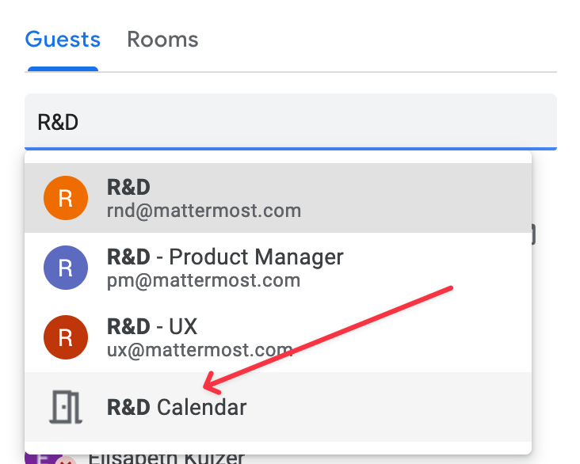
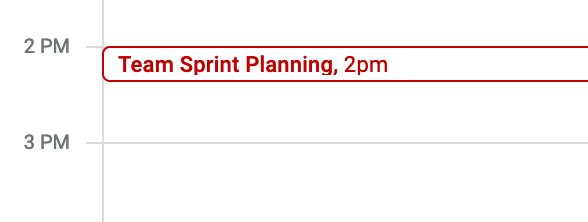
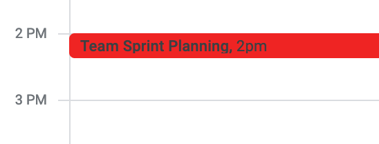

# R&D Organization

The source of truth for the R&D org structure and team membership is [this spreadsheet](https://docs.google.com/spreadsheets/d/1lH8QIjQGEoGospDUdVs_LQ_i2b82I1ce6W7z18vhPTQ/edit#gid=1820415931).

## Divisions

R&D is split into multiple divisions, detailed below. Areas of responsibility (AORs) for each team are linked.

### Product

The Product division builds and ships the majority of anything product related.

#### Core Product

The Core Product sub-division is responsible for building the features and systems of the core product.

* **[Core 1](/operations/research-and-development/organization/core1.md)**
* **[Core 2](/operations/research-and-development/organization/core2.md)**

#### Platform

The Platform sub-division is responsible for the libraries, architecture and infrastructure, collectively the platforms, that the core product is built upon.

* **[Integration Frameworks](/operations/research-and-development/organization/integrations_framework.md)**
* **[Web/Desktop/Mobile](/operations/research-and-development/organization/web_desktop_mobile.md)**
* **[Server](/operations/research-and-development/organization/server.md)**
* **[QA](/operations/research-and-development/organization/qa.md)**
* **[Tech Writing](/operations/research-and-development/organization/tech_writing.md)**

### Growth

The Growth division develops solutions and features across the spectrum that allow us to reach more users and customers.

* **[Growth](/operations/research-and-development/organization/growth.md)**
* **[Self-Serve](/operations/research-and-development/organization/self-serve_subscriptions.md)**

### Data Engineering

The Data Engineering division builds and supports the data infrastructure and analysis tools.

* **[Data Engineering](/operations/research-and-development/organization/data_engineering.md)**

### Infrastructure

The [Infrastructure](/operations/research-and-development/engineering/cloud-engineering/README.md) group empowers Mattermost to provide a SaaS Platform as Product which serves internal and external users by guaranteeing that we operate an enterprise-grade SaaS platform with self-serve powers.

* **[Delivery](/operations/research-and-development/organization/delivery.md)**
* **[Cloud Platform](/operations/research-and-development/organization/cloud_platform.md)**
* **[Site Reliabilty Engineering](/operations/research-and-development/organization/sre.md)**

### Security

The Security division is responsible for the implementation and monitoring of the company's security program.

* **[Governance, Risk, and Compliance (GRC)](/operations/research-and-development/organization/grc.md)**
* **[Product Security](/operations/research-and-development/organization/product_security.md)**
* **[Security Operations](/operations/research-and-development/organization/security_operations.md)**

## Calendar

The [R&D Calendar](https://calendar.google.com/calendar/u/0?cid=bWF0dGVybW9zdC5jb21fdTc3cWxscjB2NDVhM3ZzczdycWN1dHQ3ZDRAZ3JvdXAuY2FsZW5kYXIuZ29vZ2xlLmNvbQ) highlights recurring events such team planning meetings, guild meetings, hangouts, and office hours.

Adding these events to a shared calendar accomplishes several purposes:
* It improves the onboarding experience by allowing new staff members to self-discover meetings of interest.
* It reinforces our culture of being "default open", even if most of the time only those explicitly invited show up.
* It allows for occasional guest participation without having to juggle a permanent invite.

### Guest Participation

All staff are encouraged to occasionally join another team's planning meeting. In addition to learning more about the product and areas of ownership, this can be a chance to see how that team works together and incorporate the best parts on your own team. It's not necessary to ask permisison to join a meeting on the R&D Calendar, but focus on being a listener instead of a contributor to avoid distracting the team.

### Adding events to the R&D Calendar

All staff in R&D have permisison to invite the R&D Calendar to recurring meetings. When adding a guest, search for `R&D` and be careful not to invite `rnd@mattermost.com` which would invite everyone in R&D. Instead, simply invite the calendar itself:

The calendar will not "accept" the invite by default, with the invitation showing up as pending. With the calendar visible, select the event and accept the invite so the calendar appears uniform:

**Before Accepting**

**After Accepting**

