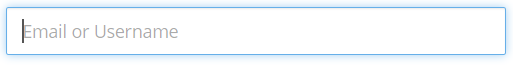
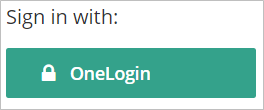
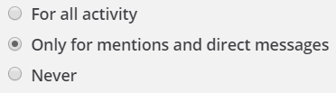
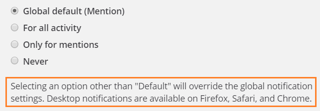
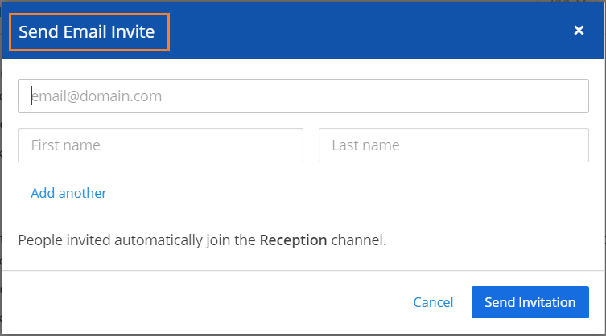

# User Interface Text Guidelines

This is the Mattermost style guide for text used in the Mattermost
product. Use these guidelines to ensure text on the Mattermost user
interface (UI) is consistent and clear. These guidelines cover two types
of UI text:

  - Messages triggered because something happened
  - Static text on the user interface

Contributions that do not adhere to this style guide will receive edit
requests; we'll merge your contribution once you edit the text to
conform to these guidelines. You might want to look at the [UX design
guidelines]() as well.

-----

## General principles for in-product text

  - Keep in mind that your users are from all over the world. Use words
    that are clear and easy to understand.

  - Be concise.

  - Use the active voice, except for these cases:
    
    >   - If you'll end up blaming the user. For example, don't say *You
    >     entered an incorrect password*. Instead, say *The password is
    >     incorrect*.
    >   - If you're describing what just happened. For example, it's
    >     okay to say *Your incoming webhook is set up*.
    >   - If the subject (the doer of an action) is the Mattermost
    >     application itself. For example, it's okay to say *The image
    >     is deleted* instead of *The server deleted the image*.

  - Use the present tense to describe a current state or condition, and
    the future tense to state something that is very definitely going to
    happen.

  - If you're asking the user to do or not do something, use imperatives
    (command phrases). For example, say *Do not change the Hostname*
    instead of saying *It is not recommended to change the Hostname*.
    Better still, explain what could go wrong if they do or don't do
    something. For example, say *Do not change the Hostname because if
    you do so \<this bad thing will happen\>.*

## Guidelines for messages

Don't blame the user. Inform them about what happened, explain why it
happened, and suggest a way forward.

Try to use complete sentences in your messages. A sentence phrase (an
incomplete sentence) might sound okay in English but could present
internationalization challenges.

If a message contains variables (tokens):

  - Do not use verbs or adjectives as variables.
  - Do not create plurals of variables by adding an *s*.
  - If the variable is a noun, use a qualifier after the variable. For
    example, say *The {channel\_name} channel was created* instead of
    saying *The {channel\_name} was created*.

Messages can be of the following types: notification, confirmation,
warning, and error. The following sections contain guidelines that are
specific to each of these types.

### Notification messages

A notification message is for informing somebody about something that
happened. Such messages do not need any user input, and do not prevent a
user from continuing to use Mattermost.

  - Use either a complete sentence or a sentence phrase.
  - If using a complete sentence, end it with a period.
  - Examples:
      - *Member added to channel*
      - *The plug-in was installed.*

# Confirmation messages

A confirmation message is for asking somebody to confirm whether the
immediately preceding command should be proceeded with. The user cannot
use Mattermost until a confirmation is given or denied.

  - Use complete sentences.
  - Include a question that has a Yes/No answer.
  - Examples:
      - *Are you sure you want to delete this channel?*
      - *A plug-in with this ID already exists. Would you like to
        overwrite it?*

# Warning messages

A warning message is for alerting somebody about something that might go
wrong. The user can continue using Mattermost unless the warning message
needs an explicit user input.

  - Use complete sentences.
  - Explain what has happened or can happen, and what can go wrong as a
    consequence.
  - Examples:
      - *The Enterprise license expires in 2 days. If you do not renew
        it, some features will be disabled on licence expiry.*
      - *If you claim this AD/LDAP account, you will no longer be able
        to log in with your email.*

# Error messages

An error message is for telling somebody that something went wrong.
Errors prevent a user from doing a task or accessing a feature till the
error is resolved.

  - Use complete sentences.
  - If what went wrong isn't obvious, explain in one sentence.
  - If a solution or workaround isn't obvious, suggest one.
  - Examples:
      - *Messages must have fewer than 120 characters.*
      - *A connection to the marketplace server could not be
        established. Check your settings on the \[System
        Console\](\<hyperlink\>).*

## Guidelines for UI elements

Use this table when writing the text for UI elements such as windows,
dialog boxes, labels, and prompts.

<table>
<colgroup>
<col style="width: 10%" />
<col style="width: 30%" />
<col style="width: 10%" />
<col style="width: 25%" />
<col style="width: 25%" />
</colgroup>
<thead>
<tr class="header">
<th>Element</th>
<th>Image</th>
<th>Capitalization</th>
<th>Phrasing</th>
<th>Examples</th>
</tr>
</thead>
<tbody>
<tr class="odd">
<td>Menu</td>
<td></td>
<td>Headline style</td>
<td><ul>
<li>Noun, noun phrase, or verb</li>
<li>No punctuation</li>
<li>Not more than three words</li>
<li>Action after clicking is obvious, without needing someone to click to discover</li>
</ul></td>
<td><ul>
<li><em>Members</em></li>
<li><em>Account Preferences</em></li>
<li><em>Log Out</em></li>
</ul></td>
</tr>
<tr class="even">
<td>Tooltip</td>
<td></td>
<td>Sentence style</td>
<td><ul>
<li>Sentence fragment or sentence</li>
<li>No punctuation</li>
<li>Include articles (<em>a</em>, <em>an</em>, <em>the</em>)</li>
<li>Keep it short</li>
</ul></td>
<td><ul>
<li><em>Start a Zoom meeting</em></li>
<li><em>Flag for following up</em></li>
<li><em>Remove from this list</em></li>
</ul></td>
</tr>
<tr class="odd">
<td>In-field text</td>
<td></td>
<td>Sentence style</td>
<td><ul>
<li>Sentence fragment, sentence, or word that's an example of a valid entry</li>
<li>No punctuation</li>
<li>Include articles (<em>a</em>, <em>an</em>, <em>the</em>)</li>
</ul></td>
<td><ul>
<li><em>Add a comment</em></li>
<li><em>Search</em></li>
</ul></td>
</tr>
<tr class="even">
<td>Action button</td>
<td></td>
<td>Headline style</td>
<td><ul>
<li>Verb or verb phrase</li>
<li>No longer than 3 words</li>
<li>No articles (<em>a</em>, <em>an</em>, <em>the</em>)</li>
<li>Exceptions: <em>OK</em>, <em>Yes</em>, <em>No</em></li>
</ul></td>
<td><ul>
<li><em>Add Comment</em></li>
<li><em>Edit</em></li>
</ul></td>
</tr>
<tr class="odd">
<td>Label before a UI element</td>
<td></td>
<td>Sentence style</td>
<td><ul>
<li>Noun, verb, or sentence fragment that's the title of the UI element</li>
<li>End with a colon where it precedes another UI element such as a radio button or check box</li>
<li>Include articles (<em>a</em>, <em>an</em>, <em>the</em>)</li>
</ul></td>
<td><ul>
<li><em>Sign in with:</em></li>
<li><em>Other words, separated by commas:</em></li>
</ul></td>
</tr>
<tr class="even">
<td>Label after a UI element</td>
<td></td>
<td>Sentence style</td>
<td><ul>
<li>Noun, verb, or sentence fragment</li>
<li>No punctuation</li>
<li>Brief (lengthier explanations belong to help text)</li>
</ul></td>
<td><ul>
<li><em>Channels grouped by type</em></li>
<li><em>Alphabetically</em></li>
</ul></td>
</tr>
<tr class="odd">
<td>Help text</td>
<td></td>
<td>Sentence style</td>
<td>Complete sentences, with punctuation</td>
<td><ul>
<li><em>You can add 20 more people.</em></li>
<li><em>People are invited automatically to join the channel.</em></li>
</ul></td>
</tr>
<tr class="even">
<td>Title</td>
<td></td>
<td>Headline style</td>
<td><ul>
<li>Sentence fragment or sentence</li>
<li>No punctuation</li>
</ul></td>
<td><ul>
<li><em>Notification Preferences for Channel</em></li>
<li><em>Contributors</em></li>
</ul></td>
</tr>
</tbody>
</table>

.. [*] For headline style, capitalize all words except those with 3 letters or fewer, articles (*a*, *an*, *the*), prepositions (*on*, *to*, *in*, *from*, *of*), and coordinating conjunctions (*and*, *but*, *or*, *for*). Despite these exceptions, always capitalize the first and last word. For sentence style, capitalize only the first word.

