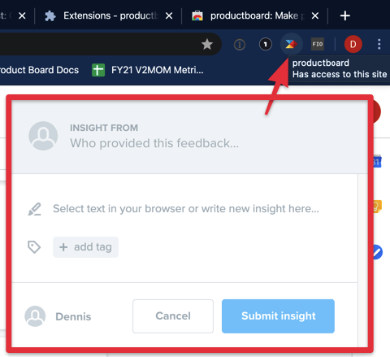
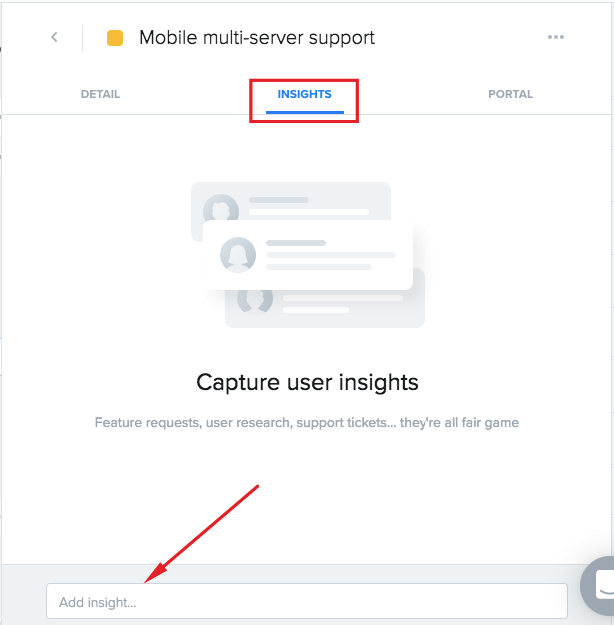
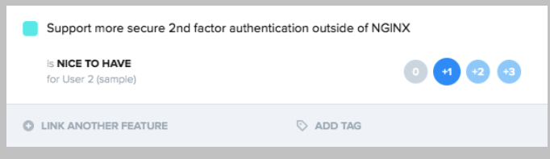

# How to Use Productboard

Productboard a tool owned by Product Management for:

* Feedback collection
* Feature validation
* Requirements gathering
* Feature prioritization/roadmap planning

Specifically, Productboard is used to decide what to build \(and when\), while other systems like Confluence or Jira are used to communicate and design on what exactly is being built at individual feature level.

Productboard is organized into: 
Insights (AKA “Notes”)
Features
Roadmaps
Portals

## ProductBoard Insights (also called Notes)

### Creating Insights

You can add a new note to capture feedback. This is used to help identify customer problems, wants/needs, feature shortcomings, and any other areas for improvement that stem from interacting with customers. Essentially, think of this as a place to communicate the most important takeaways from customers that the Product team can help you with.

Notes from customer calls should be filed in [Salesforce](https://docs.google.com/document/u/1/d/1Ilm0t8AUtjtOociqUYuLluuT4lxcDijaiIrZ8wcamJE/edit?ts=5e6f6c50). This automatically pushes the customer call notes into the Mattermost “Customer Feedback” channel for visibility, and also to Productboard so it can be processed by PMs.

Important points about notes:

* Notes are specific to a customer/prospect.
* Notes can include multiple requests \(Product Managers can apply multiple elements from the note to different features if necessary\).
* If you're not sure if the request or feedback should apply to an existing feature, you can simply capture the feedback as a note, assign it to the Product Manager overseeing that area, or leave it unassigned.

When filing a note in Productboard: 
1. Add a title to the note that summarizes the problem, not the solution. 
2. Add the customer name. 
3. Add as much detail about the request and/or feedback as possible. 
4. (Optional) Add the PM owner as Assignee if you know it. If not, no worries.

Sample questions to answer:

* What problem are they trying to solve? What's their specific use case?
* How are they solving the problem right now? How is the current solution working or not working for them?
* How is this problem affecting their business and users?
* What's the priority for them? Is getting a solution a blocker, a must-have, or a nice-to-have?

### Adding feedback \(via Chrome extension\)

Using the official [Productboard Chrome extension](https://chrome.google.com/webstore/detail/productboard-make-product/mlpbdkpkicfkhgagnoamdcimmhdkakni) you can add notes from any page within Chrome \(including SFDC, Zendesk, GitHub, HackerNews, Mattermost web, etc.\) and streamline your workflow dramatically.

As long as you are logged into Productboard, the connectivity to the Mattermost insights board is secure and seamless.

**Pro tip**: If you keep your call notes in a browser app \(such as Google Docs\), you can highlight the sections related to feedback and quickly send them over to productboard with the extension.

### Adding insights directly to an existing feature

You also have access to view [Features](https://mattermost.productboard.com/feature-board/1097524-master-feature-list) from the Master Features view or from Roadmaps. You can search and browse all features and ideas and even read the notes and portal cards from Product Managers for a detailed description of the feature/idea. In the case of planned features, you'll have complete insight into the status of the feature and a rough idea of where it sits on the roadmap.

Within the detailed view of individual features, you can view the full list of insights added by other Product Managers, Customer Success Managers, Customer Engineers, or Support Engineers. You also have the option to add insight directly to the feature itself.

## Insights Processing

New feedback from users and customers is sent to the [Insights Board](https://mattermost.productboard.com/insights). Typically these are submitted by fellow Product Managers, Support, Customer Success Managers, or Sales through integrations with email, Zapier, Zendesk, or others.

Insights are processed by Product Managers on a weekly basis. When a new Insights is submitted in Productboard, it is also posted to the Product Management: Private channel via a Zapier integration. 

When a PM processes an Insight, they will attach the relevant information to an existing or new feature. New features are entered as “ideas”. One Insight might contain links to multiple features, you can see the highlight and a pencil icon which will show what feature the note is attached to.

## Features

### Stay up to date on feature status updates

Staying informed of status changes and comments on a feature is easy in Productboard:

1. Locate the feature on the [Master Feature list](https://mattermost.productboard.com/feature-board/1097524-master-feature-list) or by searching on the Feature tab.
2. Click on the feature name to open the feature details card.
3. Add yourself as a follower by clicking on the **+** symbol in the bottom left corner of the feature details card.

[Learn more about Productboard notifications](https://help.productboard.com/en/articles/1252670-how-do-notifications-work).

### Feature statuses

Features default to “idea” when first created: 

   * **Idea**: When you have a single request or an idea for a feature it starts out in this status. As new customer insights come in, you'll be able to attach them to this idea to validate and measure demand.
   * **Under Consideration**: This status is used to identify features that are demand validated, but we remain undecided if we'll build them \(for various reasons\).
   * **Planned**: Features that we've validated and decided to build are planned. These features should all have a release assigned \(if scheduling is unknown, assign to the release called **backlog**.
   * **In Development**: All features actively being worked on by UX or R&D belong to this status.
   * **Postponed**: If a feature is cut from a release, followers of the feature need to be notified. Currently, productboard only notifies followers when a status changes or they're explicitly mentioned. We have added this status to ensure followers of a feature can stay informed when features are cut.
   * **Won't Do**: This is a status often used after the **Under Consideration** status if we decide for any reason not to build a feature that's demanded by the market. It's important to keep track of for future cases of demand. If you set a feature to this status, please be sure to provide the reason we won't do it. This reason should be in a format that can be shared with propspects/customers.
