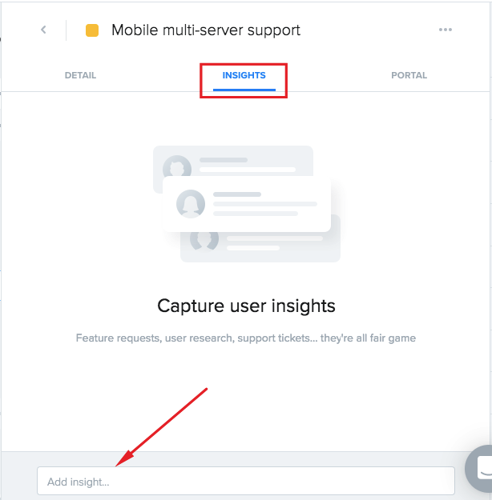

# How to use ProductBoard

ProductBoard is used by Product Managers and Customer/Sales Teams for

- Feedback collection
- Feature validation
- Requirements gathering
- Feature prioritization/roadmap planning

When a feature moves to "planned" the product team pushes it to Confluence and Jira (or wherever each team decides) to define the scope/spec and track work.

Specifically, ProductBoard is used to decide what to build (and when), while other systems like Confluence or Jira are used to communicate and design on what exactly is being built at individual feature level.  

## **1 - Day in the life of a Product Manager**

### **1a- Reviewing new feedback from users and customers**

New feedback from users and customers is sent to the [Insights Board](https://mattermost.productboard.com/insights). Typically these are submitted by fellow product managers, support, customer success managers, or sales through integrations with email, Zapier, Zendesk, or others.

When in the Insights Board, you can either go to your [Personal Inbox](https://mattermost.productboard.com/insights/my-inbox) or a [Shared Team Inbox](https://mattermost.productboard.com/insights/shared-inbox) to review feedback. When you find something relevant to your initiatives, highlight it in the notes and click the pencil icon to attach it to a feature.

You can either link the feedback to an existing feature request, or create a new one.

Finally, you will choose how important this request is for the user or customer. For feedback coming from customers, this is typically shared by the appropriate team member in the customer team who has first-hand knowledge of the criticality of the request.

Linking feedback directly to features lets you easily capture and organize ideas. It also attaches customer information and request details automatically from the call notes to the detailed product feedback \(dependent on available integrations, one for a two-way native Salesforce integration is coming soon\).

### 1b - Prioritizing features in the Features board

Second critical element is prioritizing features in the Features board.

Usually you would start from the [Feature Organization View](https://mattermost.productboard.com/feature-board/1097524-feature-organization) which has all features broken in a [product hierarchy](https://www.productboard.com/blog/product-hierarchy-set-up/) by feature teams, components and features.

* **Feature teams** is the top-level category and refers to the corresponding R&D team, such as Apps, Platform, and Integrations.
* **Components** are identified by a symbol with four square, are categories or high-level themes such as “Compliance” or “User Experience”.
* **Master Features** (often become epics) are top level features with customer facing business value such as “Legal Hold & e-Discovery” or “Improve Reply Threading”.
* **Sub-features** (typically match up with user stories) contribute to the business value of the master feature and should positively impact the end-users, the System Admins, or other users/stakeholders. Examples: “Lock messages and files for legal hold” or “pop-out windows for reply threads”.

In this view, you can filter and sort by various fields, and create custom views that you can refer back to later. Available filters include:

* **User Impact Score**, calculated based on number of requests, weighted by how important it is to them. [Learn more how the score is calculated here](https://help.productboard.com/en/articles/882615-use-the-user-impact-score-to-surface-your-top-requested-feature-ideas).
* **Drivers and prioritization scores**, including market demand, product strategy and operations. [Learn more here](https://help.productboard.com/en/articles/1552014-use-drivers-and-prioritization-scores).
* **Segments**, including OSS community, banking and finance, and government.
* **Tasks**, such as the status of designs or development.
* **Releases**, which identifies an internal target for which release the feature is scheduled.

Two other commonly used views include the [Top Requests View](https://mattermost.productboard.com/feature-board/1097530-top-requests) which automatically filters all feature requests to those with highest user impact scores, and a [Prioritization Matrix](https://mattermost.productboard.com/feature-board/1097533-prioritization-matrix), which provides a 2x2 visualization of the value a set of features gives to an objective against the level of effort.

With these views, including custom ones you can create, you can prioritize features and surface priority requests in the Features board. Based on the prioritization, you can change the feature status to a Candidate for roadmap, or Planned for roadmap.

Once the feature is in progress or released, you can update its status in ProductBoard accordingly.

Note that each time you update the status of a feature or add a comment, anyone who is a watcher will receive an email notification. In the initial roll-out, watchers are limited to Mattermost team members only.

### 1c - Organizing features in the master feature list

1. Search for your roadmap features and add any that are missing under the appropriate category to the master feature list.
2. Make sure all features that fall under your area of responsibility are assigned to you.
3. Add any important detail about the feature that is missing or that would be valuable to others that might need to help you validate or gather requirements for the feature. 
4. Assign Releases: Features can have one or many releases assigned as they may appear on different roadmap/planning views for different purposes. Below is an outline of our current structure of releases in Product Board:
 - **Planning Estimates**: H1 Plan, H2 Plan (tentative), Backlog, Community Contract, or Bounty
 - **Exact Releases** (when known): Examples: 5.22, 5.24, 1.30, Mattermost 6.0
 - **Sequence**: Now, Next, Later
 5. Setting the Status:  There are 6 statuses throughout the life of a feature:
 - **Idea**: When you have a single request or an idea for a feature it starts out in this status. As new customer insights come in, you will be able to attach them to this idea to validate and measure demand. 
 - **Under Consideration**: This status is used to identify features that are demand validated, but we remain undecided if we will build them (for various reasons).
 - **Planned**: Features that we have validated and decided to build are planned. These features should all have a release assigned (if scheduling is unknown, assign to the release called `backlog`. 
 - **In Development**: All features actively being worked on by UX or R&D belong to this status. 
 - **Postponed**: If a feature is cut from a release, followers of the feature need to be notified. Currently, productboard only notifies followers when a status changes or they are explicitly mentioned. We have added this status to ensure followers of a feature can stay informed when features are cut. 
 - **Won't Do**: This is a status often used after the `Under Consideration` status if we decide for any reason not to build a feature that is demanded by the market. It's important to keep track of for future cases of demand. If you set a feature to this status, please be sure to provide the reason we won't do it. This reason should be in a format that can be shared with propspects/customers. 
  
### 1d - Pushing/Linking features in Jira

We have enabled the ProductBoard Jira integration which allows us to both push features to Jira as new tickets as well as link existing Jira tickets to features. This is done from the detail view of a feature.
Two very important notes regarding this integration:

- Once linked, if you update the details (most importantly, the description) in either Jira or PB, they are synced and both will update
- If you are linking an existing Jira ticket, be aware that your source will overwrite your destination

#### Do’s and Don’ts

**Do's**

* Do reorder your features and play around with scoring your features.
* Do add sub-components if you feel they are appropriate and do not exist anywhere else.
* Do create your own feature views with custom prioritization scores (using existing drivers)
* Do post requests for all of the following in the ProductBoard channel.

  * New drivers or edits to driver names.
  * New top level components.
  * Renaming, removal or reorganization of top level components.

* Do feel free to reach out to Dennis, Jason, or Aaron for any questions.

**Don'ts**

* Do not reorder top level components - learn more about components, subcomponents, and features.
* Do not remove/rename any components or sub-components.
* Do not rename or adjust others' prioritization score models.
* Do not remove or rename drivers

### 1e - Setting driver values

To help score and evaluate priority of features, you can calculate and communicate “the why” in a prioritization view (it is recommended to setup a custom view for your team's features). In addition to the `User Impact Score`, there are 2 custom score columns that we setup as examples. _Note: you likely want to setup your own custom scores based on your area's priorities._

* **Happiness**: Delighters & requests/problems to solve coming from prospects or customers.
* **Ops & Strategy**: Test infrastructure, technical debt, performance, maintenance, support cost reduction, packaging & pricing, feature discovery, branding, etc.

Each of these custom score columns has its own specific drivers that you can rate from 1-5. The more data you include here for each feature, the more accurate and useful the prioritization board will be. 

### 1f - Publishing features in the internal portal

To be added \(ETA May\).

### 1g - Publishing features in the public portal

To be added \(ETA Q2/FY21\)

### 1h - Key links in ProductBoard

* [Insights Board](https://mattermost.productboard.com/insights)
  * [Personal Inbox](https://mattermost.productboard.com/insights/my-inbox)
  * [Shared Team Inbox](https://mattermost.productboard.com/insights/shared-inbox)
* [Feature Board](https://mattermost.productboard.com/feature-board)
  * [Master Feature List](https://mattermost.productboard.com/feature-board/1097524-master-feature-list)
  * [Feature Organization View](https://mattermost.productboard.com/feature-board/1097524-feature-organization)
  * [Top Requests](https://mattermost.productboard.com/feature-board/1097530-top-requests)
  * [Prioritization Matrix](https://mattermost.productboard.com/feature-board/1097533-prioritization-matrix)
* [ProductBoard Support](https://help.productboard.com/en/)

## 2 - Day in the life of a Customer Support Manager, Customer Success Manager, or Solution Architect

### 2a - Adding feedback

New feedback from users and customers is sent to the [Insights Board](https://mattermost.productboard.com/insights). Typically these are submitted by product managers, support, customer success managers, or sales through integrations with email, Zapier, Zendesk, or others.

### 2b - Creating notes

You can add a new note to capture feedback from a customer call. This is used to help identify customer problems, wants/needs, feature lack, and any other areas for improvement that stem from interacting with customers. Essentially, think of this as a place to communicate the most important takeaways from customer calls that product teams can help you with. 

Important points about notes:

* Notes are specific to a customer/prospect.
* Notes can include multiple requests (PMs can apply multiple elements from the note to different features if necessary).
* If you are not sure if the request or feedback should apply to an existing feature, you can simply capture the feedback as a note and assign to the PM overseeing that area (or just leave unassigned). 

### 2c - Adding insights directly to an existing feature

As a **Contributor** in ProductBoard, you have access to view the [master feature list](https://mattermost.productboard.com/feature-board/1097524-master-feature-list). This is the view where the Product team organizes and prioritizes new features and functionality that is being considered or planned for Mattermost. You can search and browse all features and ideas and even read the notes and portal cards from PMs for a detailed description of the feature/idea. In the case of planned features, you will have complete insight into the status of the feature and a rough idea of where it sits on the roadmap. 

Within the detailed view of individual features, you can view the full list of insights added by other PMs, CSMs, SAs, or Support Managers. You will also have the option to add insight directly to the feature itself. As you can see in the image below:

### 2d - Adding feedback (via Chrome extension)

Using the official [ProductBoard Chrome Extension](https://chrome.google.com/webstore/detail/productboard-make-product/mlpbdkpkicfkhgagnoamdcimmhdkakni) you can easily add notes from any page within chrome (including SFDC, Zendesk, GitHub, HackerNews, Mattermost web, etc.). The extensions is very easy to use and should streamline your workflow dramatically.

As long as you are logged into ProductBoard, the connectivity to the Mattermost insights board is secure and seamless.

**Pro tip**: If you keep your call notes in a browser app (such as Google Docs), you can highlight the sections related to feedback and quickly send them over to ProductBoard with the extension.

## 3 - Day in the life of a Dev Lead

### 3a - Viewing the master feature list and customer insights

As a **Contributor** in ProductBoard, you have access to view the [master feature list](https://mattermost.productboard.com/feature-board/1097524-master-feature-list). This is the view where the Product team organizes and prioritizes new features and functionality that is being considered or planned for Mattermost. You can search and browse all features and ideas and even read the notes and portal cards from PMs for a detailed description of the feature/idea. In the case of planned features, you will have complete insight into the status of the feature and a rough idea of where it sits on the roadmap. Although only PMs are able to modify the `Effort` estimate, it is highly encouraged for you to review and provide your feedback to your PM as well!

Within the detailed view of individual features, you can view the full list of insights added by other PMs, CSMs, SAs, or Support Managers.

### 3b - Monitoring the Release Schedule

You will also have access to the [release tracking view](https://mattermost.productboard.com/feature-board/1097526-release-tracking). From here you can monitor progress of all features company-wide (by release). This will be especially useful when a release is nearing to ensure that reporting of your team's progress (which features are on track or at risk) is communicated accurately.

## 4 - Day in the life of a ProductBoard viewer (everyone)

### 4a - Now, Next & Later in the Portal view

The portals will serve as our internal (and, in the future, external) communication of our product roadmap. You will have access to all internal product portals where we outline what we've released, what we're working on now, next and later.

## 5 - Frequently Asked Questions (FAQ)

### What is the difference between Confluence and ProductBoard?

ProductBoard is for ideation, validation, prioritization, and requirements gathering. It will help us with all of the following:

* Deciding **what** to build and **why**.
* Deciding **when** to build it (and the order in which to build it).
* Sharing our planning progress with internal and external stakeholders.

The Enterprise team uses Confluence for communicating in detail both the **what** (requirements we gathered) and the **why** (problem/use cases we're solving for) to the dev team - after we've decided to build something. They will determine the how. They will also spec it out further in Confluence, and track progress in Jira.
