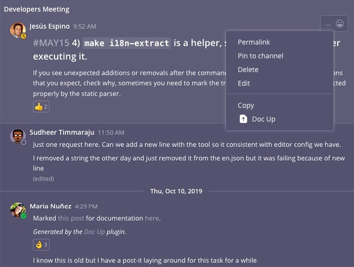

# Technical Writing Handbook

## Technical Writing Handbook

The Mattermost Technical Writers focus primarily on writing, editing, and maintaining technical documentation (including the User's Guide, Administrator's Guide, and Developer documentation).

### Areas of Responsibility

#### @justine.geffen:

* Documentation for high impact product areas
  * DevOps Command Center
  * Integrations
  * Self-serve customer journey
* Documentation metrics
  * Docs page ratings via Google Analytics
  * Google Analytics metrics for page visits, read times and bounce rates
* Consultation and guidance for R&D feature team release documentation
  * Contributing to product documentation
  * Writing MVP documentation
* Community and doc review process
  * Process for Doc Up plugin
  * Docs review and coordination with @amy.blais
  * Community Help Wanted doc issues
  * Documentation Handbook and Style Guide maintenance

The following areas remain a collaborative effort between Product Managers, Engineers, and Technical Writers until additional headcount is reached. Please reach out to the [Documentation Working Group](https://community.mattermost.com/private-core/channels/dwg-documentation-working-group) for any questions.

* [Mattermost Overview](https://docs.mattermost.com/overview/index.html)
* [User's Guide](https://docs.mattermost.com/guides/user.html)
* [Administrator's Guide](https://docs.mattermost.com/guides/administrator.html)
* GitLab documentation for:
  * [GitLab Mattermost docs](https://docs.gitlab.com/omnibus/gitlab-mattermost/%20)
  * GitLab helm chart docs
* Developer documentation for:
  * [developers.mattermost.com](https://developers.mattermost.com), including Contribute, Integrate, and Extend sections
  * [api.mattermost.com](https://api.mattermost.com)
  * General developer experience docs, e.g. code samples, best practices, and tutorials
* Admin-facing UI Content, such as the System Console
* Developer-facing UI Content, such as the Integrations backstage

In addition, the [Mattermost Documentation Management and Maintenance guide](https://docs.google.com/document/d/1XuCto2lpi29rtMcwfNUsFSZLyGBDLYEqJ9ET2XlDu6M/edit#) provides details related to general documentation tasks and processes, applicable across the Mattermost documentation.

## Technical Documentation Processes

The processes around documentation, such as SLAs for issues and requesting documentation assistance are detailed below.

### Contributing to Documentation

The basic outline for getting started with contributions is provided in the [README](https://github.com/mattermost/docs/blob/master/README.md) of the docs repo. If you have write access to the repo, you can create a branch off master and work on that.

Once complete, submit your Pull Request \(PR\). Ensure that you assign appropriate approvers and labels. You can read more about the review process [here](https://developers.mattermost.com/contribute/getting-started/code-review) - it applies to various types of contributions including documentation.

### Submitting Feature Documentation

Feature documentation is a joint effort between Product Managers and Technical Writers. In the same way that we want to empower everyone to contribute to our documentation, Product Managers are encouraged to write MVP documentation for their product/feature.

**Note:** Due to the cadence of the release cycle, feature documentation needs to be complete and submitted as per the process below at least ten days prior to release to ensure it's included in the release documentation update.

The supplied content can be provided informally, in bullet points, or rough notes in a Google Doc and refinements are made collaboratively. This is a guideline of what MVP feature documentation includes:

* A link to the feature/product's tech spec
* Links to any relevant Jira/GitHub issues
* A description of the product/feature/update which forms the basis of the documentation
* Steps for any processes or procedures (configuration of a feature, troubleshooting, etc)
* Any FAQs or troubleshooting questions if relevant
* Configuration settings and examples for the ``config.json`` file if relevant
* (If possible) Suggestions of where in the docs the content should go

When the content has been refined and approved in draft format:

* The Technical Writer creates a branch off the relevant documentation release branch
* The documentation is updated with the approved content in that branch
 * If there are multiple pages to update for a specific feature/change try keep them all in the same branch for ease of management
* The PR is submitted and relevant reviewers added, including an editor, for final review
 * Include the link to the server/webapp repo issue in your PR for reference purposes
* Once all reviews are complete, the PR is marked as **Reviews Complete** and merged into the documentation release branch by @amyblais

You can read more about the review process [here](https://developers.mattermost.com/contribute/getting-started/code-review).

### Submitting Documentation With Your PR

We want to empower everyone to contribute to our documentation, and be comfortable submitting documentation for contributions. As such, we don't expect every contribution to adhere to our style guide when first submitted.

During the review process the editorial team also provides feedback on style elements to bring the submission in line with the [Documentation Style Guide](https://docs.mattermost.com/guides/core.html#documentation-style-guide).

Here are some guidelines around this:

* When submitting a PR, please include updated documentation if applicable
* The documentation update can be in the form of a bullet list or an outline
* Label the PR as **Docs Needed**/**Editor Review** and tag @justinegeffen or @amyblais
* The documentation you've submitted will be reviewed
* At times, the editors may make and commit stylistic changes \(such as punctuation\) but any content changes will be added as a suggestion for the submitter's consideration
* Once the PR is approved, it will be merged, and the documentation will be updated

You can read more about the review process [here](https://developers.mattermost.com/contribute/getting-started/code-review).

Note: This process does not apply to the [API Documentation requirements](https://github.com/mattermost/mattermost-api-reference).

### Adding Reviewers to PRs

Mattermost documentation covers a number of different topics. For documentation, the following reviewers are recommended:

**Editor Review**

* Amy Blais \(@amyblais\) or Justine Geffen \(@justinegeffen\)

**Product Manager Review**

* Admin Guide - Enterprise: Dennis Kittrell \(@thefactremains\)
* Admin Guide - Non-enterprise: Katie Wiersgalla \(@kwiersgalla\)
* End User Guide - Mobile and desktop app: Eric Sethna \(@esethna\)
* End User Guide - Other: Adam Clarkson \(@adamjclarkson\)
* Integrations: Aaron Rothschild \(@aaronrothschild\)
* Handbook and Process: Jason Blais \(@jasonblais\)

**Dev Review**

If your change requires dev review add the developer/s you've been working with as the reviewer/s. If you're unsure who to add as a dev reviewer you can select one of the team leads below:

* Enterprise: Scott Bishel \(@sbishel\)
* Server/infra: George Goldberg \(@grundleborg\)
* Cloud: Joram Wilander \(@jwilander\)
* Mobile and desktop app: Elias Nahum \(@enahum\)
* Webapp and desktop: Dean Whillier \(@deanwhillier\)
* Integrations: Lev Brouk \(@levb\)
* Security: Daniel Schalla \(@dschalla\)
* DevOps: Jesse Hallam \(@lieut-data\)
* Handbook and Process: Jason Blais \(@jasonblais\)

### Requesting Documentation via Doc Up

Requests for documentation can be made within [community.mattermost.com](https://community.mattermost.com), using the Doc Up plugin embedded in the post menu.

When you select Doc Up and choose **Admin** as the issue type, an issue is generated in the GitHub docs repo, and added to the issues list. An update is listed in the Documentation channel, with the issue link.

You can also select **Developer** or **Company Handbook** to direct the Doc Up request to the appropriate repo.

As the issues are open to the community, the more information provided in the issue the better.

Review the issue in the [docs repo](https://github.com/mattermost/docs/issues?q=is%3Aopen+is%3Aissue), [developer documentation repo](https://github.com/mattermost/mattermost-developer-documentation/issues?q=is%3Aopen+is%3Aissue), or [handbook repo](https://github.com/mattermost/mattermost-handbook/issues?q=is%3Aopen+is%3Aissue) and add any links to appropriate documentation and/or Jira tickets. This ensures that the assignee is able to take on and complete the work within the turnaround times.

**Turnaround Time**

When the issue has been created, please follow these guidelines to assign [labels](https://developers.mattermost.com/contribute/getting-started/labels). This ensures that the issues are prioritized appropriately.

You can expect the following approximate turnaround times:

* Urgent issues \(bug, customer request/dealbreaker\): Acknowledged within 24 hours
* General issues: Acknowledged within 48 hours

There are a number of variables at play, such as review process, current workload, and type of work required which makes it difficult to provide a hard and fast time-frame for completion.

A rough guideline is between 3 and 5 days for the writing/editing portion of the work and 2 - 3 weeks for larger projects (these projects might be moved to Jira if required).

**Assignees**

Documentation does not have to be written by the Technical Product Writer/s. You can raise an issue, complete the requirement, and submit a Pull Request.

For less urgent work, if no reply has been received within 48 hours, please ping @justinegeffen in GitHub.

**Community Involvement**

We really want the community to own the docs as much as possible. In light of this, please mark your issue as “Help Wanted” so that community members are able to identify work that they’re able to assist with.

If your documentation request/issue applies to a repository other than *mattermost/docs*, you can use the **Docs Needed** and **Editor Review** labels and/or ping @justinegeffen or @amyblais.

## General Contribution Workflow

### Jira Tickets

The [Technical Writing Jira board](https://mattermost.atlassian.net/secure/RapidBoard.jspa?rapidView=61) is a snapshot of the current Technical Writing workload. Feature and release writing is planned three sprints in advance. This ensures that ad-hoc work can be taken on.

If you have a feature documentation requirement, please create a ticket and include the following fields:

* Label: Documentation
* Team: Tech Writing

Depending on what is required, please also include a sprint as well as a fix version.

If your request is not related to feature documentation, include the following fields:

* Label: Documentation
* Team: Tech Writing

**Jira Turnaround Time**

If the Jira ticket is for documentation related to a release, the documentation needs to be complete at least 10 days prior to release. Please ensure you allow sufficient time for your request to be completed or it will be moved to the next available slot.

If the Jira ticket is for general documentation, depending on the current workload, you can generally expect it to be completed within five business days.

### Editing Requests

When submitting a PR for documentation, please add the **Editor Review** label. Once the Technical Writer/Editor has signed off on the PR they will remove the label. When all the requested reviews are complete, the **Reviews Complete** label will be applied and the changes merged.

### Providing Editorial Feedback

If you're asked to provide editorial feedback on a PR, and it's your first editorial feedback request, first read up on the review process [here](https://developers.mattermost.com/contribute/getting-started/code-review) to get an idea of what's expected in terms of turnaround time, type of feedback, and so on.

Editorial feedback is based on the guidelines laid out in the [Documentation Style Guide](https://docs.mattermost.com/guides/core.html#documentation-style-guide) as well as the [Voice, Tone, and Writing Style Guide](https://handbook.mattermost.com/operations/operations/publishing/publishing-guidelines/voice-tone-and-writing-style-guidelines).

### Formatting and Style Guide

The [Documentation Style Guide](https://docs.mattermost.com/guides/core.html#documentation-style-guide) and [UI text guidelines](https://docs.mattermost.com/process/documentation-UItext-guidelines.html).

## Community Documentation Involvement

Every month the Mattermost community plans, builds, tests, documents, releases, and supports new product improvements for Team Edition to benefit the user community. The Mattermost Enterprise Team does the same for Enterprise Edition to benefit the subscriber community.

A critical part of this development is documentation which ranges from feature documentation to FAQs, guides, and tutorials.

### Feature Documentation

Feature documentation is generally written by the Product Manager and Technical Writer within a specific time-frame aligned with releases. Community members are welcome to assist, if the time expectations are manageable.

Feature request documentation is usually located in the [mattermost-server](https://github.com/mattermost/mattermost-server/issues?q=is%3Aopen+is%3Aissue+label%3ADocs%2FNeeded) repo and the [mattermost-webapp](https://github.com/mattermost/mattermost-webapp/pulls?q=is%3Aopen+is%3Apr+label%3ADocs%2FNeeded) repo and are labelled as “Docs Needed”. As these are tied to a release \(and a deadline\) it’s best to only take on the work if you’re sure you can complete it on time. It’s understood that community members contribute in their available time, which is why this type of documentation isn’t usually the best option to take on.

### Help Wanted Tickets/Doc Issues

Help Wanted tickets are generally not linked to a release and are more flexible in terms of timeline and delivery date. You can find the documentation Help Wanted tickets [here](https://github.com/mattermost/docs/labels/Help%20Wanted). To start working on one, assign it to yourself, add a comment indicating you’ll be working on it, find the relevant document in the [source](https://github.com/mattermost/docs/tree/master/source) directory, read through the [README](https://github.com/mattermost/docs/blob/master/README.md) file if you're not familiar with the process, and get started.

If you have any questions, you can post them in the [Documentation](https://community.mattermost.com/core/channels/documentation) channel and we'll be happy to help.

### Engineering/Developer Documentation

Most, if not all, contributions to the Mattermost project have a documentation impact. As part of the development and submission process, it’s recommended that the relevant documentation be updated \(or created\) and included in the PR. This provides consistency and accuracy in communicating the changes/new feature and cuts down on having multiple issues and PRs for related documentation.

Visit the [Contribute to Documentation](https://handbook.mattermost.com/operations/operations/publishing/publishing-guidelines/voice-tone-and-writing-style-guidelines/submitting-documentation-with-your-pr) page to get started with submitting documentation with your PR. You can read more about the review process [here](https://developers.mattermost.com/contribute/getting-started/code-review).
