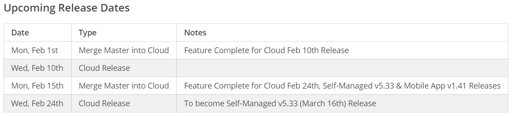

# Release Overview

Mattermost ships with a new version on the 16th of each month in [binary form](http://docs.mattermost.com/administration/upgrade.html#mattermost-team-edition).

For the past few years, Mattermost used a monthly “tick-tock” alternating release cycle. A tick-tock cycle refers to even-numbered releases (e.g., 5.26) containing new features, and odd-numbered releases (e.g., 5.27) containing only bug fixes and performance improvements. As our product and team continue to evolve, we're moving away from this alternating release cycle in favor of a general monthly release.

When security issues are found that warrant a patch release, we follow the [security release process outlined here](https://handbook.mattermost.com/operations/research-and-development/product/release-process/security-release).

Mattermost also ships releases with new features and bug fixes [to Mattermost Cloud](https://docs.mattermost.com/guides/cloud-admin-guide.html) every two weeks.

## Release Numbering

Mattermost numbers stable releases in the following format:
**[Version Number].[Major Build Number].[Minor Build Number]**

**Version Number:**

- Purpose: Major system releases introduce significantly new functionality or change existing product behaviour
- Release frequency: Unscheduled. Major system releases are infrequent
- Example: v1.x.x, v2.x.x

**Major Build Number:**

- Purpose: Introduce new features, bug fixes and performance improvements
- Release frequency: Monthly on the 16th of each month
- Example:
  - Even numbers (e.g. v1.2.x, v1.4.x): New features and bug fixes
  - Odd numbers (e.g. v1.3.x, v1.5.x): Quality release including performance improvements and bug fixes

**Minor Build Number:**

- Purpose: Patch existing releases when severe bug fixes or security patches are required
- Release frequency: As required
- Example: v1.2.5, v1.2.6

## Overview of Release Cycles

Currently Mattermost Cloud releases occur on a 2-week cycle, but the goal is to release more frequently. Cloud and Self-Managed PRs don’t need to be cherry-picked to releases, except for any last minute bug fixes that get merged after the release branch is cut, and any necessary hotfixes.

Schedule for Mattermost Cloud releases:
 - (T-7): 1 week prior to the release day, the ``master`` branch is merged to the Cloud branch.
 - (T-0): Release Day

Schedule for Self-Managed releases:
 - (T-30): Feature Review/Judgment Day/Release branch cut
 - (T-9): RC1 Cut
 - (T-8 to T-7): RC testing and final QA testing
 - (T-5): Code Freeze
 - (T-2): Cut Final
 - (T-0): Release Day

1. The feature is tested on a PR and E2E test automation is added.
2. Large features are added behind a feature flag.
3. The feature flag is initially “off” in Mattermost Cloud and will be rolled out slowly.
    - Feature flag rollout plan: https://developers.mattermost.com/contribute/server/feature-flags/.
5. Self-Managed release branch and release candidate are cut based on the Mattermost Cloud release. Prior to the cut to Self-Managed, the Release Manager reviews new feature flags and provides a report to the PM/QA teams for their review. Essentially a feature will be included in a Self-Managed release once the feature flag has been removed.
6. Self-Managed release candidate is smoke tested.
7. Self-Managed release final is cut and released publicly.

## Release Dates Communication

Release dates are currently communicated in the following ways. Further iteration and improvements on this process can be done in the future.

1. Channels
  - The [Release Announcements channel](https://community.mattermost.com/core/channels/release-announcements) functions as the main location for important announces about new releases, release branches cut, release candidates and test server updates, and release dates and feature complete deadlines. Specific teams or people may be at-mentioned if the announce is targeted to someone.
  - The [Announcements channel](https://community.mattermost.com/private-core/channels/announcements) functions as the central place to find the most important announcements for new releases with links to blog posts that can be easily shared with external stakeholders including MLT and customers.
2. Mattermost Release Dates Calendar
  - Lists key release dates and deadlines.
3. PM and R&D meetings 
  - Updates are provided on upcoming key dates and/or features.

**Understanding the Cadence**

 - The Mattermost Cloud releases follow a 2-week cycle and the release day is normally on Wednesdays. Feature Complete deadline for each Mattermost Cloud release is on Mondays 9 days prior to the release day.
 - The Mobile App releases follow the same schedule as Self-Managed releases.
 - Currently the cadence is that the Mattermost Cloud release shipped in the last week of a month will become the next Self-Managed release. The release branch for a Self-Managed release (e.g. ``release-5.32``) will be cut once the Mattermost Cloud release that will be used for the next Self-Managed release has been shipped.
 - This cadence is subject to change in the future and any changes will be documented and announced.

## Tracking Feature Flags

Release Manager is able to look at the version we have deployed to Mattermost Cloud. Also, when we are hooked up to split.io, there will be a dashboard where you can see active and historic feature flags. Any feature that has its flag removed would be included on any Self-Managed releases past the point after that removal was merged. More details on feature flags: https://developers.mattermost.com/contribute/server/feature-flags/.

## Cloud Release Branch Processes

**Process for merging the ``master`` branch into the ``cloud`` branch**
 - The Cloud team opens PRs in webapp, server, redux, and enterprise branches to merge the ``master`` branch into the ``cloud`` branch ([example PR](https://github.com/mattermost/mattermost-server/pull/16838)).
 - Devs should be aware of the dates when the ``master`` branch is merged into the ``cloud`` branch in order to be mindful of avoiding having incomplete features in a Cloud release and to be mindful of bug fixes that we may want to include in a release.

**Process for cutting release branch for on-prem based off of Cloud releases**
 - Instead of using the tick-tock branching process, the on-prem releases are now cut based off of the Mattermost Cloud release tags (e.g Self-Managed v5.32 release was based off of ``cloud-2021-01-26`` tag).

## Adding Milestones on PRs and Jira Tickets

Releases are now focused on "shipping features and improvements when they're ready for Mattermost Cloud, and then they'll get to a Self-Managed release once they've been available on Mattermost Cloud for 2+ weeks".

 - A new Cloud branch (based off of master) is used, and any regression bug fixes for the next Mattermost Cloud release will be cherry-picked there.
 - This applies to webapp/server/Redux/Enterprise repos.
 - A fix version such as “Cloud (November 24)” is added in Jira to track regression bug fixes for Mattermost Cloud releases.
 - The Self-Managed releases are based off of Mattermost Cloud releases.
 - Submitted feature or bug fix PRs don’t need a release milestone added to them unless the PR is scheduled for a specific Mattermost Cloud or Self-Managed release. Release Manager will track merged PRs and help ensure that correct milestones are added as needed. Any concerns can be brought up for discussion on a case-by-case basis.

## Triaging Mattermost Cloud Customer Issues

When triaging a bug report, consider the following:
 - Impact of the bug on customers
 - Severity of the issue
 - Risk and effort of reverting to the last version or fixing a bug

**Criteria**
1. "We need to revert to the last version" process:
 - Crash or all services are down due to a bug; affects some to all Mattermost Cloud customers.
2. "We need to release this ASAP" process:
 - A severe regression or loss of functionality; affects some to all Cloud customers.
3. "It's OK to wait until next release" process:
 - Loss of function, but little impact on Cloud customers.

**Responders**
 - Who is making the decision on which process above we need to follow?
    - In some cases it's the SET On-Call Commander, and in some cases it's other people such as the Release Manager or developers who notice or get notified about the report.
 - Bugs will be fixed by either the SET team or by respective development teams, depending on availability and expertise.

**Reports**
 - The Cloud team has created a central channel for escalations from Cloud Support channel (available in the Staff team). Additionally when a report is posted, it is important to notify the SET Lead, Release Manager, and Development Lead of the team that owns the feature.

## Frequently Asked Questions

**Q: What is the release cycle for the React Native mobile apps?**

  - A: The mobile apps follow the same monthly release cycle as Mattermost Server/Webapp, releasing on the 16th of each month.

**Q: What is the release cycle for the Mattermost Desktop app?**

  - A: Desktop releases are currently released as required.

**Q: When is release branch cut for a Self-Managed release?**

  - A: Self-Managed releases are based off of Mattermost Cloud releases. For example, the Self-Managed v5.32.0 release is based off of the ``cloud-2021-01-26`` release tag. Currently the cadence is that the Mattermost Cloud release shipped in the last week of a month will become the next Self-Managed release. The release branch for a Self-Managed release will be cut once the Mattermost Cloud release that will be used for the next Self-Managed release has been shipped.

**Q: How are PRs merged for release?**

  - A: PRs are first merged to master. The dev who submitted the fix is also responsible for cherry-picking it to the release branch after a release branch has been cut.

**Q: How is cherry-picking done?**

  - A: See the [cherry pick process documentation](https://developers.mattermost.com/contribute/getting-started/branching/#cherry-pick-process-developer/) for details.

**Q: What is community.mattermost kept on?**

  - A: community.mattermost is kept on the most recent Mattermost Cloud release.

**Q: What is community-release.mattermost kept on?**

  - A: community-release.mattermost is kept on the currently in-progress Mattermost Cloud release.

**Q: What is community-daily.mattermost kept on?**

  - A: Normally on `master` branch.

**Q: How to remove a feature/bug from a release?**

  - A: Revert from release branch. Optionally revert from master.

**Q: How are NOTICE.txt PRs submitted?**

  - A: PRs are first merged to master. The dev who submitted the fix is then responsible for cherry-picking it to the release branch.

**Q: Is an improvement a feature or a bug?**

  - A: Usually features/story tickets.

**Q: How does release team monitor what changes went into a release?**

  - A: Monitor the commit history of the respective release branch, e.g., https://github.com/mattermost/mattermost-server/commits/release-5.4 contains commits that shipped with mattermost-server v5.4. Jira ticket is resolved after cherry picking is done.

**Q: How does translations branching work?**

  - A: Lock the translation server to the release branch. The translation PR will be submitted against the release branch and it can just be merged directly to the release branch without cherry-picking. When the translation server is locked back to master, the next PR against master will include those translations that went in for the release branch.

**Q: How does cutting mobile builds work?**

  - A: See instructions here: https://developers.mattermost.com/internal/mobile-build-process/.

**Q: What is the process for community PRs?**

  - A: Review, merge, and cherry-pick.

**Q: Will RC testing remain, or will RC testing process change?**

  - There will be some manual RC testing until all release tests are automated.

**Q: Do Mobile and Desktop App releases follow the "cloud first" strategy?**

  - Mobile and Desktop App releases are not based off of Mattermost Cloud releases at this point.

**Q: How do we track feature differences for Mattermost Cloud and Self-Managed releases?**

  - Any feature that's promoted out of the feature flag process would be turned on for the Self-Managed releases. That way Self-Managed releases only get fully tested features that are ready for release, and does not get the ones still being tested. There will be some cases where we need to make a fix or change something for the Self-Managed release (e.g., a bug that only occurs if you use a certain Self-Managed setting or a certain database we don't use in Mattermost Cloud). In those cases the Self-Managed release might have some changes that are not a direct copy of the Mattermost Cloud build.

**Q: What information does the Customer Support team need for Cloud releases?**

  - The Cloud Releases channel in the Staff team is used for release updates and for posting the changelog. This may be automated in the future. We're also planning to have a dashboard that shows the current version deployed to Mattermost Cloud, and which commits are included.

**Q: How will versioning work?**

  - Version numbers will be less meaningful for Mattermost Cloud. Proposing the name of this to be capabilities following the naming used by OpenGL. With Mattermost Cloud, it's not whether or not a feature is enabled, but whether or not the server is capable of supporting the feature.
