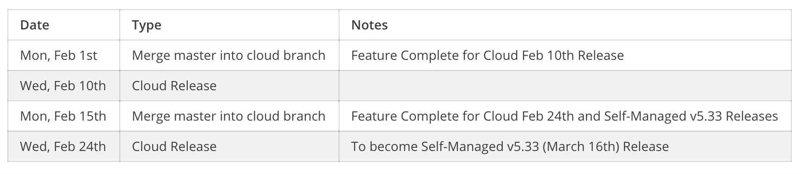

# Release Overview

Mattermost ships with a new version on the 16th of each month in [binary form](https://docs.mattermost.com/upgrade/upgrading-mattermost-server.html#upgrading-to-the-latest-version) for self-managed customers. Mattermost also ships releases with new features and bug fixes [to Mattermost Cloud](https://docs.mattermost.com/about/product.html#mattermost-cloud) biweekly.

When security issues are found that warrant a patch release, we follow the [security release process outlined here](https://handbook.mattermost.com/operations/research-and-development/product/release-process/security-release).

## Release numbering

Mattermost numbers stable releases in the following format: **\[Version Number\].\[Major Build Number\].\[Minor Build Number\]**

**Version number:**

* Purpose: Major system releases introduce significantly new functionality or change existing product behavior
* Release frequency: Unscheduled. Major system releases are infrequent
* Example: v1.x.x, v2.x.x

**Major build number:**

* Purpose: Introduce new features, bug fixes and performance improvements
* Release frequency: Monthly on the 16th of each month
* Example:
  * Even numbers \(e.g. v1.2.x, v1.4.x\): New features and bug fixes
  * Odd numbers \(e.g. v1.3.x, v1.5.x\): Quality release including performance improvements and bug fixes

**Minor build number:**

* Purpose: Patch existing releases when severe bug fixes or security patches are required
* Release frequency: As required
* Example: v1.2.5, v1.2.6

## Objectives

The goal is to deliver value to users quickly by a\) shipping fast to get features to customers quickly for experimentation/feedback, and b\) iteratively behind feature flags as a protection if any issues arise. This document outlines the principles and guidelines for how we release a new update of each product line weekly to Cloud and monthly to self-managed.

## Multi-product Release Principles

The goal is not to have the same release cadence for all products, but there may be similar schedules. E.g. Playbooks and Boards plugins are pre-packed once a month with the self-managed releases, however, admins will have a config option to turn off products. As the product suite gets bigger, we need a dedicated Release Manager for each product. We can duplicate/reuse a similar build process for new plugins in the suite.

**Release Owners**

* Channels: Amy Blais
* Boards: Boards PM and devs
* Playbooks: Playbooks dev rotation

1. **Focus on High Impact by shipping every new feature and any riskier code changes behind a feature flag.**
   * Enables us to iterate in Cloud to deliver value to self-managed users more quickly by shipping changes faster. 
   * Currently the feature complete deadline for self-managed release is roughly 3 weeks prior to release day, but in the future we can consider pushing it to later. Each suite vertical is individually responsible for quality and deciding if a feature should be included in a release or not \(with the release team giving guidelines\). This may mean shipping more patch releases, but we can manage some of this by using feature flags. This also requires good test automation coverage.
2. **Automate.**
   * This allows us to ship releases more often and push feature complete deadlines to later.
   * Automate release processes and tasks.
   * Automate release tests and have E2E tests for features.
3. **Earn Trust by communicating to external and internal stakeholders clearly.**
   * Enables us to make expectations for releases clear for all stakeholders.
   * Make expectations for each release clear \(release dates, etc.\). Communicate. Ensure that everyone on the team is familiar with the release processes.
   * Release notes, minimum version requirements, and any important upgrade notes need to be available for customers and communicated via docs, twitter, blog, emails, channels, download page, GitHub.
4. **Earn Trust by including all stakeholders \(Tech Writers, Marketing, QA, etc.\) early in the release process.**
   * Enables us to avoid missing key tasks and to avoid last minute work.
   * E.g. When opening a PR, add a “Docs/Needed” label for any PRs that need docs and communicate to Tech Writers. Don’t wait until merging the PR/feature. This ensures that we have time to complete docs on time when our releases become faster.
   * Make tracking bugs and testing requirements easy. E.g:
   * Resolve Jira tickets for QA when PRs are merged \(and cherry-picked\).
   * Add QA test steps to Jira tickets and/or PRs.
   * Add Fix Versions and Milestones in Jira/PRs for bugs/tickets for easy tracking.
   * Add clear Release Notes on PRs.
5. **Achieve Customer Obsession by doing retrospectives on release issues and monitoring customer/community release bug reports after releases.**
   * This allows us to learn from issues so that they don’t happen again and to fix critical bugs asap.
   * Retrospectives for issues and dot releases are important.
   * Monitor community and customer reports in GitHub, Forum, Zendesk, and channels like Ask R&D, in partnership with the Support team.
6. **Release new products tightly integrated with the Mattermost suite.**
   * E.g. Boards will ship as a plugin in June; Playbooks is a plugin. Plugins are the strategy for now, maybe there will be another strategy for the long-term.

## Multi-product Release Processes
 - The sample [Plugin Release Playbook](https://community.mattermost.com/playbooks/playbooks/f4oh16ardfbyfgkas1cb6intmw/preview) helps give an overview of needed steps for plugin releases.
 - Please also refer to the [Playbooks release documentation](https://handbook.mattermost.com/operations/research-and-development/product/release-process/playbooks-release) and [Boards release documentation](https://handbook.mattermost.com/operations/research-and-development/product/release-process/boards-release).

## Overview of Release Cycles

Currently Mattermost Cloud releases occur on a biweekly cycle, but the goal is to release more frequently. Cloud and self-managed PRs may need to be cherry-picked to the release branches, such as regression bug fixes and hotfixes that get merged after the release branch has already been cut.

We follow [the Agile Release Train method](https://www.scaledagileframework.com/agile-release-train/) at least for Cloud releases. If releases are not approved by a certain date, then we miss the release train.

For P0 bugs (eg. bugs that affect more than 25% of our customers with system degradation), we will do an exception and rollout a hotfix as soon as possible.

**Schedule for Cloud releases**:
 - Thursdays: Merge master into the cloud branch and update cloud test servers.
 - Friday-Tuesday: Release testing and bug fixing.
    - QA approval should be given by the EOD Tuesday, so that the release rollout can be started early Wednesday morning. 
    - If QA approval is not ready by EOD Tuesday due to a testing delay or due to a last minute high priority bug fix, then we miss the release train.
    - If the release train was missed, we need to do a retrospective on why it happened - e.g. are adjustments needed to the QA release testing process, or was there a reason why the last minute bug fix happened.
 - Wednesdays: Release day.

**Schedule for Self-managed releases**:
 - Feature Complete deadline is approximately 1 month prior to the release day.
    - When we merge master into the cloud branch for the last Cloud release of the month, this is the cut-off for new features included in the next self-managed release.
    - If a feature misses the cut-off, it doesn’t get added to the next self-managed release.
 - Cut release branch based off the last Cloud release of the month (around T-14).
 - Code Freeze at T-5.
    - Prepackaged Boards and Playbooks should be ready on or before this date. Note: currently the Boards team follows a slightly different release schedule and the Boards release may not be ready until T-3.
 - Cut Final build at T-2.
    - QA approval should be ready by T-2.
 - Release Day at T-0.

1. The feature is tested on a PR and E2E test automation is added.
2. Large features are added behind a feature flag.
3. The feature flag is initially “off” in Mattermost Cloud and will be rolled out slowly.
   * Feature flag rollout plan: [https://developers.mattermost.com/contribute/server/feature-flags/](https://developers.mattermost.com/contribute/server/feature-flags/).
4. Self-managed release branch and release candidate are cut based on the Mattermost Cloud release. Prior to the cut to self-managed, the Release Manager reviews new feature flags and provides a report to the PM/QA teams for their review. Essentially a feature will be included in a self-managed release once the feature flag has been removed.
5. Self-managed release candidate is smoke-tested.
6. Self-managed release final is cut and released publicly.

## Release dates communication

Release dates are currently communicated in the following ways. Further iteration and improvements on this process can be done in the future.

1. Channels
   * The [Release Announcements channel](https://community.mattermost.com/core/channels/release-announcements) functions as the main location for important announces about release branches cut, release candidates and test server updates, and release dates and feature complete deadlines. Specific teams or people may be at-mentioned if the announce is targeted to someone.
   * The [Announcements channel](https://community.mattermost.com/private-core/channels/announcements) functions as the central place to find the most important announcements for new releases with links to blog posts that can be easily shared with external stakeholders including MLT and customers.
2. Mattermost Release Dates Calendar
   * Lists key release dates and deadlines.
3. PM and R&D meetings
   * Updates are provided on upcoming key dates and/or features.
4. Productboard
   * [Productboard](https://mattermost.productboard.com/roadmap/2855466-features-by-release) - One calendar overview of what releases + features are coming up.
5. Spreadhseet
   * [Overview of release deadlines and cherry-picking guidelines](https://docs.google.com/spreadsheets/d/1jGEnuaZxosmC-JSUXFeZOR7I34ORFtNjPVw8hvzCIC4/edit#gid=0).

**Understanding the cadence**

* The Mattermost Cloud releases follow a biweekly cycle and the release day is normally on Wednesdays. Feature Complete deadline for each Mattermost Cloud release is on Mondays 7 working days prior to the Cloud release day.
* The Mobile App release cadence is monthly on the 16th of every month.
* Currently the cadence is that the Mattermost Cloud release shipped in the last week of a month will become the next self-managed release. The release branch for a self-managed release \(e.g. `release-5.32`\) will be cut once the Mattermost Cloud release that will be used for the next self-managed release has been shipped.
* This cadence is subject to change in the future and any changes will be documented and announced.

## Tracking feature flags

The Release Manager is able to look at the version we have deployed to Mattermost Cloud. Also, when we are hooked up to split.io, there will be a dashboard where you can see active and historic feature flags. Any feature that has its flag removed would be included on any self-managed releases past the point after that removal was merged. More details on feature flags: [https://developers.mattermost.com/contribute/server/feature-flags/](https://developers.mattermost.com/contribute/server/feature-flags/).

## Cloud release branch processes

**Process for merging the `master` branch into the `cloud` branch**

* For server, webapp, api-reference and enterprise cloud branches, the current `cloud` branch is deleted and a new one is created from the `master` branch for each. A backup of the `cloud` branches are saved. This is done biweekly on a Monday by the Release Manager via an automated process. See [this document](https://docs.google.com/document/d/1i3k322KATm76AX2k-tL8lDsjIqI-E2tl4hCx1KcXV8A/edit#heading=h.3gq28x60gnor) for more details on the process.
* Devs and Release Manager should be aware of the dates when a `master` branch is merged into a `cloud` branch in order to be mindful of avoiding having incomplete features in a Cloud release, and to include bug fixes that we may want to include in a release.

**Process for cutting the release branch for Self-Managed releases based off of Cloud releases**

* Instead of using the tick-tock branching process, the self-managed releases are now cut based off of the Mattermost Cloud release tags \(e.g Mattermost Server v5.32 release was based off of `cloud-2021-01-26` tag\).

## Adding milestones on PRs and Jira tickets

Releases are now focused on "shipping features and improvements when they're ready for Mattermost Cloud, and then they'll get to a self-managed release once they've been available on Mattermost Cloud for 2+ weeks".

* If the PR is scheduled for a specific Mattermost Cloud or self-managed release, please add the `Cherry-pick Approved` label and self-managed milestone on the PR. Cloud doesn't have a specific milestone in GitHub and the PRs can be tracked via the `Cherry-pick Approved` label. The Release Manager keeps track of PRs with the `Cherry-pick Approved` label and self-managed milestone on a daily basis.
* The Release Manager also tracks regression bugs and aims to ensure that they get fixed for the next release.
* A ``cloud`` branch \(based off of `master`\) is used, and any regression bug fixes for the next Cloud release will be cherry-picked there. This applies to webapp/server/Enterprise repos.
* A fix version such as “Cloud \(November 24\)” is added in Jira to track regression bug fixes for Mattermost Cloud releases.
* The self-managed releases are based off of Mattermost Cloud releases.

## Triaging Mattermost Cloud customer issues

When triaging a bug report, consider the following:

* Impact of the bug on customers.
* Severity of the issue.
* Risk and effort of reverting to the last version or fixing a bug.

**Criteria**

1. "We need to revert to the last version" process:
   * Crash or all services are down due to a bug; affects some to all Mattermost Cloud customers.
2. "We need to release this ASAP" process:
   * A severe regression or loss of functionality; affects some to all Cloud customers.
3. "It's OK to wait until next release" process:
   * Loss of function, but little impact on Cloud customers.

**Responders**

* Who is making the decision on which process above we need to follow?
  * In some cases it's the SET On-Call Commander, and in some cases it's other people such as the Release Manager or developers who notice or get notified about the report.
* Bugs will be fixed by either the SET team or by respective development teams, depending on availability and expertise.

**Reports**

* The Cloud team has created a central channel for escalations from Cloud Support channel \(available in the Staff team\). Additionally when a report is posted, it is important to notify the SET Lead, Release Manager, and Development Lead of the team that owns the feature.

## Frequently Asked Questions

**Q: What is the release cycle for the React Native mobile apps?**

* A: The mobile apps follow the same monthly release cycle as Mattermost Server/Webapp, releasing on the 16th of each month.

**Q: What is the release cycle for the Mattermost Desktop app?**

* A: Desktop releases are currently released as required.

**Q: When do I need to have a feature PR to be included into the next release?**

* A: Aim to have the PR merged before the Feature Complete deadline. The earlier in the monthly cycle the PR is merged, the higher the chances are for it to be included in that month's release. The quality of our releases is important and feature PRs are not normally cherry-picked to a release branch.

**Q: How can I determine if my merge request will make it into the next release?**

* A: The Release Manager adds PR milestones and Jira fix versions for tracking. You can also check the release branches (e.g. in the server repo) to see what's included.

**Q: Do we use Playbooks for releases?**

* A: Yes, playbooks are used for Cloud, Mobile, Dot releases, self-managed, and plugin releases, including Playbooks itself.

**Q: When is release branch cut for a self-managed release?**

* A: Self-managed releases are based off of Mattermost Cloud releases. For example, the self-managed v5.32.0 release is based off of the `cloud-2021-01-26` release tag. Currently the cadence is that the Mattermost Cloud release shipped in the last week of a month will become the next self-managed release. The release branch for a self-managed release will be cut once the Mattermost Cloud release that will be used for the next self-managed release has been shipped.

**Q: How does the release build pipeline process work for self-managed releases?**

* A: Documentation on the release pipeline process via Miro is available here: [https://miro.com/app/board/o9J\_lH-zx0k=/?utm\_source=notification&utm\_medium=email&utm\_campaign=daily-updates&utm\_content=go-to-board&fromRedirect=1](https://miro.com/app/board/o9J_lH-zx0k=/?utm_source=notification&utm_medium=email&utm_campaign=daily-updates&utm_content=go-to-board&fromRedirect=1) \(has restricted access\).

**Q: How are PRs merged for release?**

* A: PRs are first merged to master. As needed, the dev who submitted the fix is also responsible for cherry-picking it to the release branch after a release branch has been cut.

**Q: How is cherry-picking done?**

* A: See the [cherry pick process documentation](https://developers.mattermost.com/contribute/getting-started/branching/#cherry-pick-process-developer/) for details.

**Q: What version are community.mattermost.com and community-daily.mattermost kept on?**

* A: Normally on `master` branch and they update daily.

**Q: How to remove a feature/bug from a release?**

* A: The feature flag is turned off. Another option is reverting the feature from the `master` and `release` branches.

**Q: How are NOTICE.txt PRs submitted?**

* A: PRs are first merged to `master`. The dev reviewer is responsible for helping cherry-picking it to the `release` branch.

**Q: Is an improvement a feature or a bug?**

* A: Usually features/story tickets.

**Q: How does release team monitor what changes went into a release?**

* A: Monitor the commit history of the respective `release` branch, e.g., [https://github.com/mattermost/mattermost-server/commits/release-5.4](https://github.com/mattermost/mattermost-server/commits/release-5.4) contains commits that shipped with `mattermost-server v5.4`. Jira ticket is resolved after cherry picking is done.

**Q: How does translations branching work?**

* A: The translation PR will be submitted against the master branch and will be cherry-picked to the `release` branch as needed.

**Q: How does cutting mobile builds work?**

* A: See instructions here: [https://developers.mattermost.com/internal/mobile-build-process/](https://developers.mattermost.com/internal/mobile-build-process/).

**Q: What is the process for community PRs?**

* A: Review, merge, and cherry-pick as needed.

**Q: Will RC testing remain, or will RC testing process change?**

* There is still manual QA RC testing for Mobile App and self-managed releases until all release tests are automated.

**Q: Do Mobile and Desktop App releases follow the "cloud first" strategy?**

* Mobile and Desktop App releases are not based off of Mattermost Cloud releases at this point. These releases are based off of `master`.

**Q: How do we track feature differences for Mattermost Cloud and self-managed releases?**

* Any feature that's promoted out of the feature flag process would be turned on for the self-managed releases. That way self-managed releases only get fully tested features that are ready for release, and does not get the ones still being tested. There will be some cases where we need to make a fix or change something for the self-managed release \(e.g., a bug that only occurs if you use a certain self-managed setting or a certain database we don't use in Mattermost Cloud\). In those cases the self-managed release might have some changes that are not a direct copy of the Mattermost Cloud build.

**Q: What information does the Customer Support team need for Cloud releases?**

* The Announcements channel in the Staff team is used for release updates and for posting the changelog. This may be automated in the future. We're also planning to have a dashboard that shows the current version deployed to Mattermost Cloud, and which commits are included.
