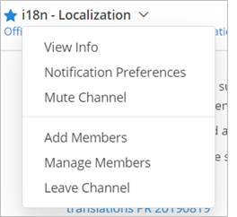
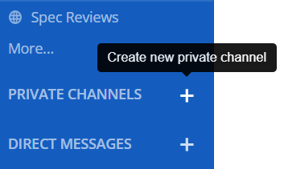
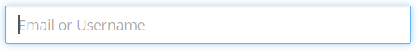
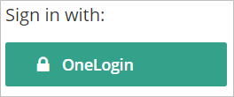
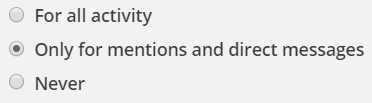
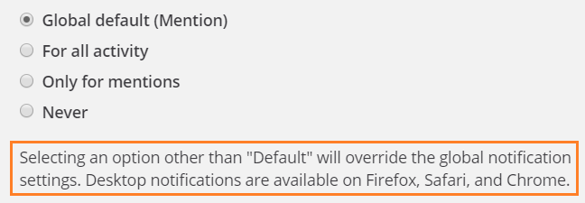
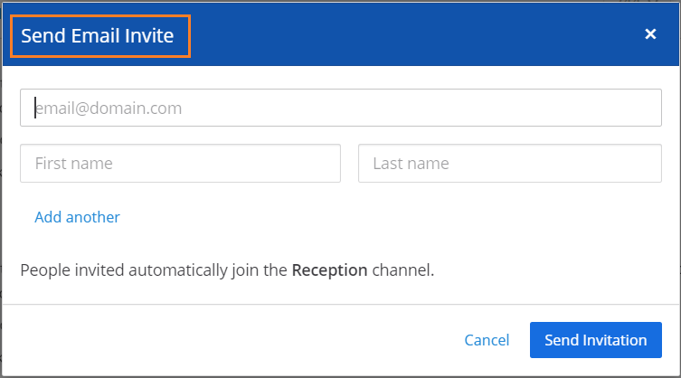
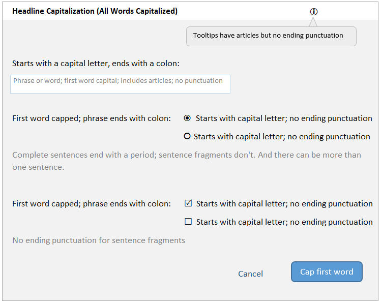

# User Interface Text Guidelines

Mattermost user interface content (microcopy) is where we can set our users up for success and build engagement with the product instead of reliance on documentation.

When we write copy for our product messaging our primary goals are to:

* Write with empathy
* Provide context
* Help users build mental models
* Reduce cognitive load
* Proactively prevent failure

To achieve these goals, we ensure that we have the right content for the right user at the right time. In addition to this, we prioritize:

* Plain language: We choose natural language, simple words, and short sentences for documentation and in-product text.
* Readability: We strive to make our documentation pages easy to scan and not overwhelming.
* Consistency: We ensure that we all refer to the same things using the same words or names, to avoid confusion.

These writing principles mean that we think like a friend, and talk like a coach to reduce friction and increase satisfaction. 

* Keep in mind that your users are from all over the world. 
* Use the present tense to describe a current state or condition, and the future tense to state something that is very definitely going to happen.
* Use the active voice, except for these cases:
  * If you’ll end up blaming the user. For example, don’t say **You entered an incorrect password**. Instead, say **The password is incorrect**.
  * If you’re describing what just happened. For example: **Your incoming webhook is set up**.
  * If the subject \(the doer of an action\) is the Mattermost application itself. For example: **The image has been deleted** instead of **The server deleted the image**.
* If you’re asking the user to do or not do something, use imperatives \(command phrases\). For example, use **Don't change the Hostname** instead of **It's not recommended to change the Hostname**. Better still, explain what could go wrong if they do or don’t do something. For example: **Don't change the Hostname because doing so will break something**.

## Types of in-product content

In general, users will encounter the following types of messaging when using Mattermost:

* Help, hints, or informative text
* Calls to action
* Confirmation dialogs
* Errors
* Notifications

In general, this content is either:

* Static text on the user interface
* An actionable button which leads to a process
* Triggered because something happened

## Writing for inclusion and diversity

This section is being built out. In the meantime, please consult [this page](https://writer.com/inclusion-glossary/) for the type of guidelines we follow when writing with inclusion and diversity in mind.

If you have any questions about writing for inclusion and diversity, or notice something we can improve, please tell us! You can find us on Mattermost in the [DWG: Documentation Working Group](https://community.mattermost.com/core/channels/dwg-documentation-working-group) channel.

## Accessibility

This section is being built out. In the meantime, here are some of the things we take into account when writing content:

- [ALT tags](https://docs.google.com/document/d/1AKY1iEkN6iDwJbsHQ-vcEkJvjtLKmq0pKYDwKLmSffs/edit)
- Colors used on-screen
- Plain and clear language

Take a look at [this article](https://www.invisionapp.com/inside-design/writing-accessible-microcopy/) for some more information on accessibility. 

Have any ideas or feedback? You can find us on Mattermost in the [DWG: Documentation Working Group](https://community.mattermost.com/core/channels/dwg-documentation-working-group) channel.

## Messaging guidelines

Don’t blame the user. Inform them about what happened, explain why it happened, and suggest a way forward. Try to use complete sentences in your messages. A sentence phrase \(an incomplete sentence\) might make sense in English but could present internationalization challenges.

### System messages

System messages can be one of the following types: **notification**, **confirmation**, **warning**, and **error**. The following sections contain guidelines that are specific to each of these types.

If a system message contains variables \(tokens\):

* Don't use verbs or adjectives as variables.
* Don't create plurals of variables by adding an "s".
* If the variable is a noun, use a qualifier after the variable. For example, say **The {channel\_name} channel was created** rather than **The {channel\_name} was created**.

### Notification messages

A notification message informs the user about an event or action that took place. These messages don't need any user input, and don't prevent the user from continuing to use Mattermost.

* Use either a complete sentence or a sentence phrase.
* If using a complete sentence, end it with a period.
* Examples:
  * **Member added to channel.**
  * **The plugin was installed.**

### Confirmation messages

A confirmation message requires user input to confirm that they want to proceed with the action. Confirmation must be provided \(either to continue or cancel\) before the user can continue to use Mattermost.

* Use complete sentences.
* Include a question that has a Yes/No answer.
* Examples:
  * **Are you sure you want to delete this channel?**
  * **A plugin with this ID already exists. Would you like to overwrite it?**

### Warning messages

A warning message alerts the user that something that might go wrong. They can continue using Mattermost unless the warning message needs user input.

* Use complete sentences.
* Explain what has happened, or can happen, and what may go wrong as a result.
* Examples:
  * **The Enterprise license expires in 2 days. If it's not renewed, some features will be disabled on license expiry.**
  * **If you claim this AD/LDAP account, you won't be able to log in with your email address.**

### Error messages

An error message informs the user that something went wrong. Errors prevent the user from completing a task or accessing a feature until the error is resolved.

* Use complete sentences.
* If what went wrong isn’t obvious, explain in one sentence.
* If a solution or workaround isn’t obvious, suggest one.
* Examples:
  * **Messages must have fewer than 120 characters.**
  * **A connection to the Marketplace server could not be established. Check your settings in the **System Console**.**

## In-product copy

The Technical Writers often work with the UI/UX team on in-product copy. The majority of guidelines are available in the [Mattermost Compass Design System](https://zeroheight.com/29be2c109/p/995619-compass-design-system).

### How we make in-product text changes

While its possible to manage in-product text changes using GitHub web tools, writers may find it more straightforward to clone each of the main Mattermost repositories, including [webapp](https://github.com/mattermost/mattermost-webapp), [server](https://github.com/mattermost/mattermost-server), [mobile](https://github.com/mattermost/mattermost-mobile), and [desktop](https://github.com/mattermost/desktop), and work through text changes in a local development environment instead. 

Making an in-product text change starts with identifying which repository, and where in the product code, a change is needed. Many in-product strings live in the `mattermost/webapp/i18n/en.json` or `mattermost/server/i18n/en.json` English translation files. However, some strings may additionally live within product code too. You may need to update both `.json` and `.tsx` files. QA can help apply updates to impacted SNAP or E2E files.

If TSX files are impacted by an in-product change, run the command `npm run updatesnapshot ./directory-or-file` to capture any TXS changes within the `en.json` file. Run this command against multiple files by separating files with spaces: `npm run updatesnapshot -i ./path_to_test.txt_file ./path_to_test.txt_file ./path_to_test.txt_file`

If E2E tests are failing during PR reviews, reach out for assistance from either the team who initiated the feature or the SDET, QA team. Then, add the **QA Needed** label for all in-product text change PRs. If you know the QA team member based on the affected product area, add them as a QA reviewer, otherwise mention the QA Lead in the PR notes.

### How we write things (WIP)

We write with empathy in the context of achievement using natural language. This can be quite hard to do; as technical writers we generally lean toward very clear and concise writing that can feel clinical. Writing more naturally means we try to avoid convoluted phrasing and we try to make things more simple.

So, instead of saying: "When testing the Java app ensure your third-party connection is secure before initiating the test sequence." rather say: "Make sure your third-party connection is secure before testing the app."

Because we strive to use natural language, the way we phrase microcopy isn't templated - that would defeat the point. Instead, here are some examples of microcopy we use for various features and products. The common theme is clarity and empathy.

#### Which words to use

There's a big difference between "jargon" and "terminology".

Jargon is usually industry-specific and can be isolating or confusing for users who aren't deeply familiar with them. Terminology is usually universally-accepted and generally understood.

### Guidelines for UI punctuation

**Headings**

These are H1 headings such as the title of a modal. Titles shouldn't have periods unless the headline is more than one sentence. Titles also shouldn't contain punctuation such as question marks, colons, semi-colons.

**Paragraphs**

Paragraphs should always be properly punctuated.

**Sentences**

When you're writing descriptive UI copy, try to write full sentences which can be punctuated. If the copy you're writing can be expressed in a single word, consider moving that word to the input field instead.

**Bullets**

Bullet lists shouldn't have periods unless the bullet text is more than one sentence.

**Button labels**

Button labels shouldn't have periods or other punctuation.

### Guidelines for capitalization

We follow the same capitalization rules across all our documentation assets, including in-product text and UI elements: Always use sentence case (except where you're using a proper noun, of course). This applies to:

* Page titles
* Page headings
* Section headings
* Button labels
* Input labels
* Navigation labels
* Menu items
* Field hint text 
* Hover text

**Instead of:** This Article is About Mattermost
**Use:** This article is about Mattermost

### Words we use in CTAs (WIP)

One way of making life easier for our customers is to ensure we are consistent with our terminology. The content below lists the CTA microcopy for various license renewal flows.

#### Self-managed renew license Customer Portal details page

* "Complete purchase"

#### Self-managed renewal license Customer Portal confirmation

* "Renew now"
* "Download license"
* "Complete purchase"

#### Self-managed renewal license email

* "Renew now"

#### Self-managed start trial license page

* "Start trial"
* "Purchase a license" "Contact sales"
* "Choose file"

#### Self-managed feature page

* "Start trial"
* "Not right now"  "Yes, start now"
* "Purchase a license"
 
#### Self-managed feature page after trial ended

* "Purchase a license" "Learn more"

#### Cloud trial

* Customer Portal: "Subscribe now"
* System Console: "Subscribe now"
* Questions: "Contact sales"
* Purchase completed: "Subscribe"
* System Console: "Upgrade now"
* IC DM: "Start 30-day trial" "Learn more"

#### Cloud purchase subscription

* "Subscribe"
 
#### Cloud upgrade

## Button labels and links

Button labels should always use action words and describe the action as concisely as possible. They should be limited to four words or less. Examples: “Log in”, “Send invitation”.

## Navigation labels

Navigation labels should be as short as possible and support the user in finding their way.

### Input labels

Input labels should be as short and concise as possible and describe the input field.

## Guidelines for UI elements

Use this table when writing the text for UI elements such as windows, dialog boxes, labels, and prompts.

<table>
  <thead>
    <tr>
      <th style="text-align:left">Element</th>
      <th style="text-align:left">Image</th>
      <th style="text-align:left">Capitalization</th>
      <th style="text-align:left">Phrasing</th>
      <th style="text-align:left">Examples</th>
    </tr>
  </thead>
  <tbody>
    <tr>
      <td style="text-align:left">Menu</td>
      <td style="text-align:left">
        
      </td>
      <td style="text-align:left">Headline style</td>
      <td style="text-align:left">
        <ul>
          <li>Noun, noun phrase, or verb</li>
          <li>No punctuation</li>
          <li>Not more than three words</li>
          <li>Action after clicking is obvious, without needing someone to click to
            discover</li>
        </ul>
      </td>
      <td style="text-align:left">
        <ul>
          <li><em>Members</em>
          </li>
          <li><em>Account Preferences</em>
          </li>
          <li><em>Log Out</em>
          </li>
        </ul>
      </td>
    </tr>
    <tr>
      <td style="text-align:left">Tooltip</td>
      <td style="text-align:left">
        
      </td>
      <td style="text-align:left">Sentence style</td>
      <td style="text-align:left">
        <ul>
          <li>Sentence fragment or sentence</li>
          <li>No punctuation</li>
          <li>Include articles (<em>a</em>, <em>an</em>, <em>the</em>)</li>
          <li>Keep it short</li>
        </ul>
      </td>
      <td style="text-align:left">
        <ul>
          <li><em>Start a Zoom meeting</em>
          </li>
          <li><em>Flag for following up</em>
          </li>
          <li><em>Remove from this list</em>
          </li>
        </ul>
      </td>
    </tr>
    <tr>
      <td style="text-align:left">In-field text</td>
      <td style="text-align:left">
        
      </td>
      <td style="text-align:left">Sentence style</td>
      <td style="text-align:left">
        <ul>
          <li>Sentence fragment, sentence, or word that&apos;s an example of a valid
            entry</li>
          <li>No punctuation</li>
          <li>Include articles (<em>a</em>, <em>an</em>, <em>the</em>)</li>
        </ul>
      </td>
      <td style="text-align:left">
        <ul>
          <li><em>Add a comment</em>
          </li>
          <li><em>Search</em>
          </li>
        </ul>
      </td>
    </tr>
    <tr>
      <td style="text-align:left">Action button</td>
      <td style="text-align:left">
        
      </td>
      <td style="text-align:left">Headline style</td>
      <td style="text-align:left">
        <ul>
          <li>Verb or verb phrase</li>
          <li>No longer than three words</li>
          <li>No articles (<em>a</em>, <em>an</em>, <em>the</em>)</li>
          <li>Exceptions: <em>OK</em>, <em>Yes</em>, <em>No</em>
          </li>
        </ul>
      </td>
      <td style="text-align:left">
        <ul>
          <li><em>Add Comment</em>
          </li>
          <li><em>Edit</em>
          </li>
        </ul>
      </td>
    </tr>
    <tr>
      <td style="text-align:left">Label before a UI element</td>
      <td style="text-align:left">
        
      </td>
      <td style="text-align:left">Sentence style</td>
      <td style="text-align:left">
        <ul>
          <li>Noun, verb, or sentence fragment that&apos;s the title of the UI element</li>
          <li>End with a colon where it precedes another UI element such as a radio
            button or check box</li>
          <li>Include articles (<em>a</em>, <em>an</em>, <em>the</em>)</li>
        </ul>
      </td>
      <td style="text-align:left">
        <ul>
          <li><em>Sign in with:</em>
          </li>
          <li><em>Other words, separated by commas:</em>
          </li>
        </ul>
      </td>
    </tr>
    <tr>
      <td style="text-align:left">Label after a UI element</td>
      <td style="text-align:left">
        
      </td>
      <td style="text-align:left">Sentence style</td>
      <td style="text-align:left">
        <ul>
          <li>Noun, verb, or sentence fragment</li>
          <li>No punctuation</li>
          <li>Brief (longer explanations belong to help text)</li>
        </ul>
      </td>
      <td style="text-align:left">
        <ul>
          <li><em>Channels grouped by type</em>
          </li>
          <li><em>Alphabetically</em>
          </li>
        </ul>
      </td>
    </tr>
    <tr>
      <td style="text-align:left">Help text</td>
      <td style="text-align:left">
        
      </td>
      <td style="text-align:left">Sentence style</td>
      <td style="text-align:left">Complete sentences, with punctuation</td>
      <td style="text-align:left">
        <ul>
          <li><em>You can add 20 more people.</em>
          </li>
          <li><em>People are invited automatically to join the channel.</em>
          </li>
        </ul>
      </td>
    </tr>
    <tr>
      <td style="text-align:left">Title</td>
      <td style="text-align:left">
        
      </td>
      <td style="text-align:left">Headline style</td>
      <td style="text-align:left">
        <ul>
          <li>Sentence fragment or sentence</li>
          <li>No punctuation</li>
        </ul>
      </td>
      <td style="text-align:left">
        <ul>
          <li><em>Notification Preferences for Channel</em>
          </li>
          <li><em>Contributors</em>
          </li>
        </ul>
      </td>
    </tr>
  </tbody>
</table>

.. \[_\] For headline style, capitalize all words except those with three letters or fewer, articles \(_a_,_ an_,_ the_\), prepositions \(_on_,_ to_,_ in_,_ from_,_ of_\), and coordinating conjunctions \(_and_,_ but_,_ or_,_ for\*\). Despite these exceptions, always capitalize the first and last word. For sentence case, capitalize only the first word.

