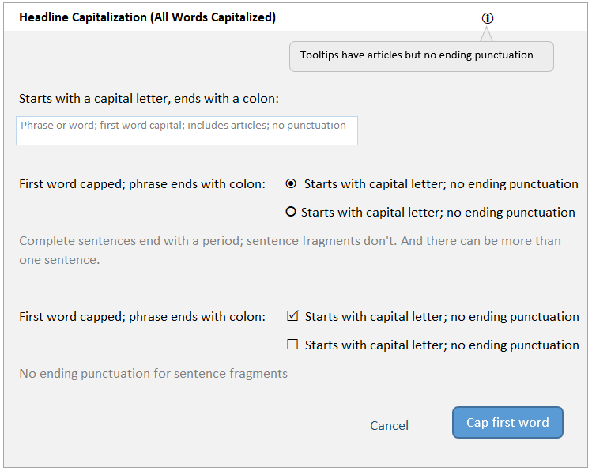

# User Interface Text Guidelines

## UX writing principles

Following these guidelines ensures that in-product communication to our users has the the same, consistent, voice.

**Concise**

Use short words and sentences.

**Clear**

Always write for clarity and simplicity. Err on the side of simple language that can be understood by novice users, and avoid vague terms and jargon.

**Consistent**

Be consistent with terminology across the product. Although we may have different terms for the same things internally, always use the same language to describe the same thing within the product.

## User interface text guidelines 

These guidelines cover two types of UI text:
- Messages triggered because something happened
- Static text on the user interface

### General principles for UI (in-product) text

- Keep in mind that your users are from all over the world. 
- Use the present tense to describe a current state or condition, and the future tense to state something that is very definitely going to happen.
- Use the active voice, except for these cases:
  - If you’ll end up blaming the user. For example, don’t say **You entered an incorrect password**. Instead, say **The password is incorrect**.
  - If you’re describing what just happened. For example: **Your incoming webhook is set up**.
  - If the subject (the doer of an action) is the Mattermost application itself. For example: **The image has been deleted** instead of **The server deleted the image**.
- If you’re asking the user to do or not do something, use imperatives (command phrases). For example, use **Don't change the Hostname** instead of **It's not recommended to change the Hostname**. Better still, explain what could go wrong if they do or don’t do something. For example: **Don't change the Hostname because doing so <could cause this bad thing will happen>**.

### Guidelines for system messages

Don’t blame the user. Inform them about what happened, explain why it happened, and suggest a way forward. Try to use complete sentences in your messages. A sentence phrase (an incomplete sentence) might make sense in English but could present internationalization challenges.

If a system message contains variables (tokens):
- Don't use verbs or adjectives as variables.
- Don't create plurals of variables by adding an "s".
- If the variable is a noun, use a qualifier after the variable. For example, say **The {channel_name} channel was created** rather than **The {channel_name} was created**.

System messages can be of the following types: **notification**, **confirmation**, **warning**, and **error**. The following sections contain guidelines that are specific to each of these types.

### Notification messages

A notification message informs the user about an event or action that took place. These messages don't need any user input, and don't prevent the user from continuing to use Mattermost.

- Use either a complete sentence or a sentence phrase.
- If using a complete sentence, end it with a period.
- Examples:
  - **Member added to channel.**
  - **The plugin was installed.**

### Confirmation messages

A confirmation message requires user input to confirm that they want to proceed with the action. Confirmation must be provided (either to continue or cancel) before the user can continue to use Mattermost.

- Use complete sentences.
- Include a question that has a Yes/No answer.
- Examples:
  - **Are you sure you want to delete this channel?**
  - **A plugin with this ID already exists. Would you like to overwrite it?**

### Warning messages

A warning message alerts the user that something that might go wrong. They can continue using Mattermost unless the warning message needs user input.

- Use complete sentences.
- Explain what has happened, or can happen, and what may go wrong as a result.
- Examples:
  - **The Enterprise license expires in 2 days. If it's not renewed, some features will be disabled on license expiry.**
  - **If you claim this AD/LDAP account, you won't be able to log in with your email address.**

### Error messages

An error message informs the user that something went wrong. Errors prevent the user from completing a task or accessing a feature until the error is resolved.

- Use complete sentences.
- If what went wrong isn’t obvious, explain in one sentence.
- If a solution or workaround isn’t obvious, suggest one.
- Examples:
  - **Messages must have fewer than 120 characters.**
  - **A connection to the Plugin Marketplace server could not be established. Check your settings in the [System Console](<hyperlink>)**. 
  
## Button labels and links

Button labels should always use action words and describe the action as concisely as possible. They should be limited to four words or less. Examples: “Log In”, “Send Invitation”.

## Navigation labels

Navigation labels should be as short as possible and support the user in finding their way.

### Input labels

Input labels should be as short and concise as possible and describe the input field.

### Capitalization

**Titles** 

Titles should use sentence case (e.g. **This article is about user interface content**) with the exception of proper nouns (e.g. **This article is about Mattermost**).

**Button labels, input labels, and navigation labels** 

These labels should use sentence case. (e.g. **This article is about user interface content**) with the exception of proper nouns (e.g. **This article is about Mattermost**).

### Punctuation

**Titles**

Titles shouldn't have periods unless the headline is more than one sentence.

**Paragraphs**

Paragraphs should always be properly punctuated.

**Bullets**

Bullets lists shouldn't have periods unless the bullet text is more than one sentence.

**Button labels**

Button labels shouldn't have periods or other punctuation.

## Guidelines for UI elements

Use this table when writing the text for UI elements such as windows, dialog boxes, labels, and prompts.

<table>
<colgroup>
<col style="width: 10%" />
<col style="width: 30%" />
<col style="width: 10%" />
<col style="width: 25%" />
<col style="width: 25%" />
</colgroup>
<thead>
<tr class="header">
<th>Element</th>
<th>Image</th>
<th>Capitalization</th>
<th>Phrasing</th>
<th>Examples</th>
</tr>
</thead>
<tbody>
<tr class="odd">
<td>Menu</td>
<td></td>
<td>Headline style</td>
<td><ul>
<li>Noun, noun phrase, or verb</li>
<li>No punctuation</li>
<li>Not more than three words</li>
<li>Action after clicking is obvious, without needing someone to click to discover</li>
</ul></td>
<td><ul>
<li><em>Members</em></li>
<li><em>Account Preferences</em></li>
<li><em>Log Out</em></li>
</ul></td>
</tr>
<tr class="even">
<td>Tooltip</td>
<td></td>
<td>Sentence style</td>
<td><ul>
<li>Sentence fragment or sentence</li>
<li>No punctuation</li>
<li>Include articles (<em>a</em>, <em>an</em>, <em>the</em>)</li>
<li>Keep it short</li>
</ul></td>
<td><ul>
<li><em>Start a Zoom meeting</em></li>
<li><em>Flag for following up</em></li>
<li><em>Remove from this list</em></li>
</ul></td>
</tr>
<tr class="odd">
<td>In-field text</td>
<td></td>
<td>Sentence style</td>
<td><ul>
<li>Sentence fragment, sentence, or word that's an example of a valid entry</li>
<li>No punctuation</li>
<li>Include articles (<em>a</em>, <em>an</em>, <em>the</em>)</li>
</ul></td>
<td><ul>
<li><em>Add a comment</em></li>
<li><em>Search</em></li>
</ul></td>
</tr>
<tr class="even">
<td>Action button</td>
<td></td>
<td>Headline style</td>
<td><ul>
<li>Verb or verb phrase</li>
<li>No longer than three words</li>
<li>No articles (<em>a</em>, <em>an</em>, <em>the</em>)</li>
<li>Exceptions: <em>OK</em>, <em>Yes</em>, <em>No</em></li>
</ul></td>
<td><ul>
<li><em>Add Comment</em></li>
<li><em>Edit</em></li>
</ul></td>
</tr>
<tr class="odd">
<td>Label before a UI element</td>
<td></td>
<td>Sentence style</td>
<td><ul>
<li>Noun, verb, or sentence fragment that's the title of the UI element</li>
<li>End with a colon where it precedes another UI element such as a radio button or check box</li>
<li>Include articles (<em>a</em>, <em>an</em>, <em>the</em>)</li>
</ul></td>
<td><ul>
<li><em>Sign in with:</em></li>
<li><em>Other words, separated by commas:</em></li>
</ul></td>
</tr>
<tr class="even">
<td>Label after a UI element</td>
<td></td>
<td>Sentence style</td>
<td><ul>
<li>Noun, verb, or sentence fragment</li>
<li>No punctuation</li>
<li>Brief (longer explanations belong to help text)</li>
</ul></td>
<td><ul>
<li><em>Channels grouped by type</em></li>
<li><em>Alphabetically</em></li>
</ul></td>
</tr>
<tr class="odd">
<td>Help text</td>
<td></td>
<td>Sentence style</td>
<td>Complete sentences, with punctuation</td>
<td><ul>
<li><em>You can add 20 more people.</em></li>
<li><em>People are invited automatically to join the channel.</em></li>
</ul></td>
</tr>
<tr class="even">
<td>Title</td>
<td></td>
<td>Headline style</td>
<td><ul>
<li>Sentence fragment or sentence</li>
<li>No punctuation</li>
</ul></td>
<td><ul>
<li><em>Notification Preferences for Channel</em></li>
<li><em>Contributors</em></li>
</ul></td>
</tr>
</tbody>
</table>

.. [*] For headline style, capitalize all words except those with three letters or fewer, articles (*a*, *an*, *the*), prepositions (*on*, *to*, *in*, *from*, *of*), and coordinating conjunctions (*and*, *but*, *or*, *for*). Despite these exceptions, always capitalize the first and last word. For sentence case, capitalize only the first word.

