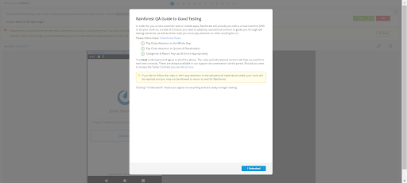
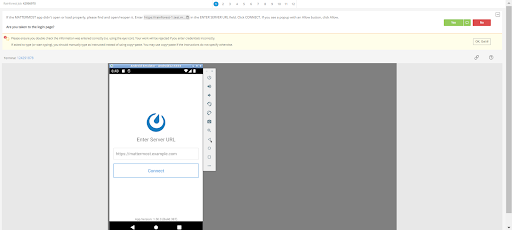

# Rainforest Process Notes

## Running tests, reviewing failures, and commenting in Zephyr

* [Run groups](#run-groups)
  * [Which run groups to run for which release?](#which-run-groups-to-run-for-which-release)
* [Webhook for reporting to Zephyr](#webhook-for-reporting-to-zephyr)
* [Preparing a run group to run](#preparing-a-run-group-to-run)
* [Reviewing failures](#reviewing-failures)
  * [Crowd-tested run groups](#crowd-tested-run-groups)
  * [Automated run groups](#automated-run-groups)
* [Commenting on test failures in Zephyr](#commenting-on-test-failures-in-zephyr)

## [Run groups](https://app.rainforestqa.com/run_groups)

### Which run groups to run for which release?

**Note**: The **browser** tests for Cloud releases have been split into groups as the original groups were getting too big. For releases going out in the first half of the month, run the **(1st Half of Month)** groups. Similarly, for releases going out in the second half of the month, run the **(2nd Half of Month)** groups.

1. Self-managed releases
   
    a. All run groups starting with **(RFA) Browser_**.

2. Mobile releases
   
    a. All run groups starting with **Android_** and **iOS_**.

3. Cloud releases
   
    a. All run groups starting with **Cloud Workspace_**.

**Additional notes**
   
* Run groups starting with **Browser_** are the old crowd-tested groups. Once conversion of all groups to Rainforest automation (RFA) is complete, these groups will be deprecated.
  
* Currently, we are not running any Desktop App tests in Rainforest.

## Webhook for reporting to Zephyr

Before setting off any group of tests to run, the webhook must be enabled in Rainforest so that it reports to Zephyr. See the [wiki](https://wiki-internal.mattermost.cloud/quality) for details. To set the webhook, go to the [Sites page](https://app.rainforestqa.com/settings/sites) in Rainforest.

1. Click on **Staging**:

    

2. Check the box to the left of **Webhook Enabled**, then click on the **Save** button:

    

3. The webhook is now enabled and all runs set off after enabling it will report to Zephyr in the folder [Rainforest Tests](https://mattermost.atlassian.net/projects/MM?selectedItem=com.atlassian.plugins.atlassian-connect-plugin:com.kanoah.test-manager__main-project-page#!/cycle?projectId=10302).

4. Running results in this folder will have the same title with run ID as the run group you set off e.g. **<Run ID>: Android - Account Settings**, so all you need to do is drag and drop it to the release folder it belongs to. 

## Preparing a run group to run

1. Go to [https://app.rainforestqa.com/run_groups](https://app.rainforestqa.com/run_groups).
   
2. Click on the run group you want to run e.g. **Android - Account Settings**.
   
3. You will see this screen:

    

4. Click on the blue **Run** button, top right of the screen. You’ll then see this screen:

    

5. Click on **Additional Options** bottom left. You’ll then see this screen:

    

6. Type the release name into the **Should this run be tied to your release process** field. e.g. v1.50 release.

    

7. Click the back arrow to the left of **Additional Options** which will take you back to this screen:

    

8. Scroll down so that **Platform** is visible and check that the correct platform to test on is selected (for mobile runs, you can click on **Mobile VM** to display only the mobile options).

    

9. Once you are certain that the correct platform is selected, (for this example Android 12.0 (Beta) is correct), click on **Start Run**.
    
10. The run will begin and you can view results here: [https://app.rainforestqa.com/runs?page=1&mode=standard](https://app.rainforestqa.com/runs?page=1&mode=standard).
   
**Note:** On the run results page, you can set a filter to show only “Standard” runs to filter out any draft runs.

## Reviewing failures

### Crowd-tested run groups

1. From this page: [https://app.rainforestqa.com/runs?page=1&mode=standard](https://app.rainforestqa.com/runs?page=1&mode=standard), click on the run group you want to review. For this example, we’ll use the **Android - Account Settings**.

    

2. You’ll be taken to this screen:

    

3. Notice that 2 tests failed. Click on the first test that failed. You’ll be taken to this screen:

    

4. Scroll down until you see a red **X** to the right of the step that failed, then click on the **X**.
   
    **Note**: Sometimes one crowd tester will get further along in a test than another tester, so there may be more than one point of failure, as there is in this example. In cases like this, click on both **X**’s to see what failed.

    

    **Let’s look at the failure in the first red X.**

    

    You can see that 2 testers passed the step but one tester failed the step due to the language in Mattermost not being in English. (This sometimes happens when previous testers have not reset the app to English before ending the test). In cases like this, add a comment that this was the case.

    **Let’s look at the failure in the 2nd red X.**

    

    You can see that one tester failed the step as he didn’t know how to change the language back to English in the incognito browser window. In this case, he did not read the instructions or follow them as they read: “Do you see language change to Chinese in the Mobile app? IMPORTANT: IF THIS STEP FAILS, do not LEAVE THE TEST BEFORE CHANGING THE LANGUAGE BACK TO ENGLISH IN THE INCOGNITO WINDOW BY FOLLOWING STEPS 9 AND 10”.

5. When it starts to look like testers are confused, open the test and preview it to ensure instructions are clear and test steps are correct. To do this, click on **Open Test** at the top of the screen.

    

    a. Once you’ve clicked on **Open Test**, the test will open in a new browser window. Click on the **Preview** button at the top of the screen.

    

    b. In preview mode, the platform is not selected, and you need to do this before previewing the test. In this example, we need to click on **Android 12**. Once you’ve selected the platform, click on the blue **Preview** button bottom right of the screen.

    

    c. A new browser window will open showing the test preview window. Click on **I understand** and go ahead with previewing the test.

    

    d. The test preview is exactly as the testers would see it as they are testing. Usually, it's helpful to have the test open in another window to edit any steps that are unclear as I go through the preview.

    

6. Once you have previewed the test (and made any updates to the test itself), go back to the failed test in the run group. For this example, it’s this page: [https://app.rainforestqa.com/runs/880602/tests/237283/browsers/android_phone_12/steps/103213942](https://app.rainforestqa.com/runs/880602/tests/237283/browsers/android_phone_12/steps/103213942). As these examples have already been reviewed and categorized, you can see that I refactored this test for clarity but, if you were reviewing the test on failure, you’d:

    a. Click on the **Categorize Failure** button, top right of the screen.
  
    

    b. Select **Needs Refactor**, then click on the blue **Next** button (the option to refactor the test yourself is already checked).

    

    c. Type in your comments/reason for refactor, then click the blue **Save** button.

    

    d. Once you’ve clicked **Save**, you will see that the **Categorize Failure** button has changed to **Categorized: Needs Refactor**.
   
**Note:** Although the button shows NEEDS REFACTOR, you have already refactored the test. To see tests that have been categorized to Needs Refactor, go to the [Dashboard](https://app.rainforestqa.com/dashboard). Here you can click the radio buttons to the left of the tests that you’ve categorized as Needs Refactor and they will disappear from the screen. This is the process I’ve followed as it’s easier for me to refactor the test as I’m reviewing failures. If you’d prefer to review all tests first then go to the Dashboard and work through the tests you need to refactor, that’s also totally possible :)
        

To review the next failure in a run group, you can click on the **Next Failure** or **Previous Failure** buttons at the bottom of the screen. Once all failures have been reviewed, these buttons are both grayed out.

### Automated run groups

1. From this page, click on the run group you want to review failures in: [https://app.rainforestqa.com/runs?page=1&mode=standard](https://app.rainforestqa.com/runs?page=1&mode=standard). For this example, we’ll look at **(RFA) Browser - Multi-Team & DM (Mac/Catalina)**.

    

2. You’ll be taken to this page. Click on the first failed test.

    

3. This page will open and automatically scroll to the failed step, showing the corresponding UI on the right-hand side.

    

4. At first glance, this seemed to be a bug as Team Open was not in view. However, when reviewing previous steps in the automated test run, I couldn’t work out why the test had failed. Sometimes it’s difficult to see exactly what was clicked on in the automated replay. In this instance, I opened the test and ran a preview. To do this, click on the **Open Test** option, top right of the screen.

    

5. You’ll be taken to the test preview page. Once the VM has loaded on the right-hand-side, click the **Select All** button, top left of the screen then manually deselect the first 2 steps as these are to load the VM to the starting page.

    

6. Click on the blue **Preview xx Actions** button and the automated preview of the test will start. If any step fails while you are previewing, you can determine why, recapture the screenshot, add in a “wait” step, etc etc. We can do some practice runs to review automated failures :)

7. For this particular example, I ran the test preview and it passed so I categorized this test as **Other** as I had no idea why the test had failed in the run.

8. To review the next failure in the run group, click on the **Next Failure** or **Previous Failure** options at the bottom of the screen.

## Commenting on test failures in Zephyr

Having enabled the webhook before running tests and with the run groups having completed, results will be posted in the [~QA: Rainforest Results channel](https://community.mattermost.com/private-core/channels/rainforest-test-run-results) in Mattermost as well as the [Rainforest Tests folder](https://mattermost.atlassian.net/projects/MM?selectedItem=com.atlassian.plugins.atlassian-connect-plugin:com.kanoah.test-manager__main-project-page#!/cycle?projectId=10302) in Zephyr. 

**Note**: The run groups in Zephyr can be dragged and dropped to the release folder they belong to.

For ease of workflow, I usually have the failed test, the group of results in ~QA: Rainforest Results channel and the run group in Zephyr open.

RAINFOREST

MATTERMOST

ZEPHYR

We will use the example run above to explain the commenting process in Zephyr:

1. The test in Rainforest (RF-B577 MM-T4173 - Boards Plugin - (Mac/Catalina) - Empty Board - Groups) failed due to browser rendering issues since Rainforest updated the browsers on their VMs so, after updating the screenshot, the test can be categorized as “System Issues” as per screenshot below:

    

2. In Mattermost, reply to the run group with failures in it, for this example, Boards Plugin - macOS, and start a thread giving reasons for failures:

    

3. In Zephyr, find the failed test (for this example “Boards App - Empty Board - Groups”), then click on **Start a new test execution**:

    

4. Click on **Not executed** and select **Comment**. This will put a pink bar to the left of the test.

    

5. In the **Comment** field, add a reason for the failure (in this example, browser rendering issues).

    

6. Continue with the process above until all failures have been commented in Zephyr.

    **Note**:  Of course, if the failure was due to a bug, it will remain in the “Fail” status in Zephyr and you can add a link to the Jira bug ticket in the Comment field. (No need to “Start a new test execution” for failures due to actual bugs).
